---

title: 拼团交易系统-笔记

---


> 学习交流使用，侵删

## [第1-1节：拼团需求分析](https://wx.zsxq.com/group/48411118851818/topic/2858455585418211)

在互联网公司中，一个需求首先是从业务侧发起的盈利目标，拆分为不同的运营策略。再把对应的策略由产品经理设计为可以支撑市场运营操作完成盈利目标的具体项目。所以这里有一般有3个角色，包括；业务人员、运营人员、产品经理。他们分别在自己的岗位产生不同的资料，包括；MRD、BRD、PRD。

- 市场需求文档（MRD）： MRD是从市场的角度出发，描述目标市场的需求和机会。它通常包括目标客户群、市场趋势、竞争分析、市场机会、产品定位以及产品应该实现的市场目标等。MRD通常由产品经理或市场分析师编写，目的是定义产品应该解决的市场问题和满足的用户需求。
- 业务需求文档（BRD）： BRD更侧重于业务角度，描述业务目标、业务流程、业务规则、业务问题以及业务需求。它是从组织的业务视角来定义需求，包括业务背景、业务目标、影响分析、风险评估等。BRD通常由业务分析师编写，目的是确保项目解决了正确的业务问题，并与公司的业务战略保持一致。
- 产品需求文档（PRD）： PRD是更详细的文档，它根据MRD和BRD中确定的需求，具体描述产品的功能性和非功能性需求。PRD包括用户故事、用例、功能列表、性能要求、界面设计、用户体验等。PRD通常由产品经理编写，目的是为设计团队和开发团队提供一个明确的、详细的产品实现指南。

### 一、项目背景

针对目前的`小型支付商城系统`、`OpenAI应用系统`，商品购买交易同比增速放缓，需要引入新的营销策略促进商品交易量。在交易数据统计分析中得到，市场存在同类竞品，商品价格设定低于目前我们的商品定价，所以用户购买意愿偏低。

所以为了盘活沉睡用户，需要适当降低商品价格。但为了达到传播的效果，所以需要引入拼团方式，以客带客，靠用户自身传播的方式进行交易拉新。这样的处理方式对比于 KOL，会让利商品价值到用户自身。【KOL 等同于抖音大主播直播卖货】

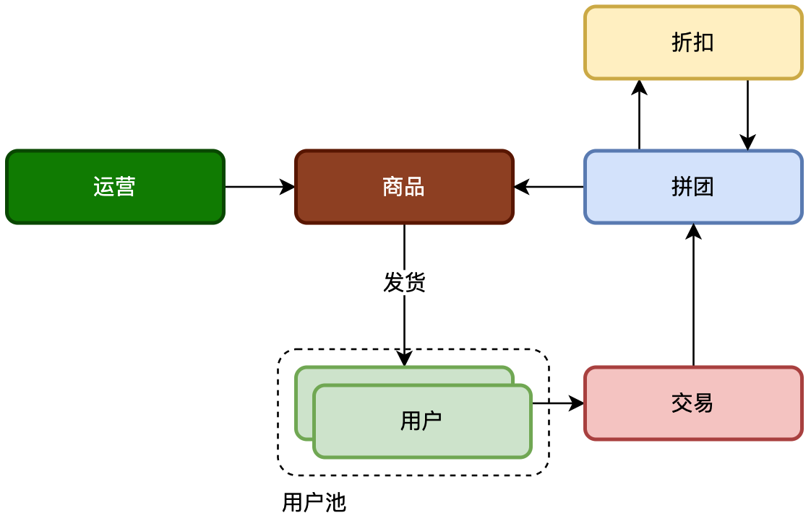

另一方面，通过本项目的增加，逐步完善功能产品和运营服务体系，优化整体的产品架构，增强市场竞争力。

### 二、产品方案

因为我们所实现的是一个平台类系统，可以满足各类交易场景的拼团需求接入。所以在实现这套系统时候，不要与其他系统耦合。并提供相关的研发侧对接标准。

此外我们要提供前端案例对接展示，满足后续其他系统，如；《小型支付商城》、《OpenAI应用》对接时候有可参考样例。

#### 1. 前端页面

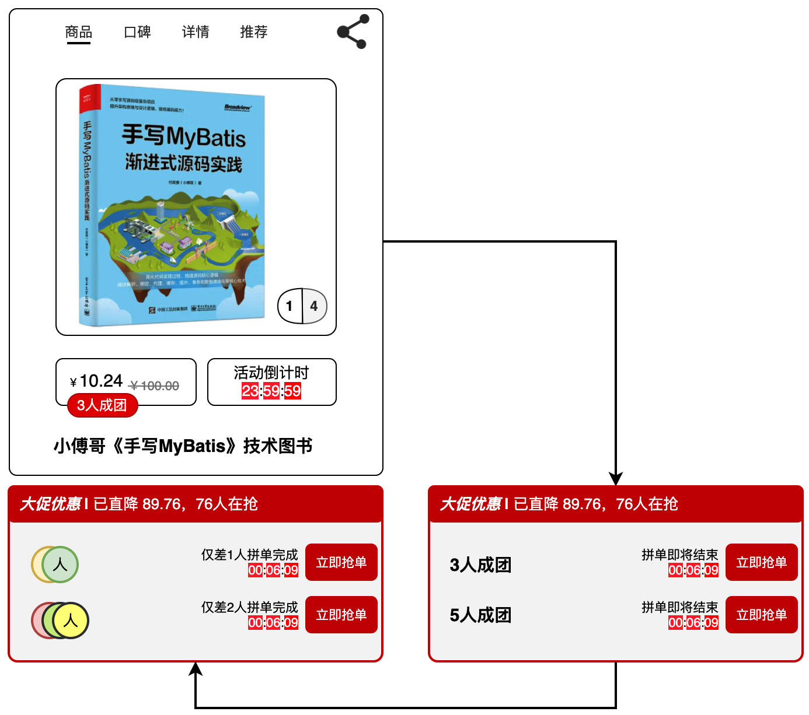

- 进入商品页后，查询是否配置了拼团活动。并进行优惠试算，拼团成团价，最低优惠展示。
- 参与首次拼团、参与拼团中拼团。拼团完成则不在展示此条拼团。
- 所有参与中的拼团统计拼团人员。

#### 2. 运营管理

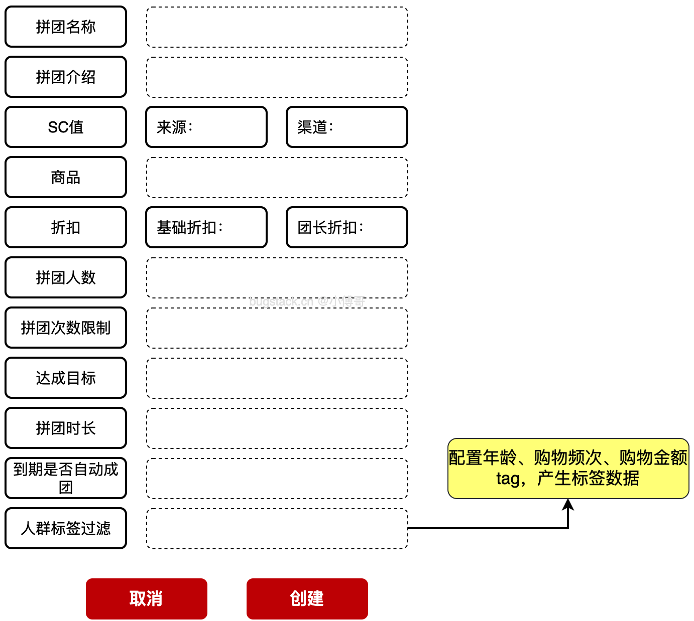

- 提供配置需要提供如图所示信息。
- 人群标签为提前设定标签类型，产生对应的人群数据。

#### 3. 功能流程

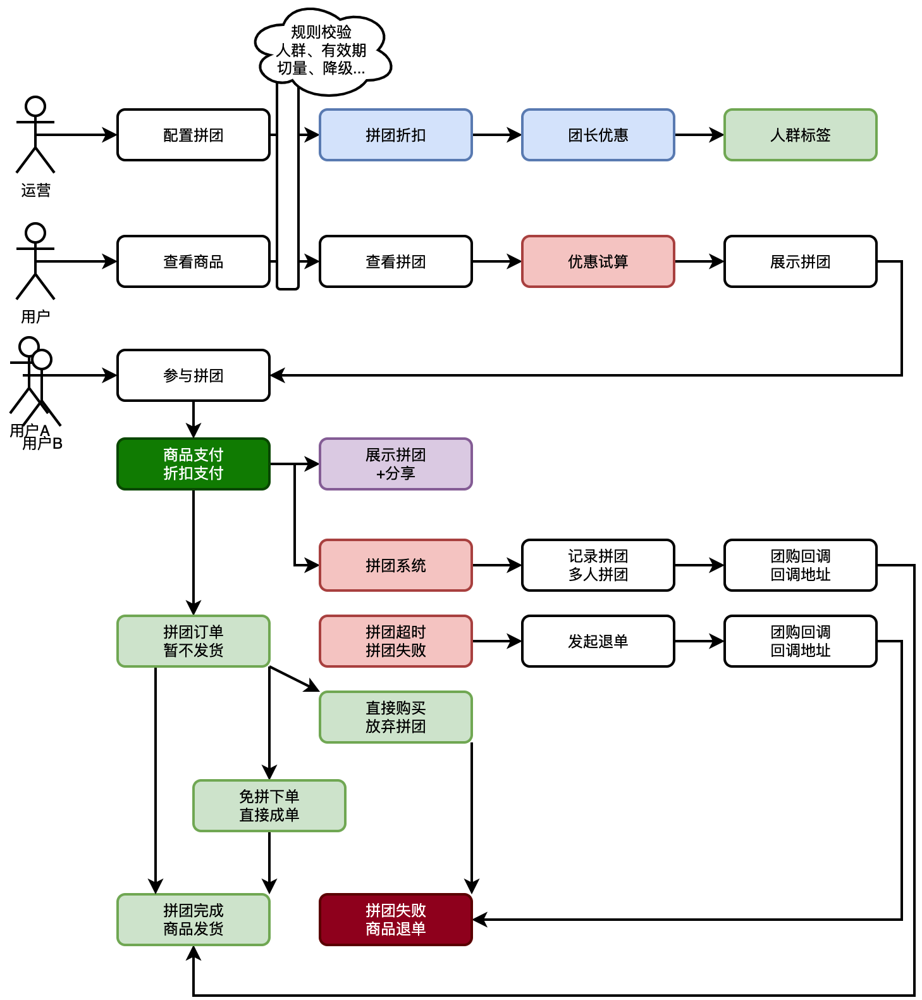

- 首先，由运营配置商品拼团活动，增加折扣方式。因为有人群标签的过滤，所以可以控制哪些人可参与拼团。
- 之后，用户可见拼团商品并参与拼团。用户可自主分享拼团或者等待拼团。因为拼团有非常大的折扣刺激用户自主分享，以此可以节省营销推广费用。
- 最后，拼团完成，触达商品发货。这里有两种，一种运营手段是拼团成团稀有性，必须打成拼团才可以。另外一种是虚拟拼团，无论是否打成，到时都完成拼团。

> 一般早期运营，先把商品价格促销大家，提高拼团的稀缺性。让大量用户知道拼团商品，之后调整为到期即可成团，只要参与就能拿到商品。

## [第1-2节：拼团库表设计](https://wx.zsxq.com/group/48411118851818/topic/2858452558558551)

具体文章：[《拼团交易平台系统》第1-2节：拼团库表设计-知识星球](https://wx.zsxq.com/group/48411118851818/topic/1525124225225222)

编程的代码是对数据逻辑的呈现，数据流转调度的好坏来自于数据结构设计的是否合理。而库表的设计就是对你过往学习数据结构知识的检测。

在库表设计时你需要了解整个业务执行过程，在这些过程中需要哪些数据作为支撑。合理的数据结构的库表设计，会让你的系统逻辑实现容易被人理解。反之，你可能要做大量的代码处理，也就是算法过程复杂度会变得很高。

这块知识的积累，最佳的手段就是多做实际的项目。从库表设计到编码实现，从编码实现反推库表合理性。做的多了，自然也就懂了。

### 一、本章诉求

通过拼团业务，讲解拼团流程实现中，所需的库表结构。包括；运营视角的配置诉求、用户视角的使用诉求。

只要你可以看懂库表设计，基本你也可以了解整个业务系统是如何实现的了。有了这样的积累，进入公司接触新的项目时，可以先从库表进行了解。知道它们的流转关系，之后在看系统设计和代码实现会更加清晰。

### 二、库表关系

在设计一套库表时，需要根据业务流程划分出大块的功能区，知道这些功能区的流转关系。

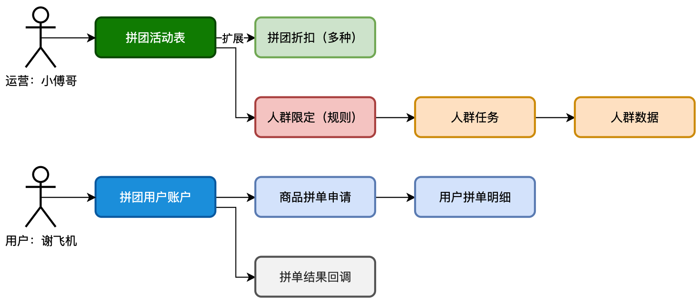

- 首先，站在运营的角度，要为这次拼团配置对应的拼团活动。那么就会涉及到；给哪个渠道的什么商品ID配置拼团，这样用户在进入商品页就可以看到带有拼团商品的信息了。之后要考虑，这个拼团的商品所提供的规则信息，包括；折扣、时间、人数等。还要拿到折扣的一个试算金额。这个试算出来的金额，就是告诉用户，通过拼团可以拿到的最低价格。
- 之后，站在用户的角度，是参与拼团。首次发起一个拼团与参与已存在的拼团进行数据的记录，达成拼团约定拼团人数后，开始进行通知。这个通知的设计站在平台角度可以提供回调，那么任何的系统也就都可以接入了。
- 另外，为了支撑这套库表，也会有人群的设计。人群是互联网公司中非常常用的手段，比如要把所有符合某个条件的用户ID，全部写入到一个特定的 Redis 记录中，之后就可以专门为这些人做特定的拼团活动了。
- 那么，拼团活动表，为什么会把折扣拆分出来呢。因为这里的折扣可能有多种迭代到一个拼团上。比如，给一个商品添加了直减10元的优惠，又对符合的人群id的用户，额外打9折，这样就有了2个折扣迭代。所以拆分出来会更好维护。这是对常变的元素和稳定的元素进行设计的思考。

> 你可以先尝试按照这样的分析进行库表设计，之后在看下文的内容。


## [第1-3节：研发系统设计](https://wx.zsxq.com/group/48411118851818/topic/5121424458454884)

具体文章：[《拼团交易平台系统》第1-3节：研发系统设计](https://articles.zsxq.com/id_olbr3cmmfslw.html)

### 一、本章诉求

通过对拼团需求的理解，进行研发系统设计。包括；用例图、系统建模、工程模型、功能流程、UML时序图。另外像是库表设计已经在前面完成了，它也属于研发系统设计的一部分，提前做了这部分是为了让大家更好的理解系统需求。

### 二、设计目的

为什么，不上来就写代码？

在15年刚加入互联网大厂的时候，基本上是一上来就写代码。产品聊完需求，研发简单记录，之后就是打开工程直接编码了。需求是上午写的，代码是下午干的。这样对于刚起步阶段是比较合适的，可以快速迭代。

但随着公司的体系化越来越完整，一个小项目也变成一个个独立业务线的大项目，一个人开发也变成了一个团队开发。所有的系统功能的实现，一点点小问题，都可能是一个个大问题。甚至一个bug，一会时间就会被传到微博，之后就是一片的舆情和客诉。

所以，到了目前这个阶段，研发不能只是为了功能而直接开发。还要遵守一些列的流程，确保开发迭代的需求，都能平稳的交付。所以要有研发设计、要有评审、要有测试、要有预发、要有黑白名单验证和功能切量。

### 三、业务模型

接下来我们站在前面已经做的产品需求功能的评审、库表的设计下，做相关的研发系统设计；


- 对照这样一个页面图，我们来分析需求做系统设计是比较容易的。

### 四、用户用例图

用例图（英语：use case diagram）是用户与系统交互的最简表示形式，展现了用户和与他相关的用例之间的关系。通过用例图，人们可以获知系统不同种类的用户和用例。用例图也经常和其他图表配合使用。

- 用例图，也可以等同于是用户故事（英语：User story）（软件开发和项目管理中的常用术语），主旨是以日常语言或商务用语撰写句子，是一段简单的功能表述。以客户或使用者的观点撰写下有价值的功能、引导、框架来与使用者进行互动，进而推动工作进程。可以被认为是一种规格文件，但更精确而言，它代表客户的需求与方向。以该用户故事来反应对象在组织内的其工作职责、范围、需要进行的任务等。用户故事在敏捷开发方法中用来定义系统需要提供的功能和实现需求管理。
- 尽管用例本身会涉及大量细节和各种可能性，用例图却能提纲挈领地让人了解系统概况。它为“系统做什么”提供了简化了的图形表示，因此被誉为“搭建系统的蓝图”。

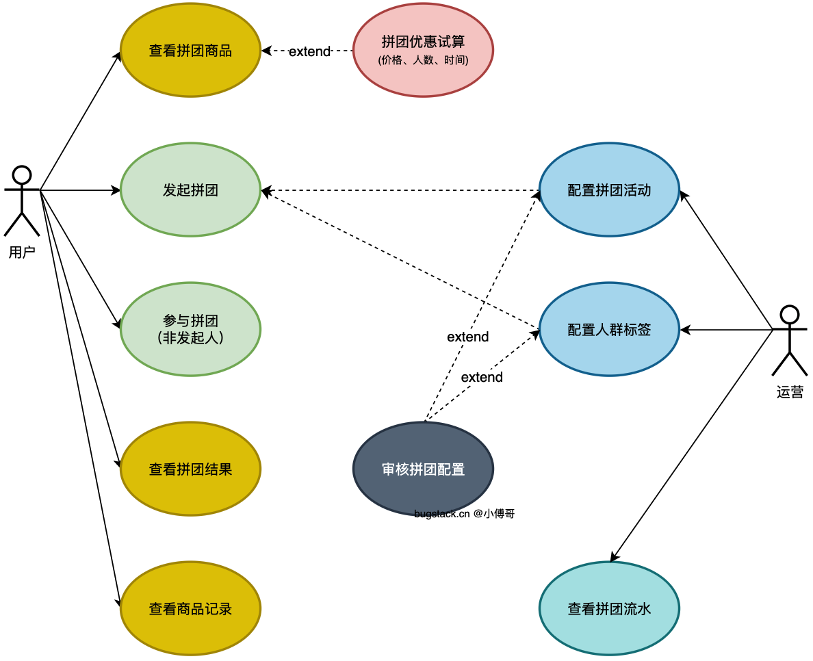

- 站在用户视角，会有；查看拼团商品、发起拼团、参与拼团、查看拼团结果、查看商品记录。
- 站在运营视角，会有；配置拼团活动、配置人群标签、审核拼团配置、查看拼团流水。

> 这样的用例图，它有点项目目标结果驱动，让你知道最终的产品形态要提供什么功能。所以有这样的一个指导是可以很好的完成后续的建模设计的。

### 五、四色建模图

在MVC的系统开发中，是很少做建模的事情的。因为它都是面向过程开发，过程就是一个流程需要什么就编写什么，但随着系统的复杂，会逐步发现，A流程、B流程、C流程，越来越多的流程加入，但这些流程中又存在了交叉、复用。也就是大家看到的 MVC 里的代码，总是一个功能，被复制了好多次，好多地方编写。所以使用 DDD 思想的情况，会对这些内容提前思考，进行建模设计，划分出领域。让一个个单元变得容易管理。

MVC 有点像睡大车店子（大通铺的一个大炕），DDD 划分了每家每户，每个床🛏睡着该睡的人。

#### 1. 建模方法

DDD 的建模过程，是以一个用户为起点，通过行为命令，发起行为动作，串联整个业务。而这个用户的起点最初来自于用例图的分析。用例图是用户与系统交互的最简表示形式，展现了用户和与他相关的用例之间的关系。通过用例图，我们可以分析出所有的行为动作。

在 DDD 中用于完成用户的行为命令和动作分析的过程，是一个四色建模的过程，也称作风暴模型。在使用 DDD 的标准对系统建模前，一堆人要先了解 DDD 的操作手段，这样才能让产品、研发、测试、运营等了解业务的伙伴，都能在同一个语言下完成系统建模。

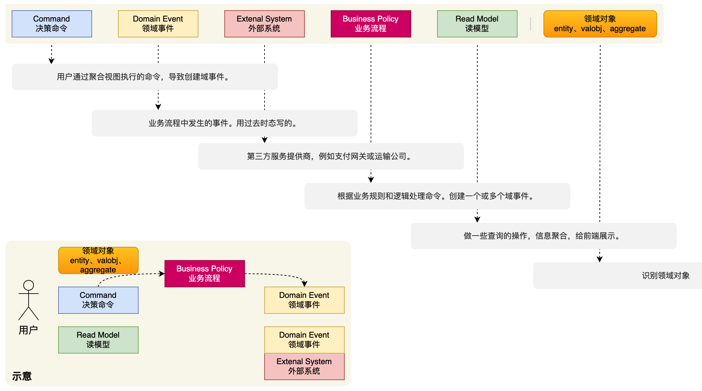

此图是整个四色建模的指导图，通过寻找领域事件，发起事件命令，完成领域事件的过程，完成 DDD 工程建模。

- 蓝色 - 决策命令，是用户发起的行为动作，如；开始签到、开始抽奖、查看额度等。
- 黄色 - 领域事件，过去时态描述。如；签到完成、抽奖完成、奖品发放完成。它所阐述的都是这个领域要完成的终态。
- 粉色 - 外部系统，如你的系统需要调用外部的接口完成流程。
- 红色 - 业务流程，用于串联决策命令到领域事件，所实现的业务流程。一些简单的场景则直接有决策命令到领域事件就可以了。
- 绿色 - 只读模型，做一些读取数据的动作，没有写库的操作。
- 棕色 - 领域对象，每个决策命令的发起，都是含有一个对应的领域对象。

**👩🏻‍🏫敲黑板** 综上，左下角的示意图。是一个用户，通过一个策略命令，使用领域对象，通过业务流程，完成2个领域事件，调用1次外部接口个过程。我们在整个 DDD 建模过程中，就是在寻找这些节点。

更多关于建模的学习：https://bugstack.cn/md/road-map/ddd-guide-02.html

#### 2. 寻找事件

寻找领域事件的过程，就是寻找系统中流程节点的结果态。什么结束了、什么完成了、什么终止。

其实这样的手段，也是一种目标结果驱动的手段，当有人为你指明了，你要去哪里，之后你会有更目标感的前进。

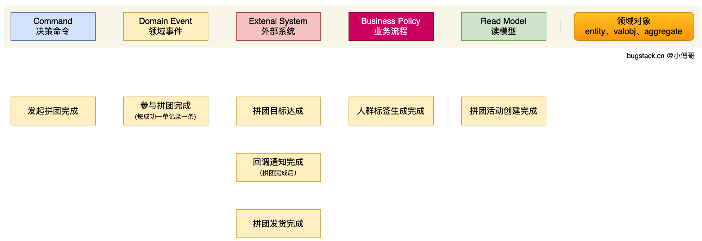

- 目前我们可以根据需求找到，如图中黄色部分的领域事件。包括；发起拼团完成、参与拼团完成、拼团目标达成、回调通知完成、拼团发货完成、人群标签生成完成、拼团活动创建完成。

- 如果后续我们在迭代新的功能的话，还会引入其他领域事件。你也可以思考，还可能存在什么领域事件。

#### 3. 划分领域

领域的划分是基于寻找领域事件之后，所有的领域事件都应该有一个对应的发起方，我们管这个叫决策命令。比如你去超时购物完成，是你媳妇发起的决策命令让你去买胖东来的0添加酱油。

那么，我们这里就要找到完成这些领域事件的决策命令；

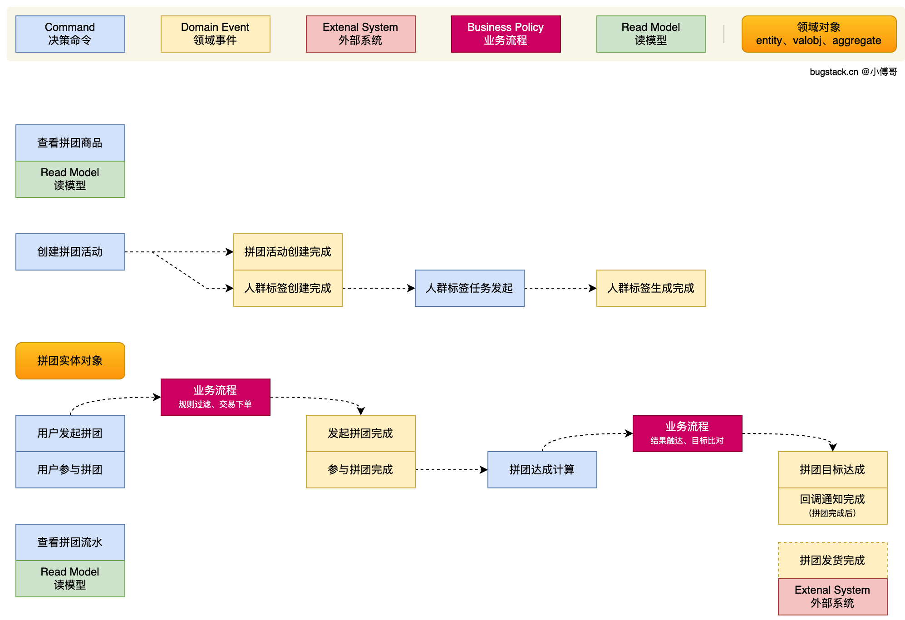

- 蓝色为以用户维度的决策命令，你发出的所有命令，都会有一个对应的结果态承接。

- 如果是复杂的业务，要做一些列的流程，则会出现一个 Business Policy 业务流程。这个业务流程里可以通过设计模式来完成功能的设计。经过这样的处理，你的代码也会变得非常清晰。

### 六、业务流程

研发功能流程设计有一粗一细，粗的是流程图为了让大家快速的了解这些功能节点的串联关系，方便讲解的时候，可以让多方了解。细的是UML时序图，这个会把流程中的个细节体现出来，指导研发做功能实现。

#### 1. 流程图

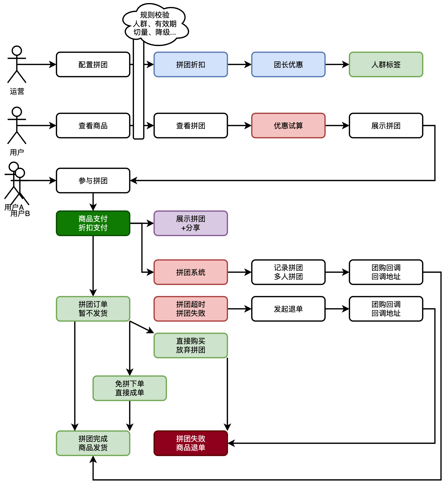

分别以用户和运营视角，了解一套拼团的配置到用户的参与。

#### 2. 时序图

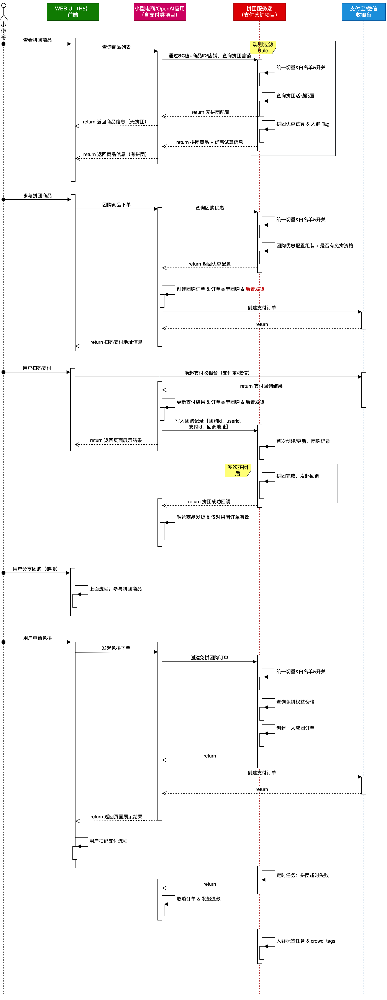

- 时序图，展示了整个拼团过程所涉及的系统模块和流转关系。这部分直接看图即可。

### 七、系统架构

DDD 是软件开发设计的一套指导思想，但不是直接决定了你如何编码，而是提供了对需求设计为研发提供编码指引的手段。所以，DDD 建模后，你可以使用3层架构 MVC 开发，也可以使用六边形架构、整洁架构、菱形架构开发。这也就是为什么有些人的简历上，专业技能栏里会有相关架构内容的体现。

在这方面，阿里最早推出的 cola 考拉🐨架构，就是整洁架构的代表。张毅老师推出的菱形架构，南向网关、北向网关，属于六边形这一类的架构。这些都是为了更好的落地 DDD 这套指导思想而出现的架构分层设计。

所以，DDD 是指导思想，帮助你建模设计，划分领域。六边形架构、整洁架构、菱形架构，是为了帮你落地知道思想到具体编码实现上。

那么，MVC 分层架构不也可以开发 DDD 知道思想的编码吗？可以，但相对来说不会那么优雅。MVC 的出现，并不是在有了分布式微服务之后，所以一些分布式资源模块的承载和领域思想的处理，在 MVC 中都是比较别扭的。所以，我们选择新的架构形态可以更好的承载 DDD 指导思想。

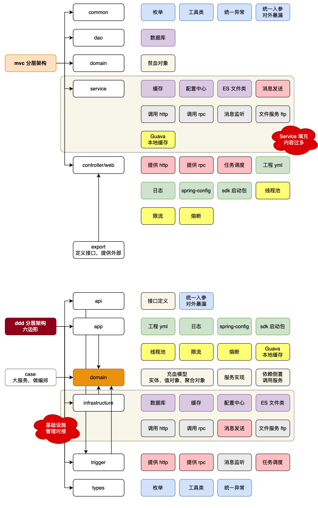

如图，展示了分布式微服务架构项目，各项开发过程中所需的资源在两套分层架构中的体现。

1. 1.

   MVC 基本是把所有的内容都用服务来承载，无论是自身的服务，还是外部的服务。这样会导致维护的混乱，长期迭代成本的增加。

2. 2.

   六边形架构，对于MVC的劣势做了针对性的架构处理，合理的划分了各项资源在不同层的承载。domain 也更专注于领域功能的实现。也就是把以前的 service 内容，划分到 domain 中处理。

关于更多的 DDD 工程模型，可以从编程路书中学习；https://bugstack.cn/md/road-map/ddd-guide-03.html


## [第2-1节：初始工程搭建](https://articles.zsxq.com/id_9hqq2pxbbajr.html)

具体文章：[《拼团交易平台系统》第2-1节：初始工程搭建](https://articles.zsxq.com/id_9hqq2pxbbajr.html)

### 一、本章诉求

教会小伙伴使用统一标准脚手架方式创建项目工程，并了解工程模块的分层用途。以及完成2张关于拼团互动库表的创建和使用。

课程会循序渐进的从0到1，逐步带着大家完成项目的开发。开局只有一把 IntelliJ IDEA，完成项目后你可以学习到；业务、架构、设计、方案、配置、部署（Linux、Docker）等各项知识。

### 二、如何开始

站在读者视角，该怎么学习呢？这里做个必要说明和前置的知识提供。

#### 1. 前置学习

小伙伴在学习的时候，可以依照课程的方式进行创建项目、变更配置、启动测试。这里有一些前置学习，包括：Git、Maven、Docker、脚手架，课程已经准备好了，可以刷下；

- Git：https://bugstack.cn/md/road-map/git.html
- Maven：https://bugstack.cn/md/road-map/maven.html
- Docker https://bugstack.cn/md/road-map/docker-what.html
- 脚手架：https://bugstack.cn/md/road-map/ddd-archetype-maven.html

另外课程会使用 Java JDK 1.8、Maven 3.8.x，软件已经提供好，可以直接下载；https://t.zsxq.com/19Rnk98M0 - `附件内含有配置好阿里云镜像的 Maven`

#### 2. 开始学习

1. 1.

   你需要通过 git clone 命令，或者 IntelliJ IDEA 自动的检出工程方式，把项目工程检出到本地。关于如何使用Git检出项目，在前置学习里提供了教程。

2. 2.

   检出代码后，你可以通过 IntelliJ IDEA 打开项目，并按照每一节最开始说明的本节对应的代码分支，把工程代码切换到对应的这一节。

3. 3.

   接下来你可以通过课程的视频和小册以及提供的代码进行学习，并跟随课程每节要完成的内容，一步步操作。过程中可以参考课程的代码进行学习。如果自己的代码运行出问题的时候，可以运行课程的代码验证是环境问题还是个人代码问题。**另外注意运行课程代码，要修改对应的环境为你的本地环境，mysql、redis等**

4. 4.

   对于课程中每节涉及的库表，会放到工程 docs/dev-ops mysql 下。你可以每节学习创建一个新的库名称，之后导入。但要记得在工程 app/application-dev.yml 文件中修改对应的库名称。

#### 3. 环境安装

课程提供了使用 Docker 部署 MySQL、Redis 环境的脚本。因为使用 Docker 可以随时方便卸载，不会污染本地电脑的本机环境。而且后续部署 Linux 云服务器也会非常顺手。

关于环境的安装；


1. 1.Windows + wsl2，本地使用 powershell 切换到工程文件夹，执行 `docker-compose -f docker-compose-environment-aliyun.yml up -d`
2. 2.Mac 电脑的适配性会更好，直接点击这里的绿色箭头即可安装。
3. 3.如果本机配置有问题，也可以选择使用云服务器。课程中有云服务器的操作教程，部署起来更方便。云服务器教程：https://bugstack.cn/md/road-map/linux.html

> 环境安装后就可以使用 MySql、Redis 链接工具使用了，也可以手动更新库表。

### 三、创建工程

本节会用到小傅哥开发好的在线 Maven 脚手架，用于创建项目工程。如下操作前，确保你的 IntelliJ IDEA 已经配置好了我提供的带有阿里云镜像 Maven，否则拉取脚手架会超时失败。如图操作。

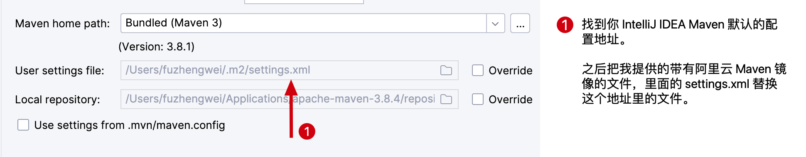

#### 1. 配置脚手架

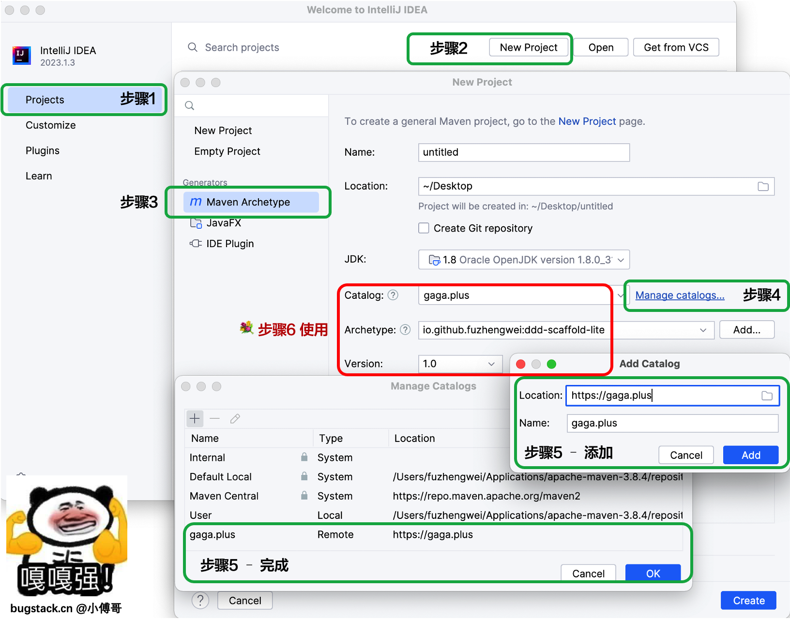

- 首先，你需要一个 IntelliJ IDEA 2021+ 版本，推荐使用社区版即可。即免费，也够用。
- 之后，如图把在线版的脚手架配置到 IntelliJ IDEA 中。这样大家使用的就是统一一套脚手架了。配置地址 [https://gaga.plus](https://gaga.plus/)

#### 2. 使用脚手架

如图，配置后使用即可。

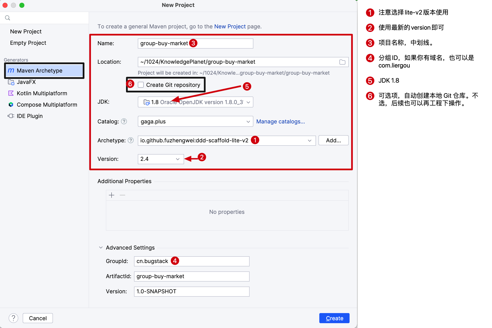

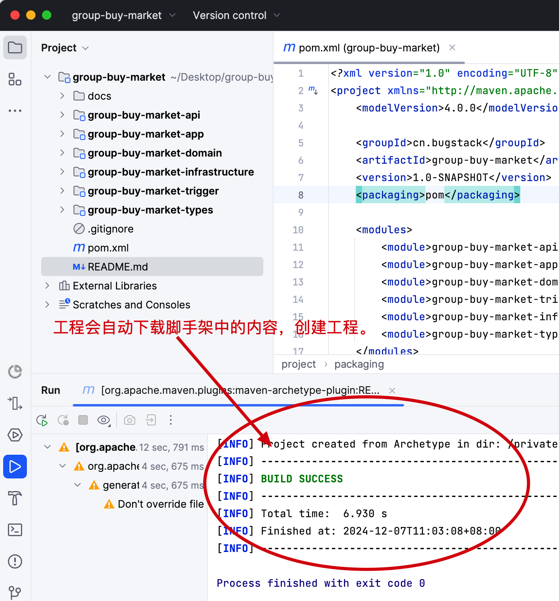

这样你就获得到了一个自动创建出来的工程结构。关于工程结构分层在前面已经介绍，这里也可以通过链接学习补充。https://bugstack.cn/md/road-map/ddd-guide-03.html 关于分层定义如下；

- **接口定义-api** ：因为微服务中引用的 RPC 需要对外提供接口的描述信息，也就是调用方在使用的时候，需要引入 Jar 包，让调用方好能依赖接口的定义做代理。
- **应用封装-app** ：这是应用启动和配置的一层，如一些 aop 切面或者 config 配置，以及打包镜像都是在这一层处理。你可以把它理解为专门为了启动服务而存在的。
- **领域封装-domain** ：领域模型服务，是一个非常重要的模块。无论怎么做DDD的分层架构，domain 都是肯定存在的。在一层中会有一个个细分的领域服务，在每个服务包中会有【模型、仓库、服务】这样3部分。
- **仓储服务-infrastructure** ：基础层依赖于 domain 领域层，因为在 domain 层定义了仓储接口需要在基础层实现。这是依赖倒置的一种设计方式。
- **领域封装-trigger** ：触发器层，用于提供接口实现、消息接收、任务执行等。所以对于这样的操作，小傅哥把它叫做触发器层。
- **类型定义-types** ：通用类型定义层，在我们的系统开发中，会有很多类型的定义，包括；基本的 Response、Constants 和枚举。它会被其他的层进行引用使用。

### 四、导入库表

这一节我们先创建 `group_buy_activity - 拼团活动`、`group_buy_discount - 折扣配置`两个库表到工程中，并完成配置和使用。

#### 1. 建表语句

```java
CREATE database if NOT EXISTS `group_buy_market` default character set utf8mb4 collate utf8mb4_0900_ai_ci;
use `group_buy_market`;

# 转储表 group_buy_activity
# ------------------------------------------------------------

DROP TABLE IF EXISTS `group_buy_activity`;

CREATE TABLE `group_buy_activity` (
  `id` bigint(11) unsigned NOT NULL AUTO_INCREMENT COMMENT '自增',
  `activity_id` bigint(8) NOT NULL COMMENT '活动ID',
  `source` varchar(8) NOT NULL COMMENT '来源',
  `channel` varchar(8) NOT NULL COMMENT '渠道',
  `goods_id` varchar(12) NOT NULL COMMENT '商品ID',
  `discount_id` varchar(8) NOT NULL COMMENT '折扣ID',
  `group_type` tinyint(1) NOT NULL DEFAULT '0' COMMENT '拼团方式（0自动成团、1达成目标拼团）',
  `take_limit_count` int(4) NOT NULL DEFAULT '1' COMMENT '拼团次数限制',
  `target` int(5) NOT NULL DEFAULT '1' COMMENT '拼团目标',
  `valid_time` int(4) NOT NULL DEFAULT '15' COMMENT '拼团时长（分钟）',
  `status` tinyint(1) NOT NULL DEFAULT '0' COMMENT '活动状态（0创建、1生效、2过期、3废弃）',
  `start_time` datetime NOT NULL DEFAULT CURRENT_TIMESTAMP COMMENT '活动开始时间',
  `end_time` datetime NOT NULL DEFAULT CURRENT_TIMESTAMP COMMENT '活动结束时间',
  `tag_id` varchar(8) DEFAULT NULL COMMENT '人群标签规则标识',
  `tag_scope` varchar(4) DEFAULT NULL COMMENT '人群标签规则范围（多选；1可见限制、2参与限制）',
  `create_time` datetime NOT NULL DEFAULT CURRENT_TIMESTAMP COMMENT '创建时间',
  `update_time` datetime NOT NULL DEFAULT CURRENT_TIMESTAMP ON UPDATE CURRENT_TIMESTAMP COMMENT '更新时间',
  PRIMARY KEY (`id`),
  UNIQUE KEY `uq_activity_id` (`activity_id`)
) ENGINE=InnoDB DEFAULT CHARSET=utf8mb4 COMMENT='拼团活动';

LOCK TABLES `group_buy_activity` WRITE;
/*!40000 ALTER TABLE `group_buy_activity` DISABLE KEYS */;

INSERT INTO `group_buy_activity` (`id`, `activity_id`, `source`, `channel`, `goods_id`, `discount_id`, `group_type`, `take_limit_count`, `target`, `valid_time`, `status`, `start_time`, `end_time`, `tag_id`, `tag_scope`, `create_time`, `update_time`)
VALUES
 (1,100123,'s01','c01','9890001','25120207',0,1,1,15,0,'2024-12-07 10:19:40','2024-12-07 10:19:40','1','1','2024-12-07 10:19:40','2024-12-07 10:19:40');

/*!40000 ALTER TABLE `group_buy_activity` ENABLE KEYS */;
UNLOCK TABLES;


# 转储表 group_buy_discount
# ------------------------------------------------------------

DROP TABLE IF EXISTS `group_buy_discount`;

CREATE TABLE `group_buy_discount` (
  `id` bigint(11) unsigned NOT NULL AUTO_INCREMENT COMMENT '自增ID',
  `discount_id` int(8) NOT NULL COMMENT '折扣ID',
  `discount_name` varchar(64) NOT NULL COMMENT '折扣标题',
  `discount_desc` varchar(256) NOT NULL COMMENT '折扣描述',
  `discount_type` tinyint(1) NOT NULL DEFAULT '0' COMMENT '折扣类型（0:base、1:tag）',
  `market_plan` varchar(4) NOT NULL DEFAULT 'ZJ' COMMENT '营销优惠计划（ZJ:直减、MJ:满减、N元购）',
  `market_expr` varchar(32) NOT NULL COMMENT '营销优惠表达式',
  `tag_id` varchar(8) DEFAULT NULL COMMENT '人群标签，特定优惠限定',
  `create_time` datetime NOT NULL DEFAULT CURRENT_TIMESTAMP COMMENT '创建时间',
  `update_time` datetime NOT NULL DEFAULT CURRENT_TIMESTAMP ON UPDATE CURRENT_TIMESTAMP COMMENT '更新时间',
  PRIMARY KEY (`id`),
  UNIQUE KEY `uq_discount_id` (`discount_id`)
) ENGINE=InnoDB DEFAULT CHARSET=utf8mb4;

LOCK TABLES `group_buy_discount` WRITE;
/*!40000 ALTER TABLE `group_buy_discount` DISABLE KEYS */;

INSERT INTO `group_buy_discount` (`id`, `discount_id`, `discount_name`, `discount_desc`, `discount_type`, `market_plan`, `market_expr`, `tag_id`, `create_time`, `update_time`)
VALUES
 (1,9890001,'测试优惠','测试优惠',0,'ZJ','20',NULL,'2024-12-07 10:20:15','2024-12-07 10:20:15');

/*!40000 ALTER TABLE `group_buy_discount` ENABLE KEYS */;
UNLOCK TABLES;
```

- 课程的 Docker compose 脚本，会帮助你自动完成库表创建。如果遇到一些权限或者兼容问题，导致库表没有自动初始化到 MySQL 中，那么也可以手动处理，执行脚本导入到 MySQL 中。

#### 2. 工程配置

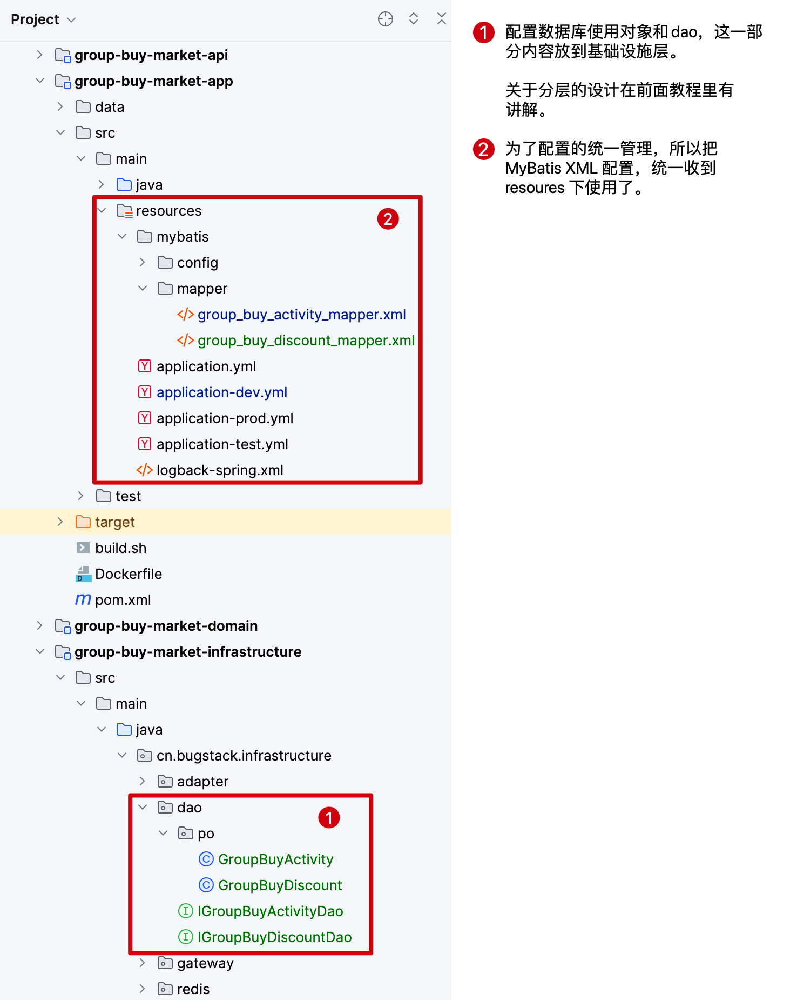

**application-dev.yml**

```
# 数据库配置；启动时配置数据库资源信息
spring:
  datasource:
    username: root
    password: 123456
    url: jdbc:mysql://127.0.0.1:3306/group_buy_market?useUnicode=true&characterEncoding=utf8&autoReconnect=true&zeroDateTimeBehavior=convertToNull&serverTimezone=Asia/Shanghai&useSSL=true
    driver-class-name: com.mysql.cj.jdbc.Driver
  hikari:
    pool-name: Retail_HikariCP
    minimum-idle: 15 #最小空闲连接数量
    idle-timeout: 180000 #空闲连接存活最大时间，默认600000（10分钟）
    maximum-pool-size: 25 #连接池最大连接数，默认是10
    auto-commit: true  #此属性控制从池返回的连接的默认自动提交行为,默认值：true
    max-lifetime: 1800000 #此属性控制池中连接的最长生命周期，值0表示无限生命周期，默认1800000即30分钟
    connection-timeout: 30000 #数据库连接超时时间,默认30秒，即30000
    connection-test-query: SELECT 1
  type: com.zaxxer.hikari.HikariDataSource

# MyBatis 配置【如需使用记得打开】
mybatis:
  mapper-locations: classpath:/mybatis/mapper/*.xml
  config-location:  classpath:/mybatis/config/mybatis-config.xml
```

- 首先，在你的工程中，需要添加数据库对象、DAO，以及 Mapper 配置文件。
- 另外，注意 application-dev.yml 也要修改为你的数据库连接信息【库名、MySQL地址和端口，注意你是 3306 还是 13306 还是 3307】，同时打开 MyBatis 配置文件。

### 五、测试验证

在公司中大家写完代码，是不会直接提交的，还需要做功能的验证。也就是编写一些测试类。

#### 1. 拼团活动查询

```java
@Slf4j
@RunWith(SpringRunner.class)
@SpringBootTest
public class GroupBuyActivityDaoTest {

    @Resource
    private IGroupBuyActivityDao groupBuyActivityDao;

    @Test
    public void test_queryGroupBuyActivityList() {
        List<GroupBuyActivity> groupBuyActivities = groupBuyActivityDao.queryGroupBuyActivityList();
        log.info("测试结果:{}", JSON.toJSONString(groupBuyActivities));
    }

}
24-12-07.11:49:59.518 [main            ] INFO  HikariDataSource       - HikariPool-1 - Starting...
24-12-07.11:49:59.880 [main            ] INFO  HikariDataSource       - HikariPool-1 - Start completed.
24-12-07.11:50:00.199 [main            ] INFO  GroupBuyActivityDaoTest - 测试结果:[{"activityId":100123,"activityName":"测试活动","channel":"c01","createTime":1733537980000,"discountId":"25120207","endTime":1733537980000,"goodsId":"9890001","groupType":0,"id":1,"source":"s01","startTime":1733537980000,"status":0,"tagId":"1","tagScope":"1","takeLimitCount":1,"target":1,"updateTime":1733543247000,"validTime":15}]
```

- 如上查询了数据库结果。验证通过。

#### 2. 拼团优惠查询

```
@Slf4j
@RunWith(SpringRunner.class)
@SpringBootTest
public class GroupBuyDiscountDaoTest {

    @Resource
    private IGroupBuyDiscountDao groupBuyDiscountDao;

    @Test
    public void test_queryGroupBuyDiscountList(){
        List<GroupBuyDiscount> groupBuyDiscounts = groupBuyDiscountDao.queryGroupBuyDiscountList();
        log.info("测试结果:{}", JSON.toJSONString(groupBuyDiscounts));
    }

}
24-12-07.11:50:20.926 [main            ] INFO  HikariDataSource       - HikariPool-1 - Starting...
24-12-07.11:50:21.254 [main            ] INFO  HikariDataSource       - HikariPool-1 - Start completed.
24-12-07.11:50:21.805 [main            ] INFO  GroupBuyDiscountDaoTest - 测试结果:[{"createTime":1733538015000,"discountDesc":"测试优惠","discountId":9890001,"discountName":"测试优惠","discountType":0,"id":1,"marketExpr":"20","marketPlan":"ZJ","updateTime":1733538015000}]
```

- 

  如上查询了数据库结果。验证通过。


## [第2-2节：试算模型抽象模板设计](https://articles.zsxq.com/id_tzf8bd3b621x.html)

具体文章：[《拼团交易平台系统》第2-2节：试算模型抽象模板设计](https://articles.zsxq.com/id_tzf8bd3b621x.html)

### 一、本章诉求

在一个工程中，随着不断地承接业务需求逻辑的实现，会有很多复杂场景需要解决。这个时候就会引入设计模式进行解耦和实现，提高工程代码的扩展性。

但随着开发的场景越来越多，在各个service实现中会存在相同的设计模式，如果是不同的人开发，那么一个责任链，一个规则树，也会有非常多的实现方式。那么这样就会导致后面在进入开发的人，对已存在的代码，维护的成本就越来越高了。

所以，本节小傅哥带着大家先做设计模式抽象模板的通用结构定义，添加一个 tree规则树抽象模型，在引入到工程中进行使用。这样后续工程中就可以不断的定义通用的设计模式被不同的场景统一使用了。

### 二、模型设计

这是一种链式的多分支规则树模型结构，由功能节点自行决定后续流程的执行链路。它的设计比责任链的扩展性更好，自由度也更高。

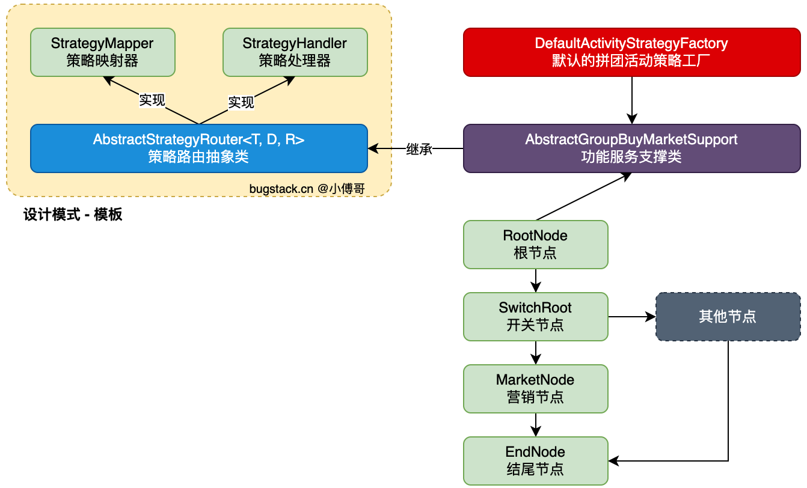

- 首先，定义抽象的通用的规则树模型结构。涵盖；StrategyMapper - 策略映射器、StrategyHandler - 策略处理器、`AbstractStrategyRouter<T, D, R>` - 策略路由抽象类。通过泛型设计允许使用方可以自定义出入参和动态上下文，让抽象模板模型具有通用性。
- 之后，由使用方自定义出工厂、功能抽象类和一个个流程流转的节点。这些节点可以自由组装进行流转，相比于责任链它的实现方式更具有灵活性。

### 三、编码实现

#### 1. 模板定义

在项目工程的 types 模块中，添加通用设计模式模板。如果是公司里的项目工程，还可以单独提供一个通用的设计模式模板工程，这样每个项目都可以引入使用了。


\- 目前，先添加 tree 规则树模型结构。后续随着开发需要在添加其他通用设计模式。

\- 设计模式资料；https://bugstack.cn/md/develop/design-pattern/2024-08-25-chain-tree.html

##### 1.1 策略映射器

```java
public interface StrategyMapper<T, D, R> {

    /**
     * 获取待执行策略
     *
     * @param requestParameter 入参
     * @param dynamicContext   上下文
     * @return 返参
     * @throws Exception 异常
     */
    StrategyHandler<T, D, R> get(T requestParameter, D dynamicContext) throws Exception;

}
```

- StrategyMapper#get 方法用于获取每一个要执行的节点，相当于一个流程走完进入到下一个流程的过程。这在我们处理复杂的业务代码时是非常重要的，避免把所有逻辑都写到一个类的方法中。
- 泛型 T - 入参、D - 上下文、R - 返参。

#####  1.2 策略受理器

```
public interface StrategyHandler<T, D, R> {

    StrategyHandler DEFAULT = (T, D) -> null;

    R apply(T requestParameter, D dynamicContext) throws Exception;

}
```

- StrategyHandler#apply 受理执行的业务流程。每个业务流程执行时，如果有数据是从前面节点到后面节点要使用的，那么可以填充到 dynamicContext 上下文中。

##### 1.3 策略路由器

```java
public abstract class AbstractStrategyRouter<T, D, R> implements StrategyMapper<T, D, R>, StrategyHandler<T, D, R> {

    @Getter
    @Setter
    protected StrategyHandler<T, D, R> defaultStrategyHandler = StrategyHandler.DEFAULT;

    public R router(T requestParameter, D dynamicContext) throws Exception {
        StrategyHandler<T, D, R> strategyHandler = get(requestParameter, dynamicContext);
        if(null != strategyHandler) return strategyHandler.apply(requestParameter, dynamicContext);
        return defaultStrategyHandler.apply(requestParameter, dynamicContext);
    }

}
```

- 通过调用策略映射器get方法，控制节点流程的走向。

#### 2. 首页试算

当一个用户进入到购物首页查看商品的优惠信息，我们可以把这个过程定义为试算过程。试算；试试算一下，这个用户进入到首页看这个商品的时候，商品的营销优惠信息。包括：原始价格、折扣价格、拼团目标、拼团时效、是否可见优惠、是否可参与拼团等，这些东西都是试算拿到的结果。

类似的，当你进入到一个信贷贷款的页面，也会告诉你分期多少，还款多少期，每期多少钱。这些东西也都是试算。


- 在 domain 领域层，实现拼团活动服务功能。model 是对象的定义，这个对象就类似于你在 mvc 中定义的 vo、req、res 这样的对象。只不过这里一般叫 xxxEntity 实体，它是一种面向对象的思维。
- trial 试算模块，把整个首页商品展示的信息都通过试算完成。后续会重点实现，本节先定义框架分层结构。
- 目前这里的代码还没有具体的实现代码，只有分层结构。可以直接参考工程的代码。

##### 2.1 营销商品实体信息

```
@Data
@Builder
@AllArgsConstructor
@NoArgsConstructor
public class MarketProductEntity {

    /** 用户ID */
    private String userId;
    /** 商品ID */
    private String goodsId;
    /** 渠道 */
    private String source;
    /** 来源 */
    private String channel;

}
```

##### 2.2 试算结果实体对象

```
@Data
@Builder
@AllArgsConstructor
@NoArgsConstructor
public class TrialBalanceEntity {

    /** 商品ID */
    private String goodsId;
    /** 商品名称 */
    private String goodsName;
    /** 原始价格 */
    private BigDecimal originalPrice;
    /** 折扣价格 */
    private BigDecimal deductionPrice;
    /** 拼团目标数量 */
    private Integer targetCount;
    /** 拼团开始时间 */
    private Date startTime;
    /** 拼团结束时间 */
    private Date endTime;
    /** 是否可见拼团 */
    private Boolean isVisible;
    /** 是否可参与进团 */
    private Boolean isEnable;

}
```

- 暂定一些试算的所需的结果，后续随着功能迭代再补充。

##### 2.3 举例节点实现

```
@Slf4j
@Service
public class RootNode extends AbstractGroupBuyMarketSupport<MarketProductEntity, DefaultActivityStrategyFactory.DynamicContext, TrialBalanceEntity> {

    @Override
    public TrialBalanceEntity apply(MarketProductEntity requestParameter, DefaultActivityStrategyFactory.DynamicContext dynamicContext) throws Exception {
        return null;
    }

    @Override
    public StrategyHandler<MarketProductEntity, DefaultActivityStrategyFactory.DynamicContext, TrialBalanceEntity> get(MarketProductEntity requestParameter, DefaultActivityStrategyFactory.DynamicContext dynamicContext) throws Exception {
        return null;
    }

}
```

- 根节点，实现 AbstractGroupBuyMarketSupport 抽象类。这个抽象类目前是空实现，后续一些通用的方法会放入这个抽象类里。

## [第2-3节：多线程异步数据加载-知识星球](https://wx.zsxq.com/group/48411118851818/topic/2858422848528251)

具体文章：[《拼团交易平台系统》第2-3节：多线程异步数据加载](https://articles.zsxq.com/id_oghwwt024h39.html)

在互联网公司中的业务功能开发，会非常重视接口的响应效率，一般整体的接口响应要控制在350毫秒，那么在每个细分领域的接口可能会被压缩到50~100毫秒。


这样的响应时间对于一些简单的接口到不会有什么影响，但如果是复杂较多的业务流程串联的接口，那么控制接口的响应时长就是一个非常大的挑战了。对于这样的情况，往往会引入异步线程加载数据的方式进行处理，之后在做统一的逻辑处理，这样就可以很好的降低接口响应时间。

### 一、本章诉求

扩展规则树模型结构，增加异步数据加载区。将用于试算营销优惠的接口使用异步线程进行加载，之后写入上下文，用于后续的逻辑处理。

这部分的模型设计是非常巧妙的，通过解耦逻辑和划分功能区，让代码具有了文档属性，看到对应的类和类下的方法区，就可以轻松的理解代码实现方式。这样的处理非常有利于后续功能的迭代。

### 二、模型链路

如图，为整个模型链路的执行过程图；

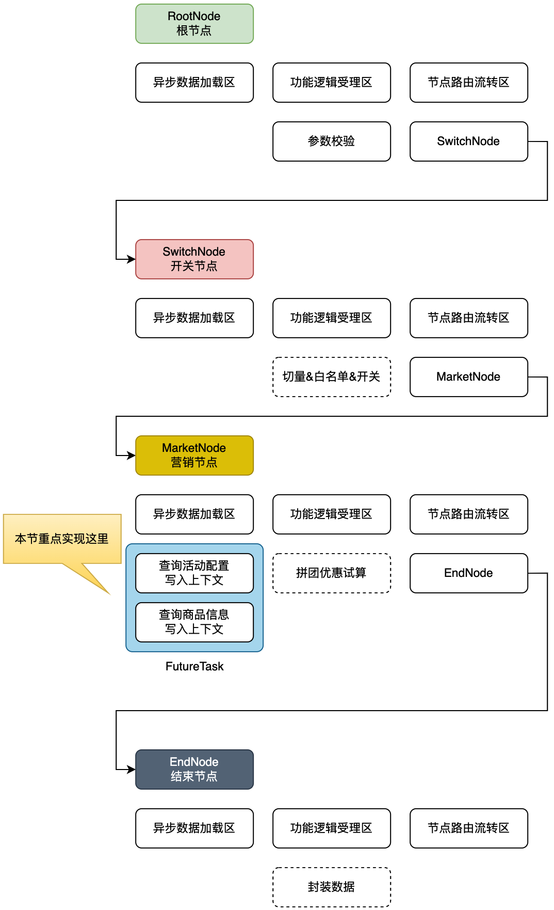

- 首先，对通用设计模式树结构扩展出异步数据加载区，这样可以把接口实现中所需的数据前置到异步数据加载区完成加载操作。以此提高接口的响应效率。
- 之后，本节串联功能节点，并在 MarketNode 节点，添加数据加载操作。
- 另外，注意本节需要新增加一个表 sku，也就是商品信息表，通过商品信息表获得当前商品的价格配置，以此来做商品的折扣计算。这块在实际生产中有两种实现方式，一种是每次都调用外部接口获取商品，另外一种是有商品统一同步库可以查询。我们这里先通过一个统一的商品库进行处理。那么后续谁要对接这个系统，就调用sku商品库，同步好商品即可。【库表已更新到工程下】

### 三、编码实现

#### 1. 工程结构

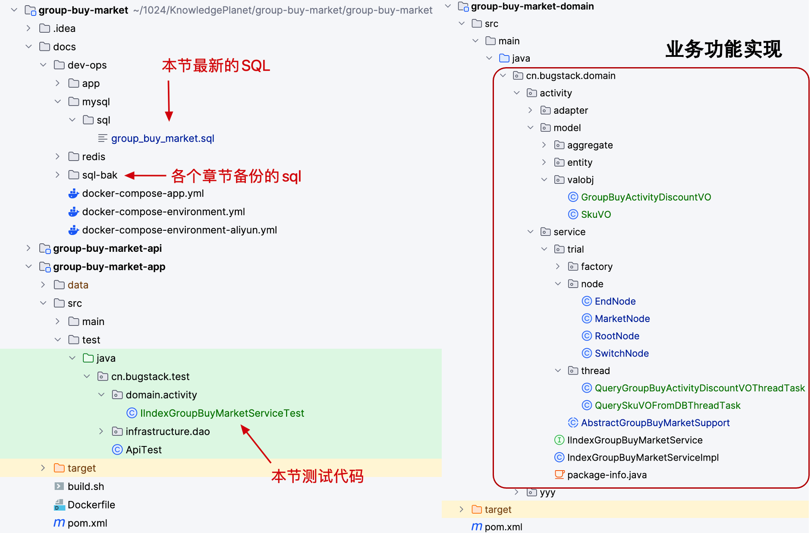

- 本节开始，增加 sql-bak 存放各个章节的 sql，方便大家随时用不同的 sql 做测试。本节你可以直接导入最新的 SQL 语句即可。
- domain 模块下，做功能逻辑实现。新增加了 thread 多线程模块，处理异步数据任务。

#### 2. 扩展模板 - 增加多线程模块

在 types 模块的 design 模型定义中，新增加抽象类设计多线程数据加载区。

```java
public abstract class AbstractMultiThreadStrategyRouter<T, D, R> implements StrategyMapper<T, D, R>, StrategyHandler<T, D, R> {

    @Getter
    @Setter
    protected StrategyHandler<T, D, R> defaultStrategyHandler = StrategyHandler.DEFAULT;

    public R router(T requestParameter, D dynamicContext) throws Exception {
        StrategyHandler<T, D, R> strategyHandler = get(requestParameter, dynamicContext);
        if(null != strategyHandler) return strategyHandler.apply(requestParameter, dynamicContext);
        return defaultStrategyHandler.apply(requestParameter, dynamicContext);
    }

    @Override
    public R apply(T requestParameter, D dynamicContext) throws Exception {
        // 异步加载数据
        multiThread(requestParameter, dynamicContext);
        // 业务流程受理
        return doApply(requestParameter, dynamicContext);
    }

    /**
     * 异步加载数据
     */
    protected abstract void multiThread(T requestParameter, D dynamicContext) throws ExecutionException, InterruptedException, TimeoutException;

    /**
     * 业务流程受理
     */
    protected abstract R doApply(T requestParameter, D dynamicContext) throws Exception;

}
```

- 主要是添加了一个 multiThread 方法，这个方法在执行 apply 受理业务功能逻辑实现前完成对数据的加载调用。
- 之后在提供一个 doApply 受理的抽象方法，让使用方完成这个方法的实现即可。
- 这块的逻辑对新人可能有点绕，你可以在本节最后的代码测试调试时进行验证。**debug 断点调试代码对编码来说非常重要**

#### 3. 节点逻辑

##### 3.1 RootNode

```java
@Slf4j
@Service
public class RootNode extends AbstractGroupBuyMarketSupport<MarketProductEntity, DefaultActivityStrategyFactory.DynamicContext, TrialBalanceEntity> {

    @Resource
    private SwitchNode switchNode;

    @Override
    protected TrialBalanceEntity doApply(MarketProductEntity requestParameter, DefaultActivityStrategyFactory.DynamicContext dynamicContext) throws Exception {
        log.info("拼团商品查询试算服务-RootNode userId:{} requestParameter:{}", requestParameter.getUserId(), JSON.toJSONString(requestParameter));
        // 参数判断
        if (StringUtils.isBlank(requestParameter.getUserId()) || StringUtils.isBlank(requestParameter.getGoodsId()) ||
                StringUtils.isBlank(requestParameter.getSource()) || StringUtils.isBlank(requestParameter.getChannel())) {
            throw new AppException(ResponseCode.ILLEGAL_PARAMETER.getCode(), ResponseCode.ILLEGAL_PARAMETER.getInfo());
        }
        return router(requestParameter, dynamicContext);
    }

    @Override
    public StrategyHandler<MarketProductEntity, DefaultActivityStrategyFactory.DynamicContext, TrialBalanceEntity> get(MarketProductEntity requestParameter, DefaultActivityStrategyFactory.DynamicContext dynamicContext) throws Exception {
        return switchNode;
    }

}
```

- 根节点一般会做数据的初始操作，信息判断，缓存处理等功能。

##### 3.2 SwitchNode

```java
@Slf4j
@Service
public class SwitchNode extends AbstractGroupBuyMarketSupport<MarketProductEntity, DefaultActivityStrategyFactory.DynamicContext, TrialBalanceEntity> {

    @Resource
    private MarketNode marketNode;

    @Override
    public TrialBalanceEntity doApply(MarketProductEntity requestParameter, DefaultActivityStrategyFactory.DynamicContext dynamicContext) throws Exception {
        return router(requestParameter, dynamicContext);
    }

    @Override
    public StrategyHandler<MarketProductEntity, DefaultActivityStrategyFactory.DynamicContext, TrialBalanceEntity> get(MarketProductEntity requestParameter, DefaultActivityStrategyFactory.DynamicContext dynamicContext) throws Exception {
        return marketNode;
    }

}
```

- 开关功能的节点在后续在做实现。

##### 3.3 MarketNode

这个节点是本节最重要实现的一个节点，让大家理解多线程在实际场景中的使用。

当你一个节点要执行业务逻辑时候，需要为这些业务逻辑准备接口、数据库、Redis、配置中心等各样的数据，但有些时候外部的接口依赖的很多，那么就不能一个个顺序的查询，这样会导致接口的时长很大。所以要多线程并行处理，那么所有的时长也就只是那个耗时最长的接口时长了。

首先，新增加异步 FutureTask 任务，完成对活动配置的查询，商品的查询。

```java
public class QueryGroupBuyActivityDiscountVOThreadTask implements Callable<GroupBuyActivityDiscountVO> {

    /**
     * 来源
     */
    private final String source;

    /**
     * 渠道
     */
    private final String channel;

    /**
     * 活动仓储
     */
    private final IActivityRepository activityRepository;

    public QueryGroupBuyActivityDiscountVOThreadTask(String source, String channel, IActivityRepository activityRepository) {
        this.source = source;
        this.channel = channel;
        this.activityRepository = activityRepository;
    }

    @Override
    public GroupBuyActivityDiscountVO call() throws Exception {
        return activityRepository.queryGroupBuyActivityDiscountVO(source, channel);
    }

}

public class QuerySkuVOFromDBThreadTask implements Callable<SkuVO> {

    private final String goodsId;

    private final IActivityRepository activityRepository;

    public QuerySkuVOFromDBThreadTask(String goodsId, IActivityRepository activityRepository) {
        this.goodsId = goodsId;
        this.activityRepository = activityRepository;
    }

    @Override
    public SkuVO call() throws Exception {
        return activityRepository.querySkuByGoodsId(goodsId);
    }

}
```

- 这里是两个实现了 Callable 接口的任务，分别查询不同的数据。
- 在实际的工作中，查询的不只是数据，还有很多其他方提供的RPC、HTTP接口。

接下来，我们就可以在 MarketNode 节点，来处理这些数据任务的调用操作。

```
@Slf4j
@Service
public class MarketNode extends AbstractGroupBuyMarketSupport<MarketProductEntity, DefaultActivityStrategyFactory.DynamicContext, TrialBalanceEntity> {

    @Resource
    private ThreadPoolExecutor threadPoolExecutor;
    @Resource
    private EndNode endNode;

    @Override
    protected void multiThread(MarketProductEntity requestParameter, DefaultActivityStrategyFactory.DynamicContext dynamicContext) throws ExecutionException, InterruptedException, TimeoutException {
        // 异步查询活动配置
        QueryGroupBuyActivityDiscountVOThreadTask queryGroupBuyActivityDiscountVOThreadTask = new QueryGroupBuyActivityDiscountVOThreadTask(requestParameter.getSource(), requestParameter.getChannel(), repository);
        FutureTask<GroupBuyActivityDiscountVO> groupBuyActivityDiscountVOFutureTask = new FutureTask<>(queryGroupBuyActivityDiscountVOThreadTask);
        threadPoolExecutor.execute(groupBuyActivityDiscountVOFutureTask);

        // 异步查询商品信息 - 在实际生产中，商品有同步库或者调用接口查询。这里暂时使用DB方式查询。
        QuerySkuVOFromDBThreadTask querySkuVOFromDBThreadTask = new QuerySkuVOFromDBThreadTask(requestParameter.getGoodsId(), repository);
        FutureTask<SkuVO> skuVOFutureTask = new FutureTask<>(querySkuVOFromDBThreadTask);
        threadPoolExecutor.execute(skuVOFutureTask);

        // 写入上下文 - 对于一些复杂场景，获取数据的操作，有时候会在下N个节点获取，这样前置查询数据，可以提高接口响应效率
        dynamicContext.setGroupBuyActivityDiscountVO(groupBuyActivityDiscountVOFutureTask.get(timeout, TimeUnit.MINUTES));
        dynamicContext.setSkuVO(skuVOFutureTask.get(timeout, TimeUnit.MINUTES));

        log.info("拼团商品查询试算服务-MarketNode userId:{} 异步线程加载数据「GroupBuyActivityDiscountVO、SkuVO」完成", requestParameter.getUserId());
    }

    @Override
    public TrialBalanceEntity doApply(MarketProductEntity requestParameter, DefaultActivityStrategyFactory.DynamicContext dynamicContext) throws Exception {
        log.info("拼团商品查询试算服务-MarketNode userId:{} requestParameter:{}", requestParameter.getUserId(), JSON.toJSONString(requestParameter));

        // todo xfg 拼团优惠试算

        return router(requestParameter, dynamicContext);
    }

    @Override
    public StrategyHandler<MarketProductEntity, DefaultActivityStrategyFactory.DynamicContext, TrialBalanceEntity> get(MarketProductEntity requestParameter, DefaultActivityStrategyFactory.DynamicContext dynamicContext) throws Exception {
        return endNode;
    }

}
```

- 

  multiThread 方法中，启动对异步数据的查询处理，之后在使用动态上下文承接数据。

- 

  doApply 受理业务流程的实现放在后续在处理。

- 

  threadPoolExecutor 线程池配置的是 CallerRunsPolicy 策略。当线程池中的任务队列已满，并且没有空闲线程可以执行新任务时，CallerRunsPolicy 会将任务回退到调用者线程中运行。这种策略适用于不希望丢失任务且可以接受调用者线程被阻塞的场景。【有时候面试不会直接问八股，而是结合这样的场景来问。】

#### 4.4 EndNode

用于封装最终返回的结果数据。

```
@Slf4j
@Service
public class EndNode extends AbstractGroupBuyMarketSupport<MarketProductEntity, DefaultActivityStrategyFactory.DynamicContext, TrialBalanceEntity> {

    @Override
    public TrialBalanceEntity doApply(MarketProductEntity requestParameter, DefaultActivityStrategyFactory.DynamicContext dynamicContext) throws Exception {
        log.info("拼团商品查询试算服务-EndNode userId:{} requestParameter:{}", requestParameter.getUserId(), JSON.toJSONString(requestParameter));

        GroupBuyActivityDiscountVO groupBuyActivityDiscountVO = dynamicContext.getGroupBuyActivityDiscountVO();
        SkuVO skuVO = dynamicContext.getSkuVO();

        // 返回空结果
        return TrialBalanceEntity.builder()
                  .goodsId(skuVO.getGoodsId())
                  .goodsName(skuVO.getGoodsName())
                  .originalPrice(skuVO.getOriginalPrice())
                  .deductionPrice(new BigDecimal("0.00"))
                  .targetCount(groupBuyActivityDiscountVO.getTarget())
                  .startTime(groupBuyActivityDiscountVO.getStartTime())
                  .endTime(groupBuyActivityDiscountVO.getEndTime())
                  .isVisible(false)
                  .isEnable(false)
                  .build();
    }

    @Override
    public StrategyHandler<MarketProductEntity, DefaultActivityStrategyFactory.DynamicContext, TrialBalanceEntity> get(MarketProductEntity requestParameter, DefaultActivityStrategyFactory.DynamicContext dynamicContext) throws Exception {
        return defaultStrategyHandler;
    }

}
```

- 返回的数据可以由动态上下文中的结果进行封装。
- 暂时咱们这里只把可以获取到的数据做一个处理。关于优惠金额以及可见性等参数mock写入即可。

### 四、测试验证

```java
@Slf4j
@RunWith(SpringRunner.class)
@SpringBootTest
public class IIndexGroupBuyMarketServiceTest {

    @Resource
    private IIndexGroupBuyMarketService indexGroupBuyMarketService;

    @Test
    public void test_indexMarketTrial() throws Exception {
        MarketProductEntity marketProductEntity = new MarketProductEntity();
        marketProductEntity.setUserId("xiaofuge");
        marketProductEntity.setSource("s01");
        marketProductEntity.setChannel("c01");
        marketProductEntity.setGoodsId("9890001");

        TrialBalanceEntity trialBalanceEntity = indexGroupBuyMarketService.indexMarketTrial(marketProductEntity);
        log.info("请求参数:{}", JSON.toJSONString(marketProductEntity));
        log.info("返回结果:{}", JSON.toJSONString(trialBalanceEntity));
    }

}
```

```powershell
24-12-21.11:17:40.759 [main            ] INFO  RootNode               - 拼团商品查询试算服务-RootNode userId:xiaofuge requestParameter:{"channel":"c01","goodsId":"9890001","source":"s01","userId":"xiaofuge"}
24-12-21.11:17:40.823 [pool-2-thread-2 ] INFO  HikariDataSource       - HikariPool-1 - Starting...
24-12-21.11:17:41.117 [pool-2-thread-2 ] INFO  HikariDataSource       - HikariPool-1 - Start completed.
24-12-21.11:17:41.176 [main            ] INFO  MarketNode             - 拼团商品查询试算服务-MarketNode userId:xiaofuge requestParameter:{"channel":"c01","goodsId":"9890001","source":"s01","userId":"xiaofuge"}
24-12-21.11:17:41.176 [main            ] INFO  EndNode                - 拼团商品查询试算服务-EndNode userId:xiaofuge requestParameter:{"channel":"c01","goodsId":"9890001","source":"s01","userId":"xiaofuge"}
24-12-21.11:17:41.177 [main            ] INFO  IIndexGroupBuyMarketServiceTest - 请求参数:{"channel":"c01","goodsId":"9890001","source":"s01","userId":"xiaofuge"}
24-12-21.11:17:41.186 [main            ] INFO  IIndexGroupBuyMarketServiceTest - 返回结果:{"deductionPrice":0.00,"endTime":1733537980000,"goodsId":"9890001","goodsName":"《手写MyBatis：渐进式源码实践》","isEnable":false,"isVisible":false,"originalPrice":100.00,"startTime":1733537980000,"targetCount":1}
```

- 调用 *首页营销服务接口* 做功能逻辑的验证。
- 从测试结果看符合预期。

## [第2-4节：策略模式优惠折扣计算-知识星球](https://wx.zsxq.com/group/48411118851818/topic/8858422254118512)

具体文章：[《拼团交易平台系统》第2-4节：策略模式优惠折扣计算](https://articles.zsxq.com/id_76rtxi18xl6g.html)

### 一、本章诉求

通过策略模式处理多类型折扣方式的逻辑计算，同时设定抽象模板，用于扩展后续人群标签的过滤。

不断的拆解功能逻辑边界的过程，比只是编写流水式代码要重要的多。在整个系统实现的过程中，要多体会这些思想。

### 二、模型设计

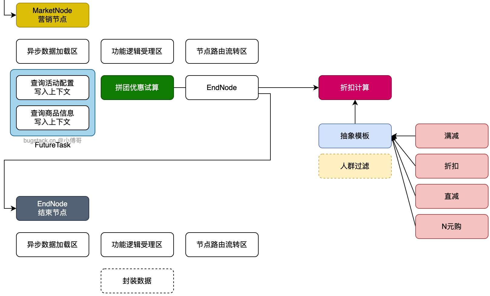

- 首先，MarketNode 节点的数据异步加载工作已经在上一节完成，这一节开始使用这里的数据做折扣计算。
- 之后，折扣是在数据库中配置的，按照类型包括；ZJ - 直减、MJ - 满减、ZK - 折扣、N - n元购。那么这些不同的类型就可以用策略模型进行包装，每个实现类专门负责自己的逻辑计算。

### 三、编码实现

### 1.工程结构

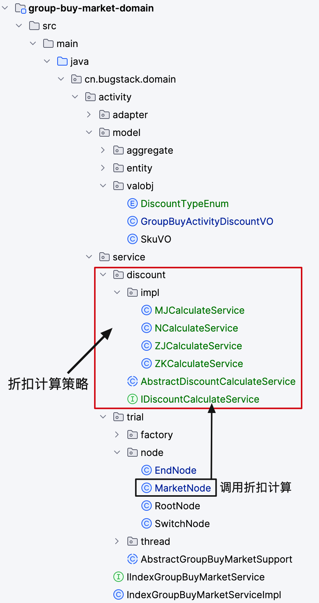

- service 包下，增加 discount 折扣计算包，提供不同类型的折扣计算服务。
- 之后再 MarketNode 节点做逻辑调用。计算完结果后在写上下文，便于最后在 EndNode 节点填充。

### 2.折扣策略

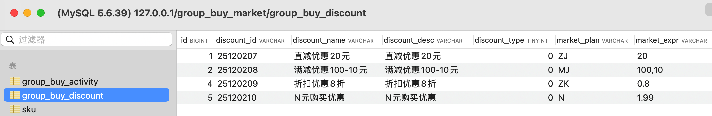

折扣的方式可以有；ZJ、MJ、ZK、N，以及多种方式。这里的 market_expr 是计算的公式，比如 MJ - 满减这样的，就是满100元，减10元。

概念：像是这种营销折扣方式，是一种商家配置无券营销方式，用户是无感知券但可以使用优惠的。另外一种就是有券，用户主动拿到手里的券，自己选择消费方式

#### 2.1 定义接口

```java
public interface IDiscountCalculateService {

    /**
     * 折扣计算
     *
     * @param userId           用户ID
     * @param originalPrice    商品原始价格
     * @param groupBuyDiscount 折扣计划配置
     * @return 商品优惠价格
     */
    BigDecimal calculate(String userId, BigDecimal originalPrice, GroupBuyActivityDiscountVO.GroupBuyDiscount groupBuyDiscount);

}
```

- 定义折扣计算的接口，包括用户ID、商品原始价格、折扣计划配置。
- 用户ID，主要用于后续做人群标签的过滤使用。

#### 2.2 抽象模板

```java
public abstract class AbstractDiscountCalculateService implements IDiscountCalculateService {

    @Override
    public BigDecimal calculate(String userId, BigDecimal originalPrice, GroupBuyActivityDiscountVO.GroupBuyDiscount groupBuyDiscount) {
        // 1. 人群标签过滤
        if (DiscountTypeEnum.TAG.equals(groupBuyDiscount.getDiscountType())){
            boolean isCrowdRange = filterTagId(userId, groupBuyDiscount.getTagId());
            if (!isCrowdRange) return originalPrice;
        }
        // 2. 折扣优惠计算
        return doCalculate(originalPrice, groupBuyDiscount);
    }

    // 人群过滤 - 限定人群优惠
    private boolean filterTagId(String userId, String tagId) {
        // todo xiaofuge 后续开发这部分
        return true;
    }

    protected abstract BigDecimal doCalculate(BigDecimal originalPrice, GroupBuyActivityDiscountVO.GroupBuyDiscount groupBuyDiscount);

}
```

* 定义抽象模板封装计算折扣优惠的执行过程。人群标签部分后续统一处理

#### 2.3 折扣方法

```java
@Slf4j
@Service("MJ")
public class MJCalculateService extends AbstractDiscountCalculateService {

    @Override
    public BigDecimal doCalculate(BigDecimal originalPrice, GroupBuyActivityDiscountVO.GroupBuyDiscount groupBuyDiscount) {
        log.info("优惠策略折扣计算:{}", groupBuyDiscount.getDiscountType().getCode());

        // 折扣表达式 - 100,10 满100减10元
        String marketExpr = groupBuyDiscount.getMarketExpr();
        String[] split = marketExpr.split(Constants.SPLIT);
        BigDecimal x = new BigDecimal(split[0].trim());
        BigDecimal y = new BigDecimal(split[1].trim());

        // 不满足最低满减约束，则按照原价
        if (originalPrice.compareTo(x) < 0) {
            return originalPrice;
        }

        // 折扣价格
        BigDecimal deductionPrice = originalPrice.subtract(y);

        // 判断折扣后金额，最低支付1分钱
        if (deductionPrice.compareTo(BigDecimal.ZERO) <= 0) {
            return new BigDecimal("0.01");
        }

        return deductionPrice;
    }

}
```

- 这里举例其中一个，MJ 的折扣计算。其他的可以参考代码中的实现。
- 满减，拿到折扣的配置表达式，拆分 `100,10`，之后判断商品金额是否满足100元，满足100元则可以减去10元。不过这里要知道，如果商品最终折扣价格不足1分钱，要按照1分钱计算。

### 3. 营销调用

```java
@Slf4j
@Service
public class MarketNode extends AbstractGroupBuyMarketSupport<MarketProductEntity, DefaultActivityStrategyFactory.DynamicContext, TrialBalanceEntity> {

    @Resource
    private ThreadPoolExecutor threadPoolExecutor;
    @Resource
    private EndNode endNode;

    /**
     * <a href="https://bugstack.cn/md/road-map/spring-dependency-injection.html">Spring 注入详细说明</a>
     */
    @Resource
    private Map<String, IDiscountCalculateService> discountCalculateServiceMap;

    @Override
    public TrialBalanceEntity doApply(MarketProductEntity requestParameter, DefaultActivityStrategyFactory.DynamicContext dynamicContext) throws Exception {
        log.info("拼团商品查询试算服务-MarketNode userId:{} requestParameter:{}", requestParameter.getUserId(), JSON.toJSONString(requestParameter));

        GroupBuyActivityDiscountVO groupBuyActivityDiscountVO = dynamicContext.getGroupBuyActivityDiscountVO();
        GroupBuyActivityDiscountVO.GroupBuyDiscount groupBuyDiscount = groupBuyActivityDiscountVO.getGroupBuyDiscount();

        SkuVO skuVO = dynamicContext.getSkuVO();

        IDiscountCalculateService discountCalculateService = discountCalculateServiceMap.get(groupBuyDiscount.getMarketPlan());
        if (null == discountCalculateService) {
            log.info("不存在{}类型的折扣计算服务，支持类型为:{}", groupBuyDiscount.getMarketPlan(), JSON.toJSONString(discountCalculateServiceMap.keySet()));
            throw new AppException(ResponseCode.E0001.getCode(), ResponseCode.E0001.getInfo());
        }

        // 折扣价格
        BigDecimal deductionPrice = discountCalculateService.calculate(requestParameter.getUserId(), skuVO.getOriginalPrice(), groupBuyDiscount);
        dynamicContext.setDeductionPrice(deductionPrice);

        return router(requestParameter, dynamicContext);
    }
    
    // ... 省略部分代码

}
```

- `private Map<String, IDiscountCalculateService> discountCalculateServiceMap;` 是一种 Spring 的Map 注入方式，会根据一个接口把所有的实现类都注入上，之后 Key 是 Bean 的名字。扩展学习；https://bugstack.cn/md/road-map/spring-dependency-injection.html
- 这样我们就可以根据数据库配置的折扣的类型来调用对应的策略，也就把 if...else 这样的判断代码给去掉了。

## [第2-5节：人群标签数据采集](https://wx.zsxq.com/group/48411118851818/topic/5121445114128884)

具体文章：[《拼团交易平台系统》第2-5节：人群标签数据采集](https://articles.zsxq.com/id_zl9c3gz8av14.html)

### 一、本章诉求

以轻量化的方式构建人群标签数据，将人群数据写入到 Redis BitMap 用于后续使用。

在公司中，所有部门产生的业务数据都会回流到数仓，它有一个非常庞大的数据集市系统。之后这些数据会被量化分析师使用，通过 R 语言建模，执行模型任务，把符合模型所需的标签数据跑到一个新的指定表文件中，这些文件在通过加工存放到 Redis BitMap 进行使用。一般一个标签可能会有 50万、100万、500万的数据规模。

有了这些标签数据，运营人员就可以精准的对这些用户做定向活动投放，比如；特定的券、特定的通知等。以此达到更加精准的运营效果。

### 二、业务流程

虽然，我们不能像公司那样有那么大规模的数据量，但我们也可以仅使用拼团商品的数据，做人群标签的实现，让大家了解这样一个场景。

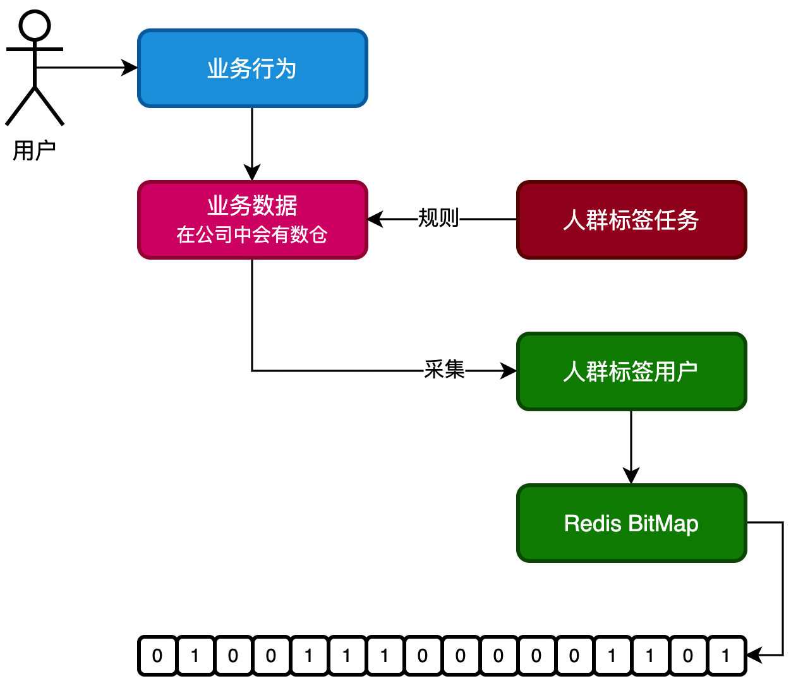

- 首先，人群标签是通过创建的采集任务所产生的数据。任务里包含了要采集业务中什么类型的数据规则。本项目中会采集拼团交易数据，不过本节还没有这类数据，所以先来模拟这部分数据。
- 之后，把采集的数据除了放数据库，还需要写入到 Redis 的 BitMap 中，这个数据结构比较适合高并发场景判断用户是否存在。

### 三、编码实现

- 本节需要新创建出 crowd_tags、crowd_tags_detail、crowd_tags_job 3张库表。你可以课程工程中导入。
- 引入 Redisson 配置，pom引入、app/config 增加配置、infrastructure 增加 Redisson 服务接口和实现类。

```java
<dependency>
    <groupId>org.redisson</groupId>
    <artifactId>redisson-spring-boot-starter</artifactId>
    <version>3.26.0</version>
</dependency>
```

#### 1. 工程结构

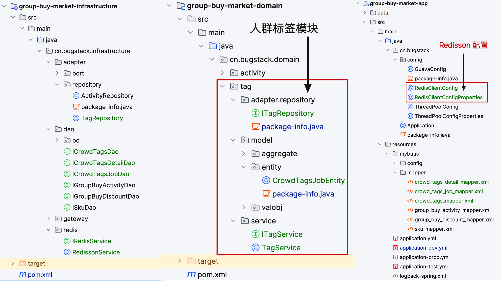

- infrastructure 基础设施层，增加人群标签仓储服务和3个操作人群标签的DAO操作，同时在增加一个 Redisson 操作接口和实现类（你可以直接复制课程的）。
- domain 领域层，增加 tag 人群标签领域，完成人群标签功能实现。
- app 应用启动层，配置 mapper、application-dev.yml、以及 config 下的 Redis 链接配置类。

#### 2. 人群任务

增加人群标签服务接口，并实现功能流程。

```java
@Slf4j
@Service
public class TagService implements ITagService {

    @Resource
    private ITagRepository repository;

    @Override
    public void execTagBatchJob(String tagId, String batchId) {
        log.info("人群标签批次任务 tagId:{} batchId:{}", tagId, batchId);

        // 1. 查询批次任务
        CrowdTagsJobEntity crowdTagsJobEntity = repository.queryCrowdTagsJobEntity(tagId, batchId);

        // 2. 采集用户数据 - 这部分需要采集用户的消费类数据，后续有用户发起拼单后再处理。

        // 3. 数据写入记录
        List<String> userIdList = new ArrayList<String>() {{
            add("xiaofuge");
            add("liergou");
        }};

        // 4. 一般人群标签的处理在公司中，会有专门的数据数仓团队通过脚本方式写入到数据库，就不用这样一个个或者批次来写。
        for (String userId : userIdList) {
            repository.addCrowdTagsUserId(tagId, userId);
        }

        // 5. 更新人群标签统计量
        repository.updateCrowdTagsStatistics(tagId, userIdList.size());
    }

}

```

- 通过采集人群标签任务获取人群数据，暂时没有这类业务数据，所以先模拟一个用户数据，你也可以调整这里的数据为你需要的。
- 采集数据后，`repository.addCrowdTagsUserId(tagId, userId);` 写入到数据库表。注意 addCrowdTagsUserId 方法，写入后还会做 BitMap 存储。
- 这些操作完成后，会更新统计量。注意，目前的统计量更新是不准的，因为执行 addCrowdTagsUserId 操作，会有主键冲突，主键冲突直接拦截不会抛异常。那么更新人群标签的统计量会继续增加。你可以思考下这里要怎么处理，课程后续也会继续处理。

#### 3. 数据存储 - bitmap

```java
@Override
public void addCrowdTagsUserId(String tagId, String userId) {
    CrowdTagsDetail crowdTagsDetailReq = new CrowdTagsDetail();
    crowdTagsDetailReq.setTagId(tagId);
    crowdTagsDetailReq.setUserId(userId);
    try {
        crowdTagsDetailDao.addCrowdTagsUserId(crowdTagsDetailReq);
        // 获取BitSet
        RBitSet bitSet = redisService.getBitSet(tagId);
        bitSet.set(redisService.getIndexFromUserId(userId), true);
    } catch (DuplicateKeyException ignore) {
        // 忽略唯一索引冲突
    }
}
```

- 执行完写库后，开始把数据写入到人群标签。
- 不过注意人群标签的存储不是字符串，所以要转行为长整型进行存放。


## [第2-6节：拆分库表关联关系](https://wx.zsxq.com/group/48411118851818/topic/1525111528411542)

具体文章：[《拼团交易平台系统》第2-6节：拆分库表关联关系](https://articles.zsxq.com/id_695jhwno47z5.html)

### 一、本章诉求

在系统开始之初，简化功能设计，让拼团活动配置表直接耦合商品ID。也就是一个拼团活动，只关联一个商品ID。那么如果现在需要给10个商品，全配置一个相同的拼团活动，就没法配置了。总不能一个个全配置一遍。所以本节要对这块的内容做拆分解耦。

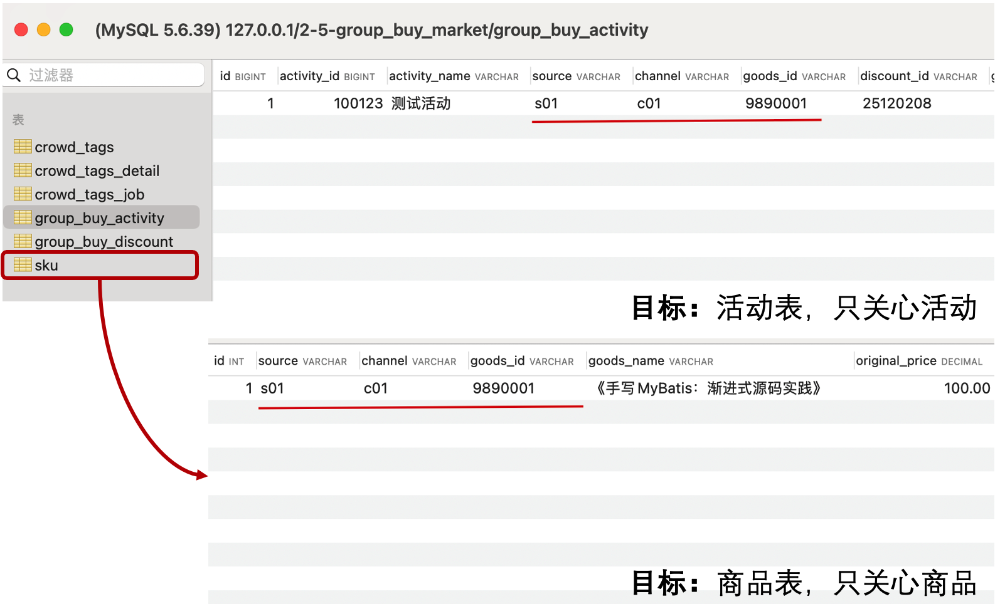

- group_buy_activity 拼团活动配置表中，融合了渠道和商品ID，属于和活动配置绑定了。
- sku 商品信息，已经包含了渠道SC值和商品ID。而商品表咱们前面提到过，它是由接入方同步的商品信息，也可以不走这里，直接用 RPC/HTTP 接口查询数据，所以 sku 表不适合绑定互动ID。
- 那么，就需要一个新的表来关联活动和商品信息配置，表名为 sc_sku_activity 必备字段；SC渠道、活动ID、商品ID。（自己创建库表后可以和课程的库表对比）
- 你可以根据这样的信息来创建你的库表，同时移除 group_buy_activity 表中 SC渠道值和商品ID。

### 二、业务流程

如图，整个改动流程的核心为让 MarketNode 节点的查询由原来方式改为先查询SC商品活动配置关联表，获得到活动ID，再查询活动信息。这期间如果有效的活动配置信息无，那么则走到 ErrorNode 节点，返回一个指定的错误码。

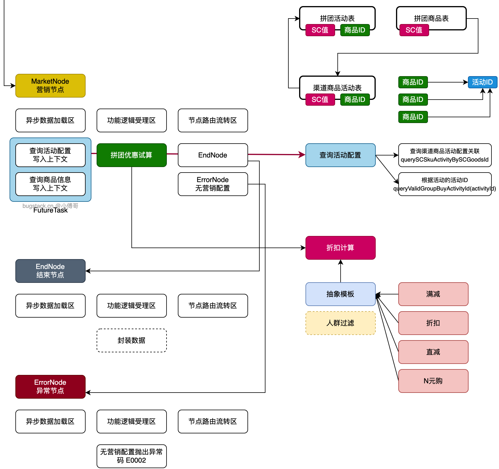

- 首先，你可以先通过如图的调用过程，理解本节要完成的编程动作。包括解耦后的新的库表关联关系。
- 之后，编码的时候异步多线程查询商品关联配置，如果配置的信息为空，或者不存在有效的活动，那么可以返回一个 null。当拿到null 以后，可以做判断进行路由，走到 ErrorNode 节点。「这部分代码一定自己尝试下，多思考。」

### 三、编码实现

#### 1. 工程结构

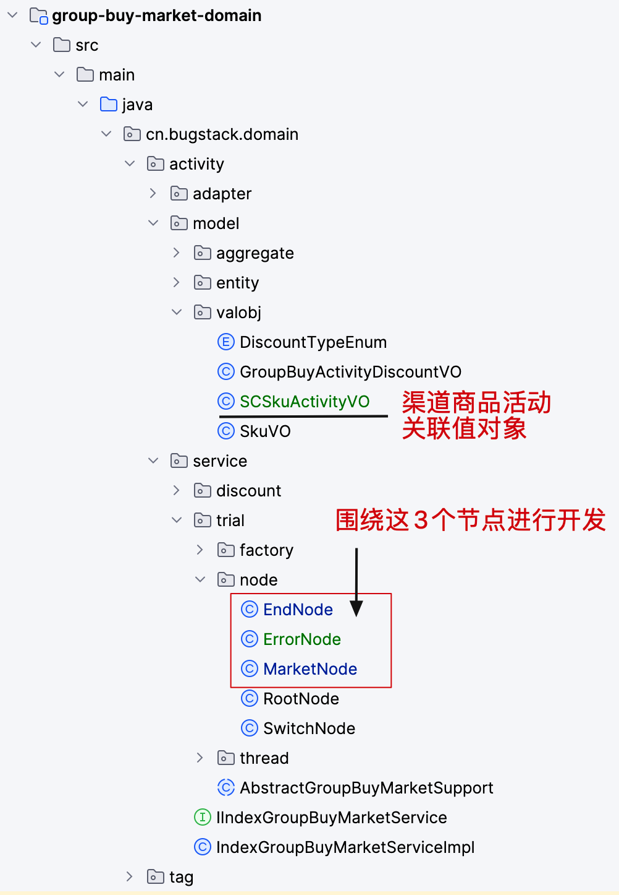

- 功能主要以这3个节点进行开发，会涉及到关于数据库映射 PO、Mapper 的字段调整和新的映射关系添加。
- MarketNode 营销节点查询数据方式调整处理，在 QueryGroupBuyActivityDiscountVOThreadTask 中需要有一个 querySCSkuActivityBySCGoodsId 方法，来查询商品对应的活动配置。
- ErrorNode 节点，主要处理一些异常兜底的逻辑，比如查询不到对应的拼团活动配置，那么就要返回对应的错误码。

#### 2. SC商品渠道DAO

```java
@Mapper
public interface ISCSkuActivityDao {

    SCSkuActivity querySCSkuActivityBySCGoodsId(SCSkuActivity scSkuActivity);

}

<?xml version="1.0" encoding="UTF-8"?>
<!DOCTYPE mapper PUBLIC "-//mybatis.org//DTD Mapper 3.0//EN" "http://mybatis.org/dtd/mybatis-3-mapper.dtd">
<mapper namespace="cn.bugstack.infrastructure.dao.ISCSkuActivityDao">

    <resultMap id="dataMap" type="cn.bugstack.infrastructure.dao.po.SCSkuActivity">
        <id column="id" property="id"/>
        <result column="source" property="source"/>
        <result column="channel" property="channel"/>
        <result column="activity_id" property="activityId"/>
        <result column="goods_id" property="goodsId"/>
        <result column="create_time" property="createTime"/>
        <result column="update_time" property="updateTime"/>
    </resultMap>

    <select id="querySCSkuActivityBySCGoodsId" parameterType="cn.bugstack.infrastructure.dao.po.SCSkuActivity" resultMap="dataMap">
        select source, channel, activity_id, goods_id
        from sc_sku_activity
        where goods_id = #{goodsId}
    </select>

</mapper>
```

* 需要配置新的 DAO 方法，查询渠道商品活动ID配置信息。

#### 3. 修改查询营销配置

```java
public class QueryGroupBuyActivityDiscountVOThreadTask implements Callable<GroupBuyActivityDiscountVO> {

    /**
     * 来源
     */
    private final String source;

    /**
     * 渠道
     */
    private final String channel;

    /**
     * 商品ID
     */
    private final String goodsId;

    /**
     * 活动仓储
     */
    private final IActivityRepository activityRepository;

    public QueryGroupBuyActivityDiscountVOThreadTask(String source, String channel, String goodsId, IActivityRepository activityRepository) {
        this.source = source;
        this.channel = channel;
        this.goodsId = goodsId;
        this.activityRepository = activityRepository;
    }

    @Override
    public GroupBuyActivityDiscountVO call() throws Exception {
        // 查询渠道商品活动配置关联配置
        SCSkuActivityVO scSkuActivityVO = activityRepository.querySCSkuActivityBySCGoodsId(source, channel, goodsId);
        if (null == scSkuActivityVO) return null;
        // 查询活动配置
        return activityRepository.queryGroupBuyActivityDiscountVO(scSkuActivityVO.getActivityId());
    }

}
```

* 需要多增加一个查询 querySCSkuActivityBySCGoodsId 的操作，把对应的这个商品配置的活动ID查询出来。

#### 4. 营销节点路由

```java
public TrialBalanceEntity doApply(MarketProductEntity requestParameter, DefaultActivityStrategyFactory.DynamicContext dynamicContext) throws Exception {
    log.info("拼团商品查询试算服务-MarketNode userId:{} requestParameter:{}", requestParameter.getUserId(), JSON.toJSONString(requestParameter));
    // 获取上下文数据
    GroupBuyActivityDiscountVO groupBuyActivityDiscountVO = dynamicContext.getGroupBuyActivityDiscountVO();
    if (null == groupBuyActivityDiscountVO) {
        return router(requestParameter, dynamicContext);
    }
    GroupBuyActivityDiscountVO.GroupBuyDiscount groupBuyDiscount = groupBuyActivityDiscountVO.getGroupBuyDiscount();
    SkuVO skuVO = dynamicContext.getSkuVO();
    if (null == groupBuyDiscount || null == skuVO) {
        return router(requestParameter, dynamicContext);
    }
  
    // 优惠试算
    IDiscountCalculateService discountCalculateService = discountCalculateServiceMap.get(groupBuyDiscount.getMarketPlan());
    if (null == discountCalculateService) {
        log.info("不存在{}类型的折扣计算服务，支持类型为:{}", groupBuyDiscount.getMarketPlan(), JSON.toJSONString(discountCalculateServiceMap.keySet()));
        throw new AppException(ResponseCode.E0001.getCode(), ResponseCode.E0001.getInfo());
    }
    // 折扣价格
    BigDecimal deductionPrice = discountCalculateService.calculate(requestParameter.getUserId(), skuVO.getOriginalPrice(), groupBuyDiscount);
    dynamicContext.setDeductionPrice(deductionPrice);
    return router(requestParameter, dynamicContext);
}

@Override
public StrategyHandler<MarketProductEntity, DefaultActivityStrategyFactory.DynamicContext, TrialBalanceEntity> get(MarketProductEntity requestParameter, DefaultActivityStrategyFactory.DynamicContext dynamicContext) throws Exception {
    // 不存在配置的拼团活动，走异常节点
    if (null == dynamicContext.getGroupBuyActivityDiscountVO() || null == dynamicContext.getSkuVO()) {
        return errorNode;
    }
    return endNode;
}
```

- 判断 groupBuyActivityDiscountVO、groupBuyDiscount、skuVO，是否为空。如果为空则直接路由走到兜底节点。
- 这个兜底节点就是本节新增加的 ErrorNode 节点。

#### 5. 异常兜底节点

```java
@Slf4j
@Service
public class ErrorNode extends AbstractGroupBuyMarketSupport<MarketProductEntity, DefaultActivityStrategyFactory.DynamicContext, TrialBalanceEntity> {

    @Override
    protected TrialBalanceEntity doApply(MarketProductEntity requestParameter, DefaultActivityStrategyFactory.DynamicContext dynamicContext) throws Exception {
        log.info("拼团商品查询试算服务-NoMarketNode userId:{} requestParameter:{}", requestParameter.getUserId(), JSON.toJSONString(requestParameter));

        // 无营销配置
        if (null == dynamicContext.getGroupBuyActivityDiscountVO() || null == dynamicContext.getSkuVO()) {
            log.info("商品无拼团营销配置 {}", requestParameter.getGoodsId());
            throw new AppException(ResponseCode.E0002.getCode(), ResponseCode.E0002.getInfo());
        }

        return TrialBalanceEntity.builder().build();
    }

    @Override
    public StrategyHandler<MarketProductEntity, DefaultActivityStrategyFactory.DynamicContext, TrialBalanceEntity> get(MarketProductEntity requestParameter, DefaultActivityStrategyFactory.DynamicContext dynamicContext) throws Exception {
        return defaultStrategyHandler;
    }

}
```

* 异常兜底节点可以处理很多异常流程，包括；流程讲解、接口超时等。以及公司中运营配置的活动信息有误，也会走到一个兜底的流程。

## [第2-7节：人群标签节点过滤](https://wx.zsxq.com/group/48411118851818/topic/5121444521251424)

具体文章：[《拼团交易平台系统》第2-7节：人群标签节点过滤](https://articles.zsxq.com/id_21knk4dza0gh.html)

### 一、本章诉求

在整个首页营销试算流程中，需要添加一个新的人群标签🏷节点 TagNode，来处理人群过滤的操作。

在本节你会看到目前的模型结构设计是非常容易添加出一个新的流程节点，同时对原有的功能不会有破坏性。这样既可以让我们更好的维护代码，也能方便持续的需求迭代。

### 二、业务流程

如图，增加 TagNode 节点，调整节点调用关系；

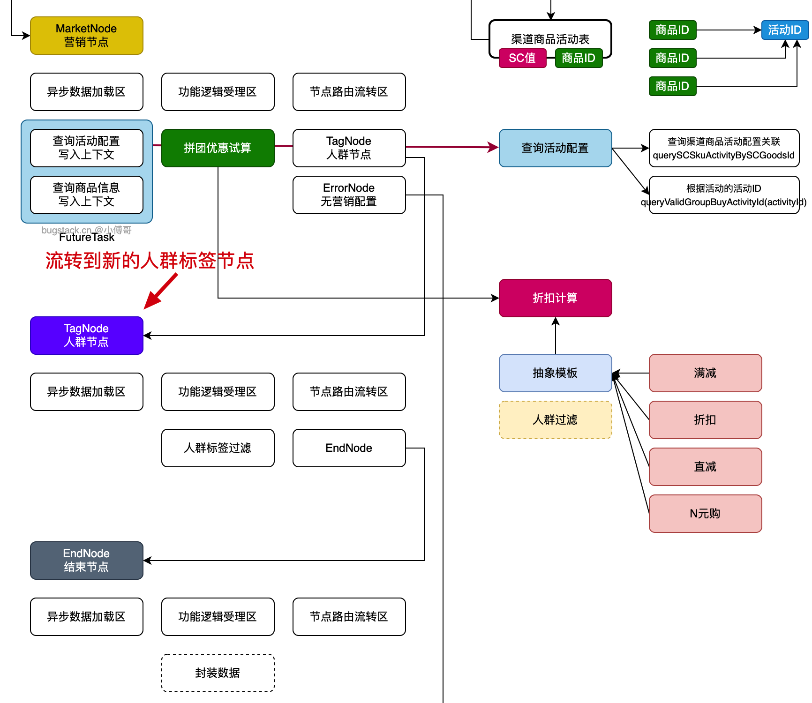

- 首先，添加一个新的 TagNode 节点，调整营销 MarketNode 节点完成业务功能后，流转到新的 TagNode 节点。
- 之后，在从个 TagNode 节点流转到 EndNode 结束节点。

### 三、编码实现

#### 1. 工程结构

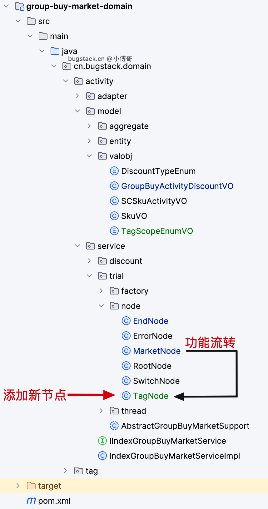

- domain 领域层的 activity 活动领域下，trial 服务下 node 节点中添加 TagNode，之后再从 MarketNode 流转到 TagNode
- TagNode 节点重点处理人群标签的过滤操作。这部分的逻辑功能不多。基本上你到这里可以思考🤔，怎么判断处理。

#### 2. 人群过滤

##### 2.1 库表配置

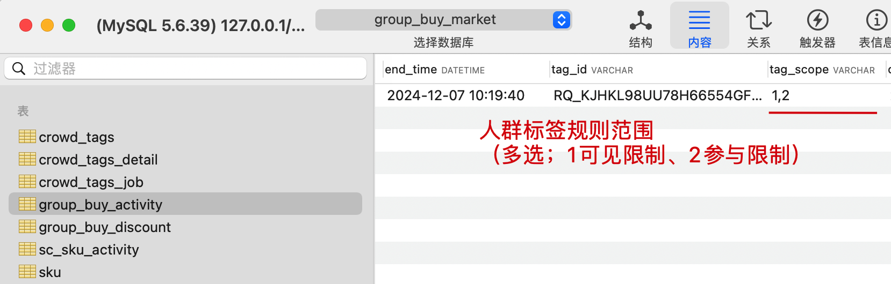

- group_buy_activity 表中 tag_scope 中配置1,2 代表需要过滤人群，限制可见性和参与性。比如这里的配置表示，一个参加活动的用户，如果不再人群范围内，既不允许看见活动，也不允许参与活动。如果只配置2，那么表示通过人群的用户，能看见，但不能参与。
- 那么我们这里就要做人群过滤限制，就要拿到这个1,2值，之后判断处理。

##### 2.2 聚合方法

```java
public class GroupBuyActivityDiscountVO {

    /**
     * 活动ID
     */
    private Long activityId;
    /**
     * 活动名称
     */
    private String activityName;
    /**
     * 来源
     */
    private String source;
    /**
     * 渠道
     */
    private String channel;
    /**
     * 商品ID
     */
    private String goodsId;
    /**
     * 折扣配置
     */
    private GroupBuyDiscount groupBuyDiscount;
    /**
     * 拼团方式（0自动成团、1达成目标拼团）
     */
    private Integer groupType;
    /**
     * 拼团次数限制
     */
    private Integer takeLimitCount;
    /**
     * 拼团目标
     */
    private Integer target;
    /**
     * 拼团时长（分钟）
     */
    private Integer validTime;
    /**
     * 活动状态（0创建、1生效、2过期、3废弃）
     */
    private Integer status;
    /**
     * 活动开始时间
     */
    private Date startTime;
    /**
     * 活动结束时间
     */
    private Date endTime;
    /**
     * 人群标签规则标识
     */
    private String tagId;
    /**
     * 人群标签规则范围
     */
    private String tagScope;

    /**
     * 可见限制
     * 只要存在这样一个值，那么首次获得的默认值就是 false
     */
    public boolean isVisible() {
        String[] split = this.tagScope.split(Constants.SPLIT);
        if (split.length > 0 && Objects.equals(split[0], "1") && StringUtils.isNotBlank(split[0])) {
            return false;
        }
        return true;
    }

    /**
     * 参与限制
     * 只要存在这样一个值，那么首次获得的默认值就是 false
     */
    public boolean isEnable() {
        String[] split = this.tagScope.split(Constants.SPLIT);
        if (split.length == 2 && Objects.equals(split[1], "2") && StringUtils.isNotBlank(split[1])) {
            return false;
        }
        return true;
    }
    
    //... 省略部分代码
}    
```

- 可见限制；方法聚合到到类中，判断是否配置了1。如果配置了，那么默认这个对应的值的结果就是 false，之后在判断是否在人群范围内，如果在人群范围内则为 true。
- 参与限制；方法聚合到到类中，判断是否配置了2。如果配置了，那么默认这个对应的值的结果就是 false，之后在判断是否在人群范围内，如果在人群范围内则为 true。

##### 2.3 代码实现

```java
@Slf4j
@Service
public class TagNode extends AbstractGroupBuyMarketSupport<MarketProductEntity, DefaultActivityStrategyFactory.DynamicContext, TrialBalanceEntity> {

    @Resource
    private EndNode endNode;

    @Override
    protected TrialBalanceEntity doApply(MarketProductEntity requestParameter, DefaultActivityStrategyFactory.DynamicContext dynamicContext) throws Exception {
        // 获取拼团活动配置
        GroupBuyActivityDiscountVO groupBuyActivityDiscountVO = dynamicContext.getGroupBuyActivityDiscountVO();

        String tagId = groupBuyActivityDiscountVO.getTagId();
        boolean visible = groupBuyActivityDiscountVO.isVisible();
        boolean enable = groupBuyActivityDiscountVO.isEnable();

        // 人群标签配置为空，则走默认值
        if (StringUtils.isBlank(tagId)) {
            dynamicContext.setVisible(true);
            dynamicContext.setEnable(true);
            return router(requestParameter, dynamicContext);
        }

        // 是否在人群范围内；visible、enable 如果值为 ture 则表示没有配置拼团限制，那么就直接保证为 true 即可
        boolean isWithin = repository.isTagCrowdRange(tagId, requestParameter.getUserId());
        dynamicContext.setVisible(visible || isWithin);
        dynamicContext.setEnable(enable || isWithin);

        return router(requestParameter, dynamicContext);
    }

    @Override
    public StrategyHandler<MarketProductEntity, DefaultActivityStrategyFactory.DynamicContext, TrialBalanceEntity> get(MarketProductEntity requestParameter, DefaultActivityStrategyFactory.DynamicContext dynamicContext) throws Exception {
        return endNode;
    }

}
```

- 首先，判断 tagId 是否为空，如果为空则访问的可见性和参与性都为 true 即可。
- 之后，过滤人群标签，`isWithin` 为用户是否在人群范围内。`visible || isWithin`、`enable || isWithin` 只要有一个 true 则可以通过。


## [第2-8节：动态配置开关操作](https://wx.zsxq.com/group/48411118851818/topic/5121444811581214)

具体文章：[《拼团交易平台系统》第2-8节：动态配置开关操作](https://articles.zsxq.com/id_g11s9obc01ih.html)

### 一、本章诉求

如何不停车就给汽车换个轮子？

这是互联网应用程序中经常干的事情，在程序运行过程中，直接动态变更某些属性配置。这些动态变更的配置包括降级和切量的开关，也包括一些功能程序的白名单用户测试。

那么对于配置中心，有 SpringCloud Config + Event Bus，也有 Nacos，还有各个大厂中会基于各类组件做的自研实现。那么本节我们先来做一个基于 Redis 发布/订阅处理动态配置的自研的实现，之后对于 SpringCloud 的动态配置变更已经有案例，小伙伴也可以学习。

案例：https://bugstack.cn/md/road-map/springcloud-bus.html

### 二、业务流程

如图，基于 Redis 实现一套动态配置中心 DCC 服务；Dynamic Config Control

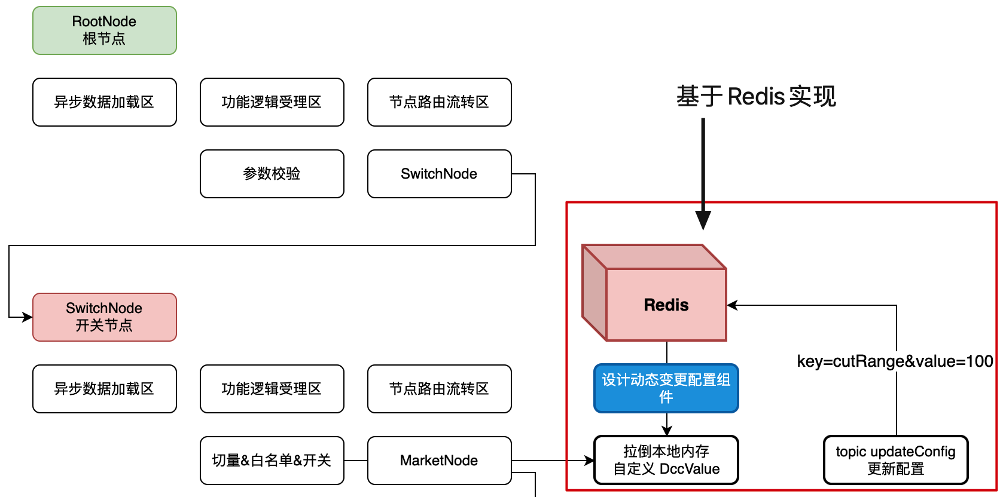

- 注意，本节会涉及到 Spring源码、Java 动态配置的一些编码操作，属于组件类开发是思想。如本节实现的功能也可以被独立出一个工程组件开发后被业务系统引入使用。
- 方案，动态配置的处理可以使用 Zookeeper 的节点监听，也可以基于 Redis 的发布/订阅。本节咱们使用 Redis 这套方案，当你学习到后面的大营销项目，还会看到 Zookeeper 的实现方案。

### 三、编码实现

#### 1. 工程结构

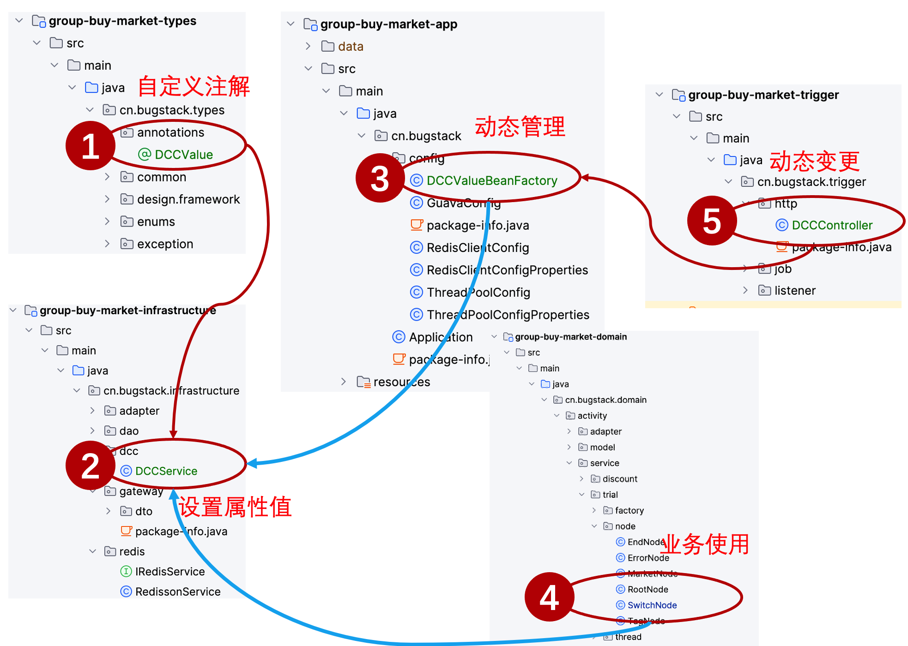

- 步骤1；添加一个自定义注解，用于 Spring 扫描 Bean 对象的时候，可以直接管理这些配置了自定义注解的类的属性。
- 步骤2；给服务类的属性添加自定义注解。
- 步骤3；由 app 模块下的 config，添加一个动态配置管理的工厂🏭，会自动的完成属性信息的填充和动态变更操作。
- 步骤4；业务使用，会调用步骤2中的属性服务。当有配置操作变动的时候，则可以把配置信息直接刷新到内存属性上。
- 步骤5；配置的变更来自于这里，当调用 DCCController 时，会触发 Redis 的发布/订阅，动态值的变更，以此把类上的属性的值做变更。

#### 2. 自定义注解和使用

```java
@Retention(RetentionPolicy.RUNTIME)
@Target({ElementType.FIELD})
@Documented
public @interface DCCValue {

    String value() default "";

}

@Service
public class DCCService {

    /**
     * 降级开关 0关闭、1开启
     */
    @DCCValue("downgradeSwitch:0")
    private String downgradeSwitch;

    @DCCValue("cutRange:100")
    private String cutRange;

    public boolean isDowngradeSwitch() {
        return "1".equals(downgradeSwitch);
    }

    public boolean isCutRange(String userId) {
        // 计算哈希码的绝对值
        int hashCode = Math.abs(userId.hashCode());

        // 获取最后两位
        int lastTwoDigits = hashCode % 100;

        // 判断是否在切量范围内
        if (lastTwoDigits <= Integer.parseInt(cutRange)) {
            return true;
        }

        return false;
    }

}
```

- 首先，我们知道在类中的属性配置的值固定的，配置后一直在程序运行中都是一个值。
- 那么，我们为了可以让程序随着功能的验证，可以动态的调整这些属性的值，就需要引入一些手段，这些手段的目的就是可以动态调整属性值。问：Java 中怎么通过反射来处理属性值的变更。现在的八股，有时候就是以场景提问，考察你是否使用过。

#### 3. 动态变更属性值

```java
@Slf4j
@Configuration
public class DCCValueBeanFactory implements BeanPostProcessor {

    private static final String BASE_CONFIG_PATH = "group_buy_market_dcc_";

    private final RedissonClient redissonClient;

    private final Map<String, Object> dccObjGroup = new HashMap<>();

    public DCCValueBeanFactory(RedissonClient redissonClient) {
        this.redissonClient = redissonClient;
    }

    @Bean("dccTopic")
    public RTopic testRedisTopicListener(RedissonClient redissonClient) {
        RTopic topic = redissonClient.getTopic("group_buy_market_dcc");
        topic.addListener(String.class, (charSequence, s) -> {
            String[] split = s.split(Constants.SPLIT);

            // 获取值
            String attribute = split[0];
            String key = BASE_CONFIG_PATH + attribute;
            String value = split[1];

            // 设置值
            RBucket<String> bucket = redissonClient.getBucket(key);
            boolean exists = bucket.isExists();
            if (!exists) return;
            bucket.set(value);

            Object objBean = dccObjGroup.get(key);
            if (null == objBean) return;

            Class<?> objBeanClass = objBean.getClass();
            // 检查 objBean 是否是代理对象
            if (AopUtils.isAopProxy(objBean)) {
                // 获取代理对象的目标对象
                objBeanClass = AopUtils.getTargetClass(objBean);
            }

            try {
                // 1. getDeclaredField 方法用于获取指定类中声明的所有字段，包括私有字段、受保护字段和公共字段。
                // 2. getField 方法用于获取指定类中的公共字段，即只能获取到公共访问修饰符（public）的字段。
                Field field = objBeanClass.getDeclaredField(attribute);
                field.setAccessible(true);
                field.set(objBean, value);
                field.setAccessible(false);

                log.info("DCC 节点监听，动态设置值 {} {}", key, value);
            } catch (Exception e) {
                throw new RuntimeException(e);
            }
        });
        return topic;
    }

    @Override
    public Object postProcessAfterInitialization(Object bean, String beanName) throws BeansException {
        // 注意；增加 AOP 代理后，获得类的方式要通过 AopProxyUtils.getTargetClass(bean); 不能直接 bean.class 因为代理后类的结构发生变化，这样不能获得到自己的自定义注解了。
        Class<?> targetBeanClass = bean.getClass();
        Object targetBeanObject = bean;
        if (AopUtils.isAopProxy(bean)) {
            targetBeanClass = AopUtils.getTargetClass(bean);
            targetBeanObject = AopProxyUtils.getSingletonTarget(bean);
        }

        Field[] fields = targetBeanClass.getDeclaredFields();
        for (Field field : fields) {
            if (!field.isAnnotationPresent(DCCValue.class)) {
                continue;
            }

            DCCValue dccValue = field.getAnnotation(DCCValue.class);

            String value = dccValue.value();
            if (StringUtils.isBlank(value)) {
                throw new RuntimeException(field.getName() + " @DCCValue is not config value config case 「isSwitch/isSwitch:1」");
            }

            String[] splits = value.split(":");
            String key = BASE_CONFIG_PATH.concat(splits[0]);
            String defaultValue = splits.length == 2 ? splits[1] : null;

            // 设置值
            String setValue = defaultValue;

            try {
                // 如果为空则抛出异常
                if (StringUtils.isBlank(defaultValue)) {
                    throw new RuntimeException("dcc config error " + key + " is not null - 请配置默认值！");
                }

                // Redis 操作，判断配置Key是否存在，不存在则创建，存在则获取最新值
                RBucket<String> bucket = redissonClient.getBucket(key);
                boolean exists = bucket.isExists();
                if (!exists) {
                    bucket.set(defaultValue);
                } else {
                    setValue = bucket.get();
                }

                field.setAccessible(true);
                field.set(targetBeanObject, setValue);
                field.setAccessible(false);
            } catch (Exception e) {
                throw new RuntimeException(e);
            }

            dccObjGroup.put(key, targetBeanObject);
        }

        return bean;
    }

}
```

- DCCValueBeanFactory 实现了 BeanPostProcessor，这样我们就可以拿到 Spring 所有实例化后的 Bean 对象。*Spring 是扫描你所工程下所有的 Bean 对象，加载到它的容器里管理。*
- `postProcessAfterInitialization` 扫描所有的 Bean 对象，之后检查哪个类的属性加有 `@DCCValue` 注解，检测到后进行管理操作。
- `@DCCValue("downgradeSwitch:0")` 解析自定义注解配置值，一个是key，一个是默认的值。之后会从 redis 获取值，如果没有则走默认值。
- `testRedisTopicListener` 是一个监听 redis 发布/订阅消息的处理，之后动态设置 Redis 值，完事后更新类中 Redis 的属性值。

#### 4. 开关节点使用

```java
@Service
public class SwitchNode extends AbstractGroupBuyMarketSupport<MarketProductEntity, DefaultActivityStrategyFactory.DynamicContext, TrialBalanceEntity> {

    @Resource
    private MarketNode marketNode;

    @Override
    public TrialBalanceEntity doApply(MarketProductEntity requestParameter, DefaultActivityStrategyFactory.DynamicContext dynamicContext) throws Exception {
        log.info("拼团商品查询试算服务-SwitchNode userId:{} requestParameter:{}", requestParameter.getUserId(), JSON.toJSONString(requestParameter));

        // 根据用户ID切量
        String userId = requestParameter.getUserId();

        // 判断是否降级
        if (repository.downgradeSwitch()) {
            log.info("拼团活动降级拦截 {}", userId);
            throw new AppException(ResponseCode.E0003.getCode(), ResponseCode.E0003.getInfo());
        }

        // 切量范围判断
        if (!repository.cutRange(userId)) {
            log.info("拼团活动切量拦截 {}", userId);
            throw new AppException(ResponseCode.E0004.getCode(), ResponseCode.E0004.getInfo());
        }

        return router(requestParameter, dynamicContext);
    }

    @Override
    public StrategyHandler<MarketProductEntity, DefaultActivityStrategyFactory.DynamicContext, TrialBalanceEntity> get(MarketProductEntity requestParameter, DefaultActivityStrategyFactory.DynamicContext dynamicContext) throws Exception {
        return marketNode;
    }

}
```

- 进入开关节点，通过仓储 repository 获取对应的值。
- repository.downgradeSwitch() 判断是否降级。
- repository.cutRange(userId) 通过用户ID的哈希值最后2位，判断是否在100范围内，以此做切量处理。


## [第2-9节：拼团交易营销锁单](https://wx.zsxq.com/group/48411118851818/topic/5121482815558814)

具体文章：[《拼团交易平台系统》第2-9节：拼团交易营销锁单](https://articles.zsxq.com/id_ek2pwwbf3mx5.html)

### 一、本章诉求

当商城类系统接入拼团时，则需要在下单过程中使用一笔营销优惠。这里的营销优惠可以为；无券平台营销、有券消费营销、拼团折扣营销、积分抵扣营销等。

那么，当商城类系统接入使用下单时，则需要到拼团系统锁定一笔优惠，也就是占用一个名额。完事后，商城类系统继续操作支付交易的过程。

### 二、业务流程

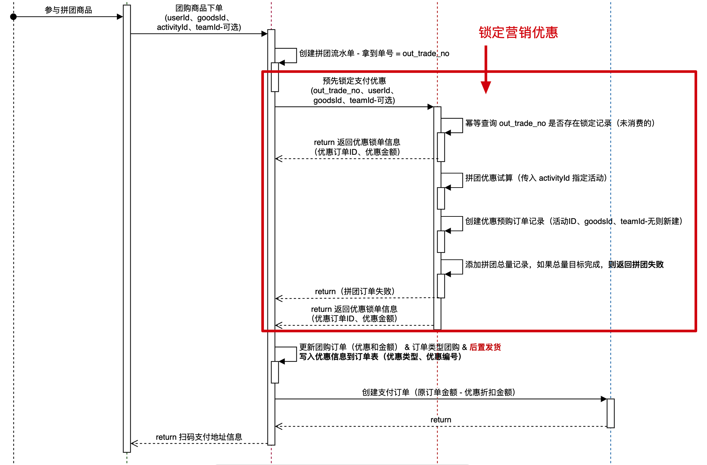

- 首先，团购的商品下单。下单过程分为创建流水单、锁定营销优惠（拼团、积分、券）、创建支付订单、唤起收银台支付、用户扫码支付、支付完成核销优惠等。
- 那么，这里用户以拼团方式下单，创建流水单完成后，需要与拼团系统交互，锁定营销优惠。更新流水单优惠金额和支付金额。接下来就可以创建支付单了（支付单需要最终的支付金额）。
- 注意，拼团表 group_buy_order 除了有目标量（target_count）、完成量（complete），还要有一个锁单量（lock_count），当锁单量达到目标量后，用户在此组织下，不能在参与拼团。直至这些用户支付完成达成拼团或者锁单超时回退支付营销，空出可参与锁单量，这样其他用户可以继续参与。

### 三、编程实现

#### 1. 工程结构

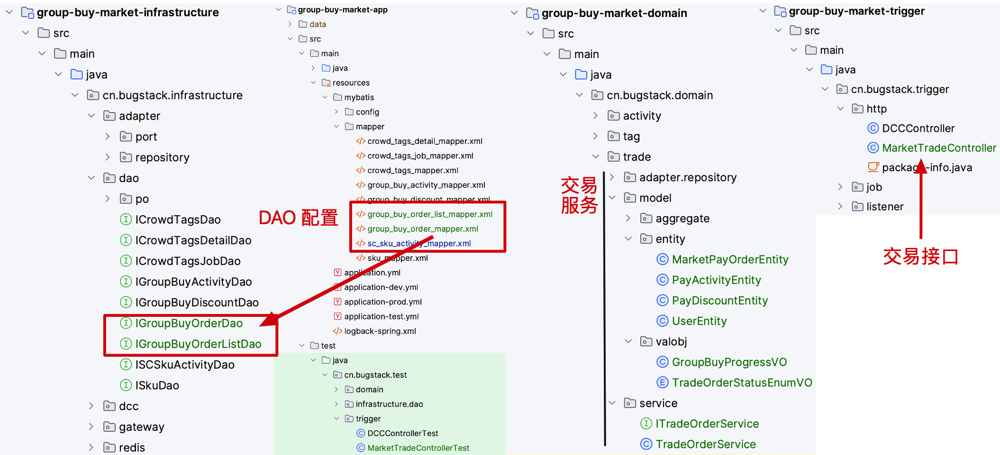

- 步骤1；添加数据库DAO配置，拼团订单、拼团明细操作。之后交给 repository 仓储使用。
- 步骤2；domain 领域层实现交易订单服务，创建拼团锁单操作，以及查询。
- 步骤3；trigger 层提供拼团交易接口服务，这里会串联 activity、trade 两个领域服务。目前的 trigger 替代了一部分 case 层的编排操作，如果是较大规模的系统，则可以单独提供一个 case 层。

#### 2. 库表更新

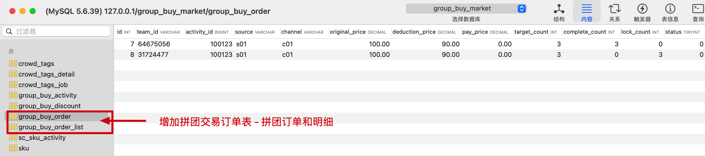

- 首先，新增加两张表；group_buy_order、group_buy_order_list 你可以从工程下 docs/dev-ops/mysq/sql 更新即可。
- 注意，库表设计中，添加了 team_id、lock_count，以及做了细化的处理。如果你前面学习库表设计，之后有了深入的理解，那么对这样的设计会有更深的理解。

#### 3. 基础操作

```java
@Mapper
public interface IGroupBuyOrderDao {

    void insert(GroupBuyOrder groupBuyOrder);

    int updateAddLockCount(String teamId);

    int updateSubtractionLockCount(String teamId);

    GroupBuyOrder queryGroupBuyProgress(String teamId);

}

@Mapper
public interface IGroupBuyOrderListDao {

    void insert(GroupBuyOrderList groupBuyOrderListReq);

    GroupBuyOrderList queryGroupBuyOrderRecordByOutTradeNo(GroupBuyOrderList groupBuyOrderListReq);

}
```

给2个新表提供新的 DAO 操作；

- IGroupBuyOrderDao 插入数据、更新锁单量、查询进度。
- IGroupBuyOrderListDao 插入拼单明细、查询交易记录。

#### 4. 交易订单

```java
@Slf4j
@Service
public class TradeOrderService implements ITradeOrderService {

    @Resource
    private ITradeRepository repository;

    @Override
    public MarketPayOrderEntity queryNoPayMarketPayOrderByOutTradeNo(String userId, String outTradeNo) {
        log.info("拼团交易-查询未支付营销订单:{} outTradeNo:{}", userId, outTradeNo);
        return repository.queryMarketPayOrderEntityByOutTradeNo(userId, outTradeNo);
    }

    @Override
    public GroupBuyProgressVO queryGroupBuyProgress(String teamId) {
        log.info("拼团交易-查询拼单进度:{}", teamId);
        return repository.queryGroupBuyProgress(teamId);
    }

    @Override
    public MarketPayOrderEntity lockMarketPayOrder(UserEntity userEntity, PayActivityEntity payActivityEntity, PayDiscountEntity payDiscountEntity) {
        log.info("拼团交易-锁定营销优惠支付订单:{} activityId:{} goodsId:{}", userEntity.getUserId(), payActivityEntity.getActivityId(), payDiscountEntity.getGoodsId());

        // 构建聚合对象
        GroupBuyOrderAggregate groupBuyOrderAggregate = GroupBuyOrderAggregate.builder()
                .userEntity(userEntity)
                .payActivityEntity(payActivityEntity)
                .payDiscountEntity(payDiscountEntity)
                .build();

        // 锁定聚合订单 - 这会用户只是下单还没有支付。后续会有2个流程；支付成功、超时未支付（回退）
        return repository.lockMarketPayOrder(groupBuyOrderAggregate);
    }

}
```

- 在交易订单中提供查询，包括；未支付营销订单、查询拼单进度和锁定营销优惠支付订单。
- 在 lockMarketPayOrder 有数据库事务操作。

```java
@Transactional(timeout = 500)
@Override
public MarketPayOrderEntity lockMarketPayOrder(GroupBuyOrderAggregate groupBuyOrderAggregate) {
    // 聚合对象信息
    UserEntity userEntity = groupBuyOrderAggregate.getUserEntity();
    PayActivityEntity payActivityEntity = groupBuyOrderAggregate.getPayActivityEntity();
    PayDiscountEntity payDiscountEntity = groupBuyOrderAggregate.getPayDiscountEntity();
    // 判断是否有团 - teamId 为空 - 新团、为不空 - 老团
    String teamId = payActivityEntity.getTeamId();
    if (StringUtils.isBlank(teamId)) {
        // 使用 RandomStringUtils.randomNumeric 替代公司里使用的雪花算法UUID
        teamId = RandomStringUtils.randomNumeric(8);
        // 构建拼团订单
        GroupBuyOrder groupBuyOrder = GroupBuyOrder.builder()
                .teamId(teamId)
                .activityId(payActivityEntity.getActivityId())
                .source(payDiscountEntity.getSource())
                .channel(payDiscountEntity.getChannel())
                .originalPrice(payDiscountEntity.getOriginalPrice())
                .deductionPrice(payDiscountEntity.getDeductionPrice())
                .payPrice(payDiscountEntity.getDeductionPrice().subtract(payDiscountEntity.getDeductionPrice()))
                .targetCount(payActivityEntity.getTargetCount())
                .completeCount(0)
                .lockCount(1)
                .build();
        // 写入记录
        groupBuyOrderDao.insert(groupBuyOrder);
    } else {
        // 更新记录 - 如果更新记录不等于1，则表示拼团已满，抛出异常
        int updateAddTargetCount = groupBuyOrderDao.updateAddLockCount(teamId);
        if (1 != updateAddTargetCount) {
            throw new AppException(ResponseCode.E0005);
        }
    }
    // 使用 RandomStringUtils.randomNumeric 替代公司里使用的雪花算法UUID
    String orderId = RandomStringUtils.randomNumeric(12);
    GroupBuyOrderList groupBuyOrderListReq = GroupBuyOrderList.builder()
            .userId(userEntity.getUserId())
            .teamId(teamId)
            .orderId(orderId)
            .activityId(payActivityEntity.getActivityId())
            .startTime(payActivityEntity.getStartTime())
            .endTime(payActivityEntity.getEndTime())
            .goodsId(payDiscountEntity.getGoodsId())
            .source(payDiscountEntity.getSource())
            .channel(payDiscountEntity.getChannel())
            .originalPrice(payDiscountEntity.getDeductionPrice())
            .deductionPrice(payDiscountEntity.getDeductionPrice())
            .status(TradeOrderStatusEnumVO.CREATE.getCode())
            .outTradeNo(payDiscountEntity.getOutTradeNo())
            .build();
    try {
        // 写入拼团记录
        groupBuyOrderListDao.insert(groupBuyOrderListReq);
    } catch (DuplicateKeyException e) {
        throw new AppException(ResponseCode.INDEX_EXCEPTION);
    }
    return MarketPayOrderEntity.builder()
            .orderId(orderId)
            .deductionPrice(payDiscountEntity.getDeductionPrice())
            .tradeOrderStatusEnumVO(TradeOrderStatusEnumVO.CREATE)
            .build();
}
```

* group_buy_order、group_buy_order_list，两个库表一个写入记录，一个更新记录。需要在一个事务中完成操作。

#### 5. 服务接口

```java
@Slf4j
@RestController()
@CrossOrigin("*")
@RequestMapping("/api/v1/gbm/trade/")
public class MarketTradeController implements IMarketTradeService {

    @Resource
    private IIndexGroupBuyMarketService indexGroupBuyMarketService;

    @Resource
    private ITradeOrderService tradeOrderService;

    @Override
    public Response<LockMarketPayOrderResponseDTO> lockMarketPayOrder(LockMarketPayOrderRequestDTO lockMarketPayOrderRequestDTO) {
        try {
            // 参数
            String userId = lockMarketPayOrderRequestDTO.getUserId();
            String source = lockMarketPayOrderRequestDTO.getSource();
            String channel = lockMarketPayOrderRequestDTO.getChannel();
            String goodsId = lockMarketPayOrderRequestDTO.getGoodsId();
            Long activityId = lockMarketPayOrderRequestDTO.getActivityId();
            String outTradeNo = lockMarketPayOrderRequestDTO.getOutTradeNo();
            String teamId = lockMarketPayOrderRequestDTO.getTeamId();

            log.info("营销交易锁单:{} LockMarketPayOrderRequestDTO:{}", userId, JSON.toJSONString(lockMarketPayOrderRequestDTO));

            if (StringUtils.isBlank(userId) || StringUtils.isBlank(source) || StringUtils.isBlank(channel) || StringUtils.isBlank(goodsId) || StringUtils.isBlank(goodsId) || null == activityId) {
                return Response.<LockMarketPayOrderResponseDTO>builder()
                        .code(ResponseCode.ILLEGAL_PARAMETER.getCode())
                        .info(ResponseCode.ILLEGAL_PARAMETER.getInfo())
                        .build();
            }

            // 查询 outTradeNo 是否已经存在交易记录
            MarketPayOrderEntity marketPayOrderEntity = tradeOrderService.queryNoPayMarketPayOrderByOutTradeNo(userId, outTradeNo);
            if (null != marketPayOrderEntity) {
                LockMarketPayOrderResponseDTO lockMarketPayOrderResponseDTO = LockMarketPayOrderResponseDTO.builder()
                        .orderId(marketPayOrderEntity.getOrderId())
                        .deductionPrice(marketPayOrderEntity.getDeductionPrice())
                        .tradeOrderStatus(marketPayOrderEntity.getTradeOrderStatusEnumVO().getCode())
                        .build();

                log.info("交易锁单记录(存在):{} marketPayOrderEntity:{}", userId, JSON.toJSONString(marketPayOrderEntity));
                return Response.<LockMarketPayOrderResponseDTO>builder()
                        .code(ResponseCode.SUCCESS.getCode())
                        .info(ResponseCode.SUCCESS.getInfo())
                        .data(lockMarketPayOrderResponseDTO)
                        .build();
            }

            // 判断拼团是否完成了目标
            if (null != teamId) {
                GroupBuyProgressVO groupBuyProgressVO = tradeOrderService.queryGroupBuyProgress(teamId);
                if (null != groupBuyProgressVO && Objects.equals(groupBuyProgressVO.getTargetCount(), groupBuyProgressVO.getLockCount())) {
                    log.info("交易锁单拦截-拼单目标已达成:{} {}", userId, teamId);
                    return Response.<LockMarketPayOrderResponseDTO>builder()
                            .code(ResponseCode.E0006.getCode())
                            .info(ResponseCode.E0006.getInfo())
                            .build();
                }
            }

            // 营销优惠试算
            TrialBalanceEntity trialBalanceEntity = indexGroupBuyMarketService.indexMarketTrial(MarketProductEntity.builder()
                    .userId(userId)
                    .source(source)
                    .channel(channel)
                    .goodsId(goodsId)
                    .activityId(activityId)
                    .build());

            GroupBuyActivityDiscountVO groupBuyActivityDiscountVO = trialBalanceEntity.getGroupBuyActivityDiscountVO();

            // 锁单
            marketPayOrderEntity = tradeOrderService.lockMarketPayOrder(
                    UserEntity.builder().userId(userId).build(),
                    PayActivityEntity.builder()
                            .teamId(teamId)
                            .activityId(activityId)
                            .activityName(groupBuyActivityDiscountVO.getActivityName())
                            .startTime(groupBuyActivityDiscountVO.getStartTime())
                            .endTime(groupBuyActivityDiscountVO.getEndTime())
                            .targetCount(groupBuyActivityDiscountVO.getTarget())
                            .build(),
                    PayDiscountEntity.builder()
                            .source(source)
                            .channel(channel)
                            .goodsId(goodsId)
                            .goodsName(trialBalanceEntity.getGoodsName())
                            .originalPrice(trialBalanceEntity.getOriginalPrice())
                            .deductionPrice(trialBalanceEntity.getDeductionPrice())
                            .outTradeNo(outTradeNo)
                            .build());

            log.info("交易锁单记录(新):{} marketPayOrderEntity:{}", userId, JSON.toJSONString(marketPayOrderEntity));

            // 返回结果
            return Response.<LockMarketPayOrderResponseDTO>builder()
                    .code(ResponseCode.SUCCESS.getCode())
                    .info(ResponseCode.SUCCESS.getInfo())
                    .data(LockMarketPayOrderResponseDTO.builder()
                            .orderId(marketPayOrderEntity.getOrderId())
                            .deductionPrice(marketPayOrderEntity.getDeductionPrice())
                            .tradeOrderStatus(marketPayOrderEntity.getTradeOrderStatusEnumVO().getCode())
                            .build())
                    .build();
        } catch (AppException e) {
            log.error("营销交易锁单业务异常:{} LockMarketPayOrderRequestDTO:{}", lockMarketPayOrderRequestDTO.getUserId(), JSON.toJSONString(lockMarketPayOrderRequestDTO), e);
            return Response.<LockMarketPayOrderResponseDTO>builder()
                    .code(e.getCode())
                    .info(e.getInfo())
                    .build();
        } catch (Exception e) {
            log.error("营销交易锁单服务失败:{} LockMarketPayOrderRequestDTO:{}", lockMarketPayOrderRequestDTO.getUserId(), JSON.toJSONString(lockMarketPayOrderRequestDTO), e);
            return Response.<LockMarketPayOrderResponseDTO>builder()
                    .code(ResponseCode.UN_ERROR.getCode())
                    .info(ResponseCode.UN_ERROR.getInfo())
                    .build();
        }
    }

}
```

- 首先，需要查询外部交易 outTradeNo 是否存在交易记录。如果存在未完成的订单，直接返回结果即可。这个是幂等的一个防护。如果不查询，最终也是会有数据库唯一索引拦截。
- 之后，判断拼团锁单是否完成目标量，如果已经完成了目标量则直接直接返回，让用户不能参与当前拼团。一般在并发情况下，如果多人选择一个拼团，那么查询拼团量可以有效拦截。如果没有拦截，最终访问数据，也会有数量判断拦截。注意这里会有数据库表的行级锁，如果tps量大，那么则需要加入 redis 操作库存量。
- 之后，开始做营销优惠试算。判断当前商品在拼团下应该优惠多少。确认完优惠后，开始锁单。最终返回给用户到界面展示，用户确认了支付所用到的营销优惠，那么在点击确认支付跳转收银台扫码支付即可。


## [第2-10节：责任链抽象模板设计](https://wx.zsxq.com/group/48411118851818/topic/2858155158111451)

具体文章：[《拼团交易平台系统》第2-10节：责任链抽象模板设计](https://articles.zsxq.com/id_o7tll9alwbnx.html)

### 一、本章诉求

在拼团交易的下单锁定优惠的过程中，以及后续的流程，都会有简单的规则串联。所以，我们先来提前做好通用的责任链模型结构，便于后续使用。

本节会涉及到链表的基础数据结构知识，可以提前补充学习；https://bugstack.cn/md/algorithm/data-structures/2022-07-22-linked-list.html

### 二、模型设计

责任链是一种简单的单链路结构，在工程中会有多个这样的单链，为了可以让不同的场景都能创建出自己的链，则需要解耦责任链的链路和执行，再有执行器处理。在本次实现中小傅哥会给大家体统两种责任链，让大家对照学习。设计如图；

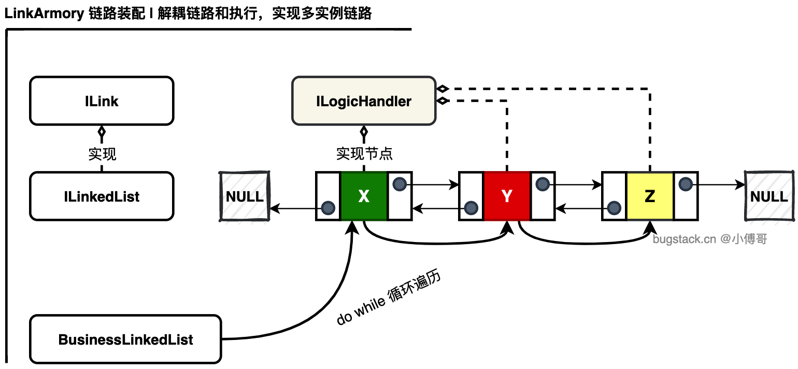

- 如图，这是一种多实例对象责任链的设计结构，会使用到如 Java JDK 源码中 Link 的方式填写链路，之后再有业务链路处理链路执行。而每一个链路都会被填充一个逻辑处理器的实现类（ILogicHandler）来处理具体的业务。
- 那么，这样就很好的扩展了各种链路的使用诉求。我们可以结合代码来学习。

### 三、编码实现

#### 1. 工程结构

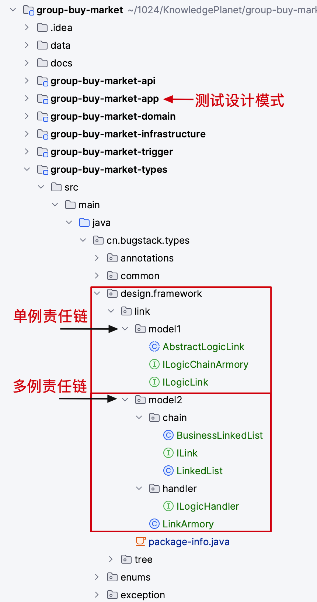

- 在 types -> design，提供 link 责任链。model1、model2
- model1，是通用的单例链，本身抽象类既可添加链路节点，又能做链路过程执行处理。
- model2，拆分了责任链和执行处理器，并由 LinkArmory 进行装配。这样就可以填充多例链。

#### 2. 单例链路

这是一套简单的单例链处理；

```java
public interface ILogicChainArmory<T, D, R> {

    ILogicLink<T, D, R> next();

    ILogicLink<T, D, R> appendNext(ILogicLink<T, D, R> next);

}

public interface ILogicLink<T, D, R> extends ILogicChainArmory<T, D, R> {

    R apply(T requestParameter, D dynamicContext) throws Exception;

}

public abstract class AbstractLogicLink<T, D, R> implements ILogicLink<T, D, R> {

    private ILogicLink<T, D, R> next;

    @Override
    public ILogicLink<T, D, R> next() {
        return next;
    }

    @Override
    public ILogicLink<T, D, R> appendNext(ILogicLink<T, D, R> next) {
        this.next = next;
        return next;
    }

    protected R next(T requestParameter, D dynamicContext) throws Exception {
        return next.apply(requestParameter, dynamicContext);
    }

}
```

- 
  ILogicChainArmory 装配链，提供添加节点方法和获取节点。
- ILogicLink 继承 ILogicChainArmory，并提供一个受理业务逻辑的方法。
- AbstractLogicLink 的过程是封装添加节点和执行 next 下一个节点的方法。

那么，这里是由统一的类维护责任链，也就是一份责任链。如果有2个独立的链要处理，就需要使用到非单例的类进行填充，否则会修改同一份链。也就是 `ILogicLink<T, D, R> next `被几份链反复调整，也就不是一个单独的链了。

#### 3. 多例链路

多例链的设计要解耦链路和执行，把链路当做一个 LinkedList 列表处理，之后执行当做是单独的 for 循环。

##### 3.1 链表接口

```java
public interface ILink<E> {

    boolean add(E e);

    boolean addFirst(E e);

    boolean addLast(E e);

    boolean remove(Object o);

    E get(int index);

    void printLinkList();

}
```

##### 3.2 链表实现

```java
public class LinkedList<E> implements ILink<E> {

    /**
     * 责任链名称
     */
    private final String name;

    transient int size = 0;

    transient Node<E> first;

    transient Node<E> last;

    public LinkedList(String name) {
        this.name = name;
    }

    void linkFirst(E e) {
        final Node<E> f = first;
        final Node<E> newNode = new Node<>(null, e, f);
        first = newNode;
        if (f == null)
            last = newNode;
        else
            f.prev = newNode;
        size++;
    }

    void linkLast(E e) {
        final Node<E> l = last;
        final Node<E> newNode = new Node<>(l, e, null);
        last = newNode;
        if (l == null) {
            first = newNode;
        } else {
            l.next = newNode;
        }
        size++;
    }

    @Override
    public boolean add(E e) {
        linkLast(e);
        return true;
    }

    @Override
    public boolean addFirst(E e) {
        linkFirst(e);
        return true;
    }

    @Override
    public boolean addLast(E e) {
        linkLast(e);
        return true;
    }

    @Override
    public boolean remove(Object o) {
        if (o == null) {
            for (Node<E> x = first; x != null; x = x.next) {
                if (x.item == null) {
                    unlink(x);
                    return true;
                }
            }
        } else {
            for (Node<E> x = first; x != null; x = x.next) {
                if (o.equals(x.item)) {
                    unlink(x);
                    return true;
                }
            }
        }
        return false;
    }

    E unlink(Node<E> x) {
        final E element = x.item;
        final Node<E> next = x.next;
        final Node<E> prev = x.prev;

        if (prev == null) {
            first = next;
        } else {
            prev.next = next;
            x.prev = null;
        }

        if (next == null) {
            last = prev;
        } else {
            next.prev = prev;
            x.next = null;
        }

        x.item = null;
        size--;
        return element;
    }

    @Override
    public E get(int index) {
        return node(index).item;
    }

    Node<E> node(int index) {
        if (index < (size >> 1)) {
            Node<E> x = first;
            for (int i = 0; i < index; i++)
                x = x.next;
            return x;
        } else {
            Node<E> x = last;
            for (int i = size - 1; i > index; i--)
                x = x.prev;
            return x;
        }
    }

    public void printLinkList() {
        if (this.size == 0) {
            System.out.println("链表为空");
        } else {
            Node<E> temp = first;
            System.out.print("目前的列表，头节点：" + first.item + " 尾节点：" + last.item + " 整体：");
            while (temp != null) {
                System.out.print(temp.item + "，");
                temp = temp.next;
            }
            System.out.println();
        }
    }

    protected static class Node<E> {

        E item;
        Node<E> next;
        Node<E> prev;

        public Node(Node<E> prev, E element, Node<E> next) {
            this.item = element;
            this.next = next;
            this.prev = prev;
        }

    }

    public String getName() {
        return name;
    }

}
```

这部分可以参考数据结构：https://bugstack.cn/md/algorithm/data-structures/2022-07-22-linked-list.html

##### 3.3 业务链路

```java
public class BusinessLinkedList<T, D, R> extends LinkedList<ILogicHandler<T, D, R>> implements ILogicHandler<T, D, R> {

    public BusinessLinkedList(String name) {
        super(name);
    }

    @Override
    public R apply(T requestParameter, D dynamicContext) throws Exception {
        Node<ILogicHandler<T, D, R>> current = this.first;
        do {
            ILogicHandler<T, D, R> item = current.item;
            R apply = item.apply(requestParameter, dynamicContext);
            if (null != apply) return apply;

            current = current.next;
        } while (null != current);

        return null;
    }

}

public interface ILogicHandler<T, D, R> {

    default R next(T requestParameter, D dynamicContext) {
        return null;
    }

    R apply(T requestParameter, D dynamicContext) throws Exception;

}
```

- BusinessLinkedList 存在的意义是为了受理业务流程，循环遍历责任链。遍历的过程不只是这样，也可以实现 Iterable 来处理。
- 遍历的过程会以 apply 是否为空和链路是否走到最后来判断。apply 为空则表示当前 ILogicHandler 实现的节点的业务流程为空，放行到下一个节点。

##### 3.4 链路装配

```java
public class LinkArmory<T, D, R> {

    private final BusinessLinkedList<T, D, R> logicLink;

    @SafeVarargs
    public LinkArmory(String linkName, ILogicHandler<T, D, R>... logicHandlers) {
        logicLink = new BusinessLinkedList<>(linkName);
        for (ILogicHandler<T, D, R> logicHandler: logicHandlers){
            logicLink.add(logicHandler);
        }
    }

    public BusinessLinkedList<T, D, R> getLogicLink() {
        return logicLink;
    }

}
```

* 提供一个链路装配器，让调用方自行装配处理。


## [第2-11节：交易规则责任链过滤](https://wx.zsxq.com/group/48411118851818/topic/8858152248121822)

具体文章：[《拼团交易平台系统》第2-11节：交易规则责任链过滤](https://articles.zsxq.com/id_pr3utfa4bw4f.html)

### 一、本章诉求

完善拼团交易营销锁单的流程，增加锁单流程中的规则处理。

本节的规则过滤，会使用到前面章节设计的统一的设计模式框架中的责任链模式。对这类轻量的场景，一般只需要选择单链的执行模型即可，而与之对比的规则树，是适合于那种节点间的复杂分支流转。

### 二、业务流程

如图，增加交易规则处理；

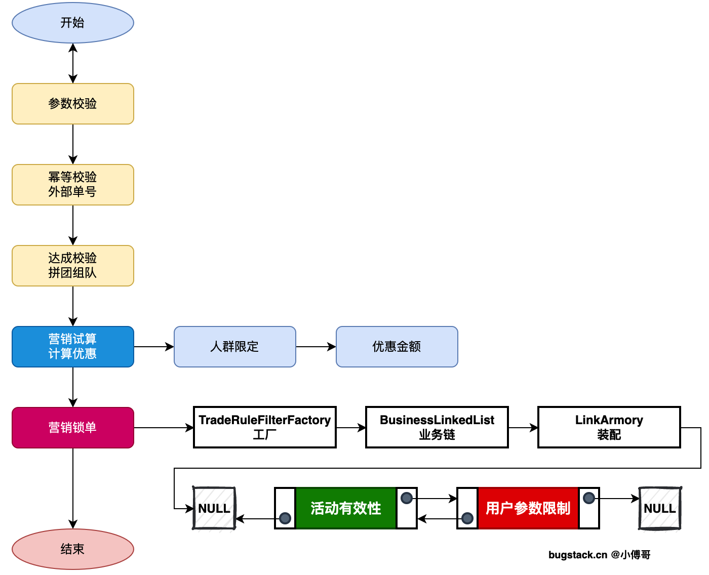

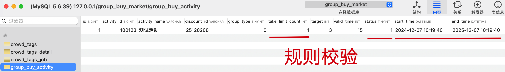

- 在前面章节，我们实现了拼团锁单中，参数校验、幂等校验、达成校验，之后做了营销试算和营销锁单。
- 那么在本节，还需要对营销锁单继续完善，过滤拼团活动配置的规则。包括；活动的有效期、状态，以及个人参与拼团的次数。在实际公司中的项目里，还会有更多的规则要被处理。

### 三、编程实现

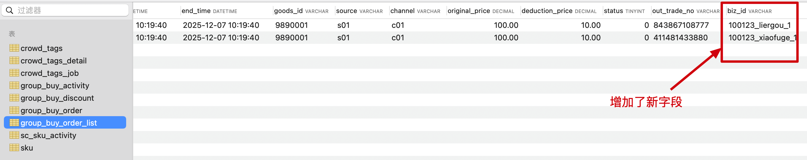

* 本节对库表进行了调整，新增加了字段。记得用课程代码下 docs/dev-ops/mysql/sql 下的文件，更新数据库表。

#### 1. 工程结构

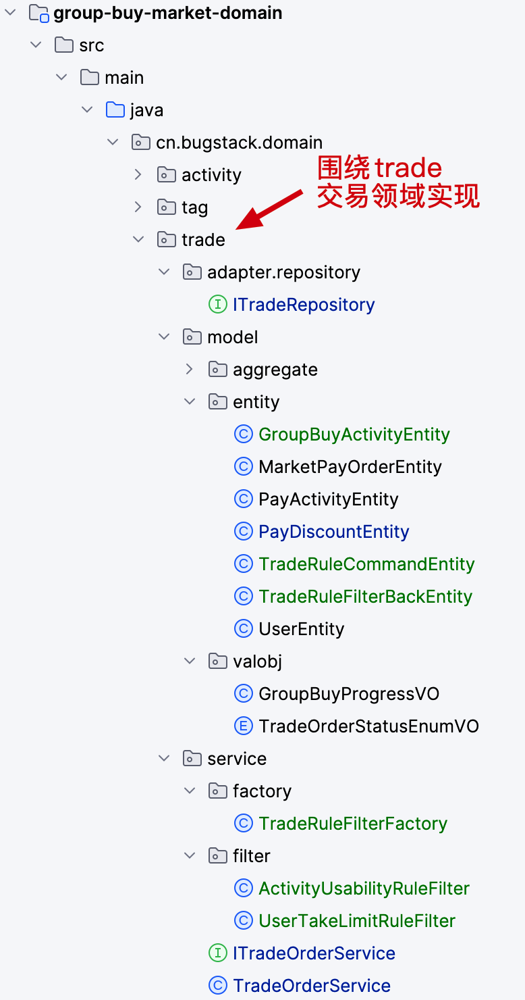

- 本节会围绕 trade 领域内 service 服务下的规则进行实现。实现的过程会使用到前面章节定义的责任链模板。
- 注意；在学习代码中，查看工程中小傅哥提交代码的记录，这样你可以注意到全部代码变动细节。

#### 2.功能修复（fix）

##### 2.1 营销优惠记录支付金额

```java
BigDecimal payPrice = discountCalculateService.calculate(requestParameter.getUserId(), skuVO.getOriginalPrice(), groupBuyDiscount);
dynamicContext.setDeductionPrice(skuVO.getOriginalPrice().subtract(payPrice));
dynamicContext.setPayPrice(payPrice);
```

* 为了更好的使用拼团营销试算，明确试算返回的优惠折扣和支付金额，为此在 拼团试算 MarketNode 节点，增加 payPrice 属性填写支付金额。

##### 2.2 营销优惠计算使用人群ID

```java
public abstract class AbstractDiscountCalculateService implements IDiscountCalculateService {

    @Resource
    protected IActivityRepository repository;

    @Override
    public BigDecimal calculate(String userId, BigDecimal originalPrice, GroupBuyActivityDiscountVO.GroupBuyDiscount groupBuyDiscount) {
        // 1. 人群标签过滤
        if (DiscountTypeEnum.TAG.equals(groupBuyDiscount.getDiscountType())){
            boolean isCrowdRange = filterTagId(userId, groupBuyDiscount.getTagId());
            if (!isCrowdRange) {
                log.info("折扣优惠计算拦截，用户不再优惠人群标签范围内 userId:{}", userId);
                return originalPrice;
            }
        }
        // 2. 折扣优惠计算
        return doCalculate(originalPrice, groupBuyDiscount);
    }

    // 人群过滤 - 限定人群优惠
    private boolean filterTagId(String userId, String tagId) {
        return repository.isTagCrowdRange(tagId, userId);
    }

    protected abstract BigDecimal doCalculate(BigDecimal originalPrice, GroupBuyActivityDiscountVO.GroupBuyDiscount groupBuyDiscount);

}
```

* 完善 AbstractDiscountCalculateService#filterTagId 中对人群标签的使用。

#### 3. 交易规则模型

##### 3.1 活动的可用性

```java
@Slf4j
@Service
public class ActivityUsabilityRuleFilter implements ILogicHandler<TradeRuleCommandEntity, TradeRuleFilterFactory.DynamicContext, TradeRuleFilterBackEntity> {

    @Resource
    private ITradeRepository repository;

    @Override
    public TradeRuleFilterBackEntity apply(TradeRuleCommandEntity requestParameter, TradeRuleFilterFactory.DynamicContext dynamicContext) throws Exception {
        log.info("交易规则过滤-活动的可用性校验{} activityId:{}", requestParameter.getUserId(), requestParameter.getActivityId());

        // 查询拼团活动
        GroupBuyActivityEntity groupBuyActivity = repository.queryGroupBuyActivityEntityByActivityId(requestParameter.getActivityId());

        // 校验；活动状态 - 可以抛业务异常code，或者把code写入到动态上下文dynamicContext中，最后获取。
        if (!ActivityStatusEnumVO.EFFECTIVE.equals(groupBuyActivity.getStatus())) {
            log.info("活动的可用性校验，非生效状态 activityId:{}", requestParameter.getActivityId());
            throw new AppException(ResponseCode.E0101);
        }

        // 校验；活动时间
        Date currentTime = new Date();
        if (currentTime.before(groupBuyActivity.getStartTime()) || currentTime.after(groupBuyActivity.getEndTime())) {
            log.info("活动的可用性校验，非可参与时间范围 activityId:{}", requestParameter.getActivityId());
            throw new AppException(ResponseCode.E0102);
        }

        // 写入动态上下文
        dynamicContext.setGroupBuyActivity(groupBuyActivity);

        // 走到下一个责任链节点
        return next(requestParameter, dynamicContext);
    }

}
```

* 活动可用性过滤活动的状态和时间。之后把活动数据写入到上下文中。

##### 3.2 用户参与限制

```java
@Slf4j
@Service
public class UserTakeLimitRuleFilter implements ILogicHandler<TradeRuleCommandEntity, TradeRuleFilterFactory.DynamicContext, TradeRuleFilterBackEntity> {

    @Resource
    private ITradeRepository repository;

    @Override
    public TradeRuleFilterBackEntity apply(TradeRuleCommandEntity requestParameter, TradeRuleFilterFactory.DynamicContext dynamicContext) throws Exception {
        log.info("交易规则过滤-用户参与次数校验{} activityId:{}", requestParameter.getUserId(), requestParameter.getActivityId());

        GroupBuyActivityEntity groupBuyActivity = dynamicContext.getGroupBuyActivity();

        // 查询用户在一个拼团活动上参与的次数
        Integer count = repository.queryOrderCountByActivityId(requestParameter.getActivityId(), requestParameter.getUserId());

        if (null != groupBuyActivity.getTakeLimitCount() && count >= groupBuyActivity.getTakeLimitCount()) {
            log.info("用户参与次数校验，已达可参与上限 activityId:{}", requestParameter.getActivityId());
            throw new AppException(ResponseCode.E0103);
        }

        return TradeRuleFilterBackEntity.builder()
                .userTakeOrderCount(count)
                .build();
    }

}
```

- 如果拼团活动配置了对用户的参与次数限制，那么需要在用户参与活动前，做好数量的校验拦截。
- 比如用户可以参与3次，那么库表里会记录3条数据；`活动ID_用户ID_1`、`活动ID_用户ID_2`、`活动ID_用户ID_3`，这样可以在库表层面做最强的防护拦截，不会让一个用户无限的参与活动。

##### 3.3 交易规则工厂

```java
@Slf4j
@Service
public class TradeRuleFilterFactory {

    @Bean("tradeRuleFilter")
    public BusinessLinkedList<TradeRuleCommandEntity, TradeRuleFilterFactory.DynamicContext, TradeRuleFilterBackEntity> tradeRuleFilter(ActivityUsabilityRuleFilter activityUsabilityRuleFilter, UserTakeLimitRuleFilter userTakeLimitRuleFilter) {
        // 组装链
        LinkArmory<TradeRuleCommandEntity, TradeRuleFilterFactory.DynamicContext, TradeRuleFilterBackEntity> linkArmory =
                new LinkArmory<>("交易规则过滤链", activityUsabilityRuleFilter, userTakeLimitRuleFilter);

        // 链对象
        return linkArmory.getLogicLink();
    }

    @Data
    @Builder
    @AllArgsConstructor
    @NoArgsConstructor
    public static class DynamicContext {

        private GroupBuyActivityEntity groupBuyActivity;

    }

}
```

- 责任链的规则创建完成后，就是在工厂类中构建责任链。
- 像是在实际的公司业务开发中，一个责任链会有很多这样的规则，因为要过滤用户的开户状态、授信状态、渠道状态、风控状态、额度状态等。那么这样的设计分层结构就非常好扩展和维护了。
- 此外，也不只是一个责任链，而是很多，他们根据不同的业务模型，比如；乡村交易、政企交易、校园交易、普户交易等，他们的规则流程也是不同的，那么为不同的流程，直接配置出对应的责任链，就可以快速的搭建符合的业务流程了，开发效率、维护效率都嘎嘎的，你的技术认可度也嘎嘎提高！


## [第2-12节：拼团组队结算统计](https://wx.zsxq.com/group/48411118851818/topic/4848142448421828)

具体文章：[《拼团交易平台系统》第2-12节：拼团组队结算统计-知识星球](https://wx.zsxq.com/group/48411118851818/topic/5121824221248154)

### 一、本章诉求

首先，你可以回忆下咱们整个拼团业务的流程。

拼团的过程是用户在商城下单，锁定拼团优惠（也就是拼团系统里锁单的过程）。之后就是用户给这笔商品完成支付交易，交易后不会直接发货，直至拼团组队完成后才会发货。

那么，这里有一个流程，就是支付完成后，需要做拼团数量的统计结算。如，拼团需要3个用户一起下单，那么每完成一笔支付，就要给拼团的组队加上一笔记录。这个就是本节要实现的流程。

### 二、业务流程

如图，拼团结算流程。

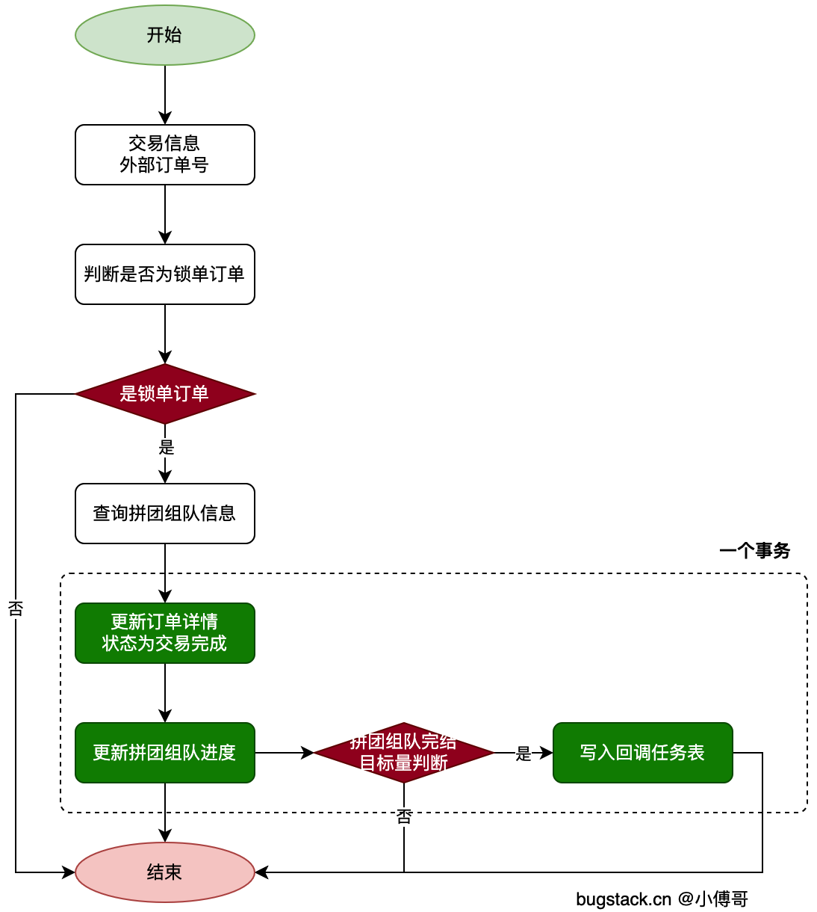

- 首先，交易订单的营销结算，核心就是更新拼团队伍的参与人数数量。每完成一笔支付，就有一笔拼团进度数量+1。
- 之后，这里要知道，更新拼团订单的明细状态（交易完成）和更新拼团进度数量要在一个事务下完成。
- 另外，更新拼团的进度要判断，当前是否为最后一次拼团完结状态。比如计算剩余1个，即可完成拼团目标量，那么这最后一笔更新完成后，既是整个拼团队伍的进度完成了。

### 三、编码实现

#### 1. 工程结构

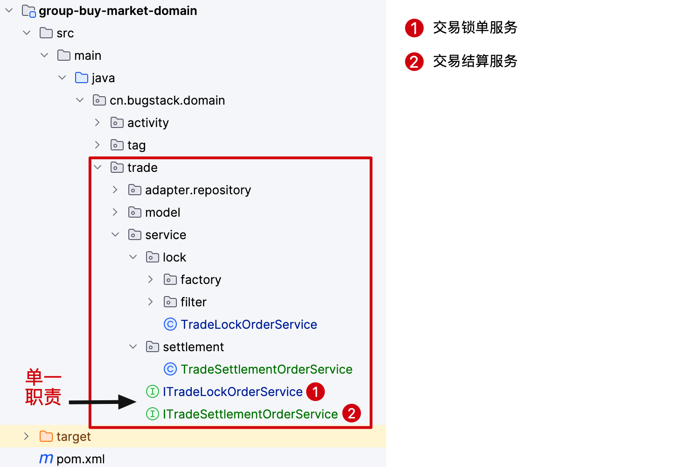

- 首先，重构交易分层，用类的名称，拆分交易中的业务场景。以此完成单一职责的划分。
- 之后，trade 领域下目前包括2部分服务，一个是营销交易锁单服务，另外一个是本节新增加的，营销交易结算服务。
- 重点，在于本节实现的营销交易结算服务，对每一笔支付记录的记账处理，直至完成拼团进度。

#### 2. 重构锁单

单一职责的特点在于一个类，主要关心一类服务的设计。单一职责的好处是：**降低复杂性** 、**提高可读性和可维护性** 、**提高复用性** 、**降低变更风险** 。

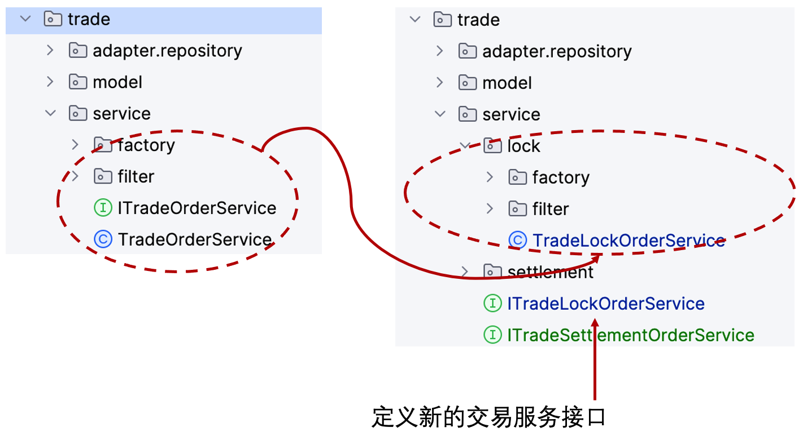

那么，我们使用单一职责来设计接口，它的特点在于，接口的命名即可看出做的业务属性，如；ITradePay、ITradeRefund、ITradeSettlement 等。如果说没有单一职责，那么这些pay、refund、settlement，就会被写到一个接口类里，这个类会随着业务的迭代，被充斥大量的业务逻辑，越往后越难维护。所以对于这类场景，我们要做单一职责设计。

#### 3. 拼团结算

##### 3.1 定义接口

```java
public interface ITradeSettlementOrderService {

    /**
     * 营销结算
     * @param tradePaySuccessEntity 交易支付订单实体对象
     * @return 交易结算订单实体
     */
    TradePaySettlementEntity settlementMarketPayOrder(TradePaySuccessEntity tradePaySuccessEntity);

}
```

- 首先，依照于单一职责，设计出一个交易结算的服务。
- 之后，定义营销结算的方法。入参为交易支付的成功实体信息，出参为交易结算的实体。

##### 3.2 功能实现

```java
@Slf4j
@Service
public class TradeSettlementOrderService implements ITradeSettlementOrderService {

    @Resource
    private ITradeRepository repository;

    @Override
    public TradePaySettlementEntity settlementMarketPayOrder(TradePaySuccessEntity tradePaySuccessEntity) {
        log.info("拼团交易-支付订单结算:{} outTradeNo:{}", tradePaySuccessEntity.getUserId(), tradePaySuccessEntity.getOutTradeNo());
        // 1. 查询拼团信息
        MarketPayOrderEntity marketPayOrderEntity = repository.queryMarketPayOrderEntityByOutTradeNo(tradePaySuccessEntity.getUserId(), tradePaySuccessEntity.getOutTradeNo());
        if (null == marketPayOrderEntity) {
            log.info("不存在的外部交易单号或用户已退单，不需要做支付订单结算:{} outTradeNo:{}", tradePaySuccessEntity.getUserId(), tradePaySuccessEntity.getOutTradeNo());
            return null;
        }

        // 2. 查询组团信息
        GroupBuyTeamEntity groupBuyTeamEntity = repository.queryGroupBuyTeamByTeamId(marketPayOrderEntity.getTeamId());

        // 3. 构建聚合对象
        GroupBuyTeamSettlementAggregate groupBuyTeamSettlementAggregate = GroupBuyTeamSettlementAggregate.builder()
                .userEntity(UserEntity.builder().userId(tradePaySuccessEntity.getUserId()).build())
                .groupBuyTeamEntity(groupBuyTeamEntity)
                .tradePaySuccessEntity(tradePaySuccessEntity)
                .build();

        // 4. 拼团交易结算
        repository.settlementMarketPayOrder(groupBuyTeamSettlementAggregate);

        // 5. 返回结算信息 - 公司中开发这样的流程时候，会根据外部需要进行值的设置
        return TradePaySettlementEntity.builder()
                .source(tradePaySuccessEntity.getSource())
                .channel(tradePaySuccessEntity.getChannel())
                .userId(tradePaySuccessEntity.getUserId())
                .teamId(marketPayOrderEntity.getTeamId())
                .activityId(groupBuyTeamEntity.getActivityId())
                .outTradeNo(tradePaySuccessEntity.getOutTradeNo())
                .build();
    }

}
```

- 首先，结算的过程分为查询外部的交易单号是否为拼团锁单订单，也就是说，之前这笔交易单号，参与过有效的锁单。
- 另外，商城类系统调用营销的要过滤是否有营销类信息，如果没有则不调用，这样会减轻对拼团类系统接口的压力。
- 最后，构建聚合对象，调用仓储层的 settlementMarketPayOrder 完成拼团类数据落库。

##### 3.3 事务操作

```java
@Slf4j
@Repository
public class TradeRepository implements ITradeRepository {

    @Resource
    private IGroupBuyActivityDao groupBuyActivityDao;
    @Resource
    private IGroupBuyOrderDao groupBuyOrderDao;
    @Resource
    private IGroupBuyOrderListDao groupBuyOrderListDao;
    @Resource
    private INotifyTaskDao notifyTaskDao;

    // ... 省略部分代码

    @Transactional(timeout = 500)
    @Override
    public void settlementMarketPayOrder(GroupBuyTeamSettlementAggregate groupBuyTeamSettlementAggregate) {

        UserEntity userEntity = groupBuyTeamSettlementAggregate.getUserEntity();
        GroupBuyTeamEntity groupBuyTeamEntity = groupBuyTeamSettlementAggregate.getGroupBuyTeamEntity();
        TradePaySuccessEntity tradePaySuccessEntity = groupBuyTeamSettlementAggregate.getTradePaySuccessEntity();

        // 1. 更新拼团订单明细状态
        GroupBuyOrderList groupBuyOrderListReq = new GroupBuyOrderList();
        groupBuyOrderListReq.setUserId(userEntity.getUserId());
        groupBuyOrderListReq.setOutTradeNo(tradePaySuccessEntity.getOutTradeNo());
        int updateOrderListStatusCount = groupBuyOrderListDao.updateOrderStatus2COMPLETE(groupBuyOrderListReq);
        if (1 != updateOrderListStatusCount) {
            throw new AppException(ResponseCode.E0005);
        }

        // 2. 更新拼团达成数量
        int updateAddCount = groupBuyOrderDao.updateAddCompleteCount(groupBuyTeamEntity.getTeamId());
        if (1 != updateAddCount) {
            throw new AppException(ResponseCode.E0005);
        }

        // 3. 更新拼团完成状态
        if (groupBuyTeamEntity.getTargetCount() - groupBuyTeamEntity.getCompleteCount() == 1) {
            int updateOrderStatusCount = groupBuyOrderDao.updateOrderStatus2COMPLETE(groupBuyTeamEntity.getTeamId());
            if (1 != updateOrderStatusCount) {
                throw new AppException(ResponseCode.E0005);
            }

            // 查询拼团交易完成外部单号列表
            List<String> outTradeNoList = groupBuyOrderListDao.queryGroupBuyCompleteOrderOutTradeNoListByTeamId(groupBuyTeamEntity.getTeamId());

            // 拼团完成写入回调任务记录
            NotifyTask notifyTask = new NotifyTask();
            notifyTask.setActivityId(groupBuyTeamEntity.getActivityId());
            notifyTask.setTeamId(groupBuyTeamEntity.getTeamId());
            notifyTask.setNotifyUrl("暂无");
            notifyTask.setNotifyCount(0);
            notifyTask.setNotifyStatus(0);
            notifyTask.setParameterJson(JSON.toJSONString(new HashMap<String, Object>() {{
                put("teamId", groupBuyTeamEntity.getTeamId());
                put("outTradeNoList", outTradeNoList);
            }}));

            notifyTaskDao.insert(notifyTask);
        }

    }

}
```

- 交易结算的过程分为；更新拼团订单明细状态、更新拼团达成数量，之后要判断当前这笔结算是否为最后的结算，如果是，还需要写入回调任务。
- 这里的回调任务，是在拼团结束后，回调商城系统，通知拼团完成。之后商城系统要对已经支付完成的订单进行发货。【如果你做过支付类系统（星球里的小型支付商城、openai应用、蓝兔支付sdk），都有支付完成的回调，通知你支付结果】
- 关于回调的流程，后续在做处理。你也可以先尝试考虑下这个流程。


## [第2-13节：交易结算责任链过滤](https://wx.zsxq.com/group/48411118851818/topic/4848142814814818)

具体文章：[《拼团交易平台系统》第2-13节：交易结算责任链过滤](https://articles.zsxq.com/id_8lei3wc3g685.html)

### 一、本章诉求

拼团交易结算的过程，需要一些列的规则过滤。包括；我们上一节提到的校验外部交易单的时间是否在拼团有效时间内，同时还有关于这笔外部交易单是否为有效的拼团锁单订单。另外像是 SC 渠道的有效性也需要在结算时进行校验。

所以，本节我们需要实现一套规则链，来处理这些业务规则。因为规则链已经被抽取为通用的模板了，那么本节使用起来会非常容易。

### 二、业务流程

如图，拼团交易结算流程设计；

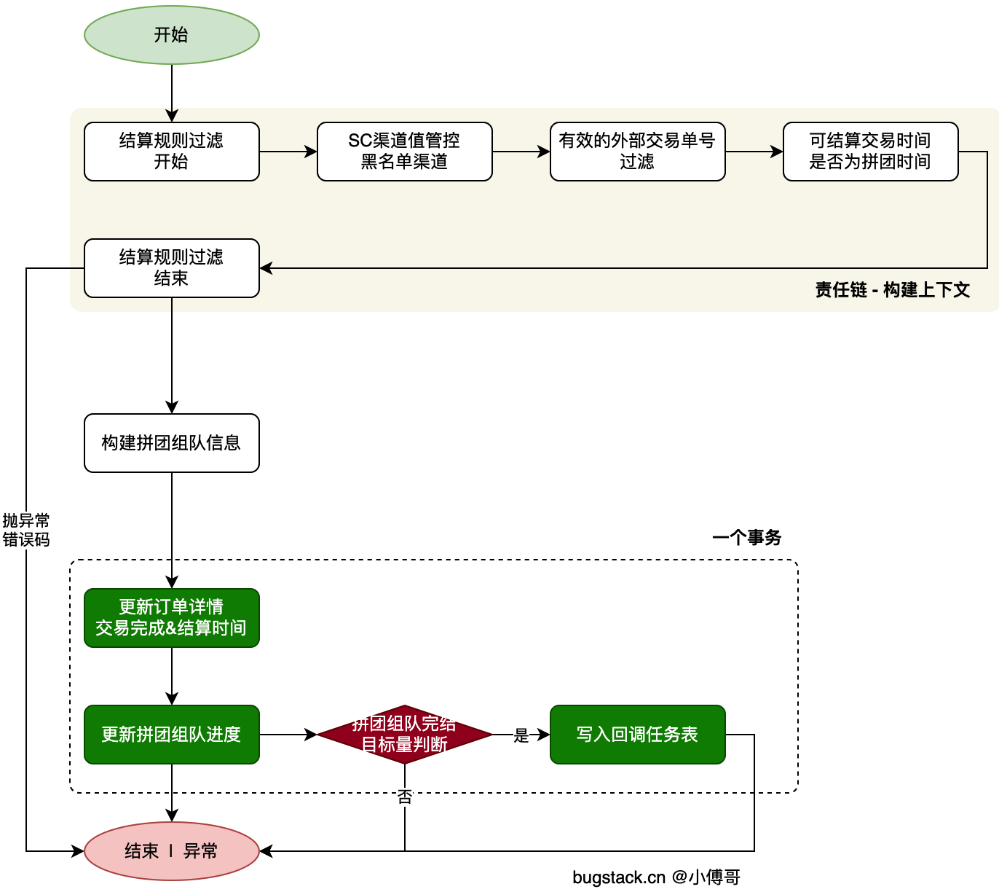

- 首先，本节的重点在于新增加结算规则过滤的责任链，处理；SC渠道管控、有效的外部交易单号、结算实现是否为拼团时效内。
- 那么这里会有一些功能改造点；
  - 拼团表，group_buy_order 增加 valid_start_time（有效开始时间）、valid_end_time（有效结束时间） 字段。用于每笔交易结算时候，用结算时间判断是否匹配到拼团有效时间范围内。
  - 拼团明细，group_buy_order_list 增加 out_trade_time（交易时间） 字段，记录每笔结算的订单结算的时间。随着状态更新的时候更新。
  - trade 领域下，lock 锁单。实体对象，修改名称。TradeRuleCommandEntity -> TradeLockRuleCommandEntity,TradeRuleFilterBackEntity -> TradeLockRuleFilterBackEntity 增加了 Lock 标识。便于在添加 TradeSettlementRuleCommandEntity、TradeSettlementRuleFilterBackEntity 时更好理解。
  - PayActivityEntity 添加 validTime，GroupBuyTeamEntity 添加 validStartTime、validEndTime
  - trade 领域下，settlement 结算服务中，使用责任链模板，实现营销交易规则的过滤。SCRuleFilter（SC黑名单管控过滤 DCCService 配置新的属性 scBlacklist）、OutTradeNoRuleFilter（外部交易单号有效性过滤）、SettableRuleFilter（交易时间是否在拼团有效时间内过滤）、EndRuleFilter（结束节点封装返回数据）
  - 交易服务，TradePaySettlementEntity 调用 tradeSettlementRuleFilter 责任链方法，并返回相关的数据信息。
  - settlementMarketPayOrder 结算一个事务下操作，增加 updateOrderStatus2COMPLETE 更新时候添加 outTradeTime 时间。

### 三、编码实现

#### 1. 工程结构

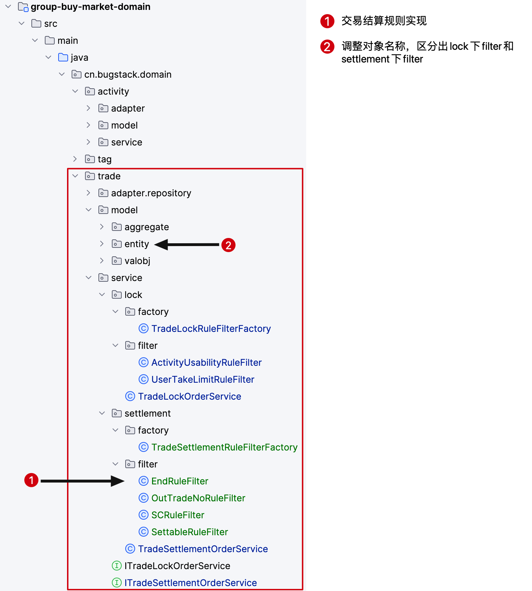

- 首先，你在实现功能编码的时候，要先考虑清楚你的模型结构如何处理。如，本节要做一个结算规则的处理，那么这些规则你是想在一个类里写大量的方法用 `if...else` 还是怎么实现。
- 之后，你要开始思考。如果不使用 `if...else` 一层层判断，那么就要先思考这块的业务流程，可以被分为几块处理。把他们的边界思考好。
- 然后，从一个个类下手，用类实现边界。也就是用类来区分你原来在一个大方法中写的一片流程代码，而每个类的衔接，可以使用规则树模型、责任链模型等，衔接中间流转的调用过程。

#### 2. 调整库表

##### 2.1 group_buy_order

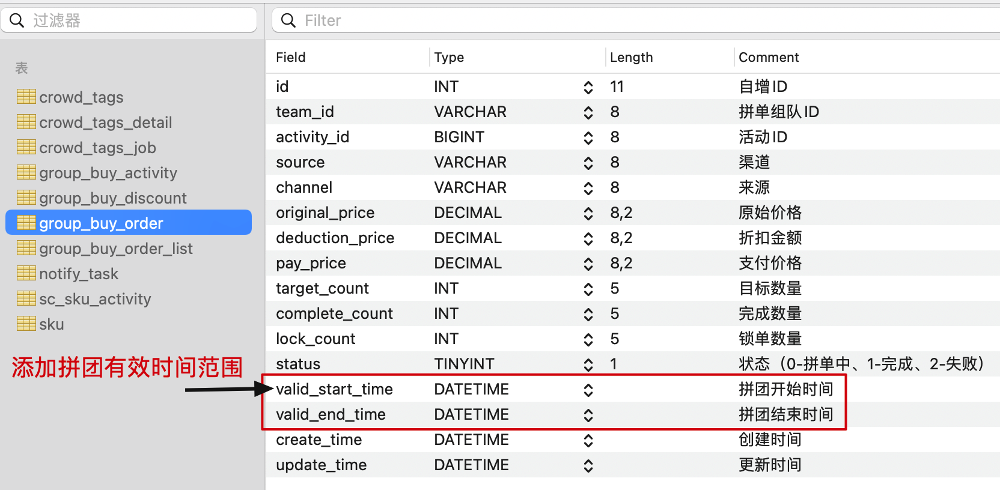

- 每一个拼团，都是从拼团活动表 group_buy_activity 获得的参与数据。也就是你在 group_buy_activity 活动有效时间范围内，在加上拼团时间。就是 group_buy_order 拼团的有效开始和结束时间。
- 把这样的数据写到 group_buy_order 表里，而不是每次都从活动表计算。是为了把即时性数据存库，避免以后调整活动时间，造成客诉不好排查。

##### 2.2 group_buy_order_list

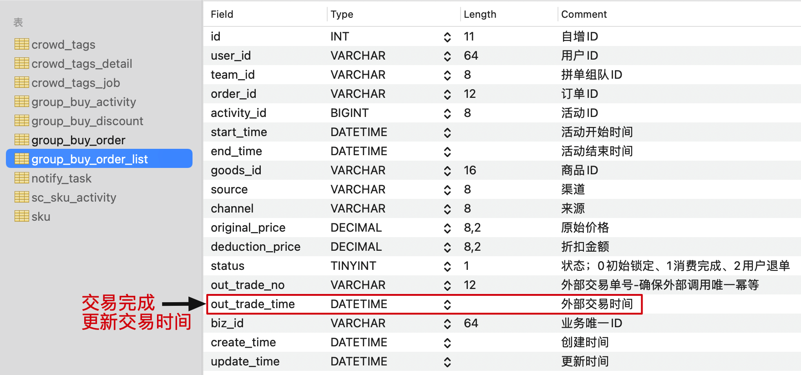

* group_buy_order_list 添加一个拼团交易完成的时间，这样可以更好的知道用户是多久锁单，多久支付的。支付时候有等待的。便于以后做数据`量化`计算。

#### 3. 结算规则

##### 3.1 SCRuleFilter

```java
@Slf4j
@Service
public class SCRuleFilter implements ILogicHandler<TradeSettlementRuleCommandEntity, TradeSettlementRuleFilterFactory.DynamicContext, TradeSettlementRuleFilterBackEntity> {

    @Resource
    private ITradeRepository repository;

    @Override
    public TradeSettlementRuleFilterBackEntity apply(TradeSettlementRuleCommandEntity requestParameter, TradeSettlementRuleFilterFactory.DynamicContext dynamicContext) throws Exception {
        log.info("结算规则过滤-渠道黑名单校验{} outTradeNo:{}", requestParameter.getUserId(), requestParameter.getOutTradeNo());

        // sc 渠道黑名单拦截
        boolean intercept = repository.isSCBlackIntercept(requestParameter.getSource(), requestParameter.getChannel());
        if (intercept) {
            log.error("{}{} 渠道黑名单拦截", requestParameter.getSource(), requestParameter.getChannel());
            throw new AppException(ResponseCode.E0105);
        }

        return next(requestParameter, dynamicContext);
    }

}
```

##### 3.2 OutTradeNoRuleFilter

```java
@Slf4j
@Service
public class OutTradeNoRuleFilter implements ILogicHandler<TradeSettlementRuleCommandEntity, TradeSettlementRuleFilterFactory.DynamicContext, TradeSettlementRuleFilterBackEntity> {

    @Resource
    private ITradeRepository repository;

    @Override
    public TradeSettlementRuleFilterBackEntity apply(TradeSettlementRuleCommandEntity requestParameter, TradeSettlementRuleFilterFactory.DynamicContext dynamicContext) throws Exception {
        log.info("结算规则过滤-外部单号校验{} outTradeNo:{}", requestParameter.getUserId(), requestParameter.getOutTradeNo());

        // 查询拼团信息
        MarketPayOrderEntity marketPayOrderEntity = repository.queryMarketPayOrderEntityByOutTradeNo(requestParameter.getUserId(), requestParameter.getOutTradeNo());

        if (null == marketPayOrderEntity) {
            log.error("不存在的外部交易单号或用户已退单，不需要做支付订单结算:{} outTradeNo:{}", requestParameter.getUserId(), requestParameter.getOutTradeNo());
            throw new AppException(ResponseCode.E0104);
        }

        dynamicContext.setMarketPayOrderEntity(marketPayOrderEntity);

        return next(requestParameter, dynamicContext);
    }

}
```

##### 3.3 SettableRuleFilter

```java
@Slf4j
@Service
public class SettableRuleFilter implements ILogicHandler<TradeSettlementRuleCommandEntity, TradeSettlementRuleFilterFactory.DynamicContext, TradeSettlementRuleFilterBackEntity> {

    @Resource
    private ITradeRepository repository;

    @Override
    public TradeSettlementRuleFilterBackEntity apply(TradeSettlementRuleCommandEntity requestParameter, TradeSettlementRuleFilterFactory.DynamicContext dynamicContext) throws Exception {
        log.info("结算规则过滤-有效时间校验{} outTradeNo:{}", requestParameter.getUserId(), requestParameter.getOutTradeNo());

        // 上下文；获取数据
        MarketPayOrderEntity marketPayOrderEntity = dynamicContext.getMarketPayOrderEntity();

        // 查询拼团对象
        GroupBuyTeamEntity groupBuyTeamEntity = repository.queryGroupBuyTeamByTeamId(marketPayOrderEntity.getTeamId());

        // 外部交易时间 - 也就是用户支付完成的时间，这个时间要在拼团有效时间范围内
        Date outTradeTime = requestParameter.getOutTradeTime();

        // 判断，外部交易时间，要小于拼团结束时间。否则抛异常。
        if (!outTradeTime.before(groupBuyTeamEntity.getValidEndTime())) {
            log.error("订单交易时间不在拼团有效时间范围内");
            throw new AppException(ResponseCode.E0106);
        }

        // 设置上下文
        dynamicContext.setGroupBuyTeamEntity(groupBuyTeamEntity);

        return next(requestParameter, dynamicContext);
    }

}
```

##### 3.4 EndRuleFilter

```java
@Slf4j
@Service
public class EndRuleFilter implements ILogicHandler<TradeSettlementRuleCommandEntity, TradeSettlementRuleFilterFactory.DynamicContext, TradeSettlementRuleFilterBackEntity> {

    @Override
    public TradeSettlementRuleFilterBackEntity apply(TradeSettlementRuleCommandEntity requestParameter, TradeSettlementRuleFilterFactory.DynamicContext dynamicContext) throws Exception {
        log.info("结算规则过滤-结束节点{} outTradeNo:{}", requestParameter.getUserId(), requestParameter.getOutTradeNo());

        // 获取上下文对象
        GroupBuyTeamEntity groupBuyTeamEntity = dynamicContext.getGroupBuyTeamEntity();

        // 返回封装数据
        return TradeSettlementRuleFilterBackEntity.builder()
                .teamId(groupBuyTeamEntity.getTeamId())
                .activityId(groupBuyTeamEntity.getActivityId())
                .targetCount(groupBuyTeamEntity.getTargetCount())
                .completeCount(groupBuyTeamEntity.getCompleteCount())
                .lockCount(groupBuyTeamEntity.getLockCount())
                .status(groupBuyTeamEntity.getStatus())
                .validStartTime(groupBuyTeamEntity.getValidStartTime())
                .validEndTime(groupBuyTeamEntity.getValidEndTime())
                .build();
    }

}
```

#### 4. 规则工厂

```java
@Slf4j
@Service
public class TradeSettlementRuleFilterFactory {

    @Bean("tradeSettlementRuleFilter")
    public BusinessLinkedList<TradeSettlementRuleCommandEntity,
            TradeSettlementRuleFilterFactory.DynamicContext, TradeSettlementRuleFilterBackEntity> tradeSettlementRuleFilter(
            SCRuleFilter scRuleFilter,
            OutTradeNoRuleFilter outTradeNoRuleFilter,
            SettableRuleFilter settableRuleFilter,
            EndRuleFilter endRuleFilter) {

        // 组装链
        LinkArmory<TradeSettlementRuleCommandEntity, TradeSettlementRuleFilterFactory.DynamicContext, TradeSettlementRuleFilterBackEntity> linkArmory =
                new LinkArmory<>("交易结算规则过滤链", scRuleFilter, outTradeNoRuleFilter, settableRuleFilter, endRuleFilter);

        // 链对象
        return linkArmory.getLogicLink();
    }
    
    // ... 省略部分代码
}
```

* 规则工厂，负责把责任链进行串联。之后提供一个指定名称的规则 Bean 对象。

#### 5. 使用规则

```java
@Slf4j
@Service
public class TradeSettlementOrderService implements ITradeSettlementOrderService {

    @Resource
    private ITradeRepository repository;
    @Resource
    private BusinessLinkedList<TradeSettlementRuleCommandEntity, TradeSettlementRuleFilterFactory.DynamicContext, TradeSettlementRuleFilterBackEntity> tradeSettlementRuleFilter;

    @Override
    public TradePaySettlementEntity settlementMarketPayOrder(TradePaySuccessEntity tradePaySuccessEntity) throws Exception {
        log.info("拼团交易-支付订单结算:{} outTradeNo:{}", tradePaySuccessEntity.getUserId(), tradePaySuccessEntity.getOutTradeNo());
        // 1. 结算规则过滤
        TradeSettlementRuleFilterBackEntity tradeSettlementRuleFilterBackEntity = tradeSettlementRuleFilter.apply(
                TradeSettlementRuleCommandEntity.builder()
                        .source(tradePaySuccessEntity.getSource())
                        .channel(tradePaySuccessEntity.getChannel())
                        .userId(tradePaySuccessEntity.getUserId())
                        .outTradeNo(tradePaySuccessEntity.getOutTradeNo())
                        .outTradeTime(tradePaySuccessEntity.getOutTradeTime())
                        .build(),
                new TradeSettlementRuleFilterFactory.DynamicContext());

        String teamId = tradeSettlementRuleFilterBackEntity.getTeamId();

        // 2. 查询组团信息
        GroupBuyTeamEntity groupBuyTeamEntity = GroupBuyTeamEntity.builder()
                .teamId(tradeSettlementRuleFilterBackEntity.getTeamId())
                .activityId(tradeSettlementRuleFilterBackEntity.getActivityId())
                .targetCount(tradeSettlementRuleFilterBackEntity.getTargetCount())
                .completeCount(tradeSettlementRuleFilterBackEntity.getCompleteCount())
                .lockCount(tradeSettlementRuleFilterBackEntity.getLockCount())
                .status(tradeSettlementRuleFilterBackEntity.getStatus())
                .validStartTime(tradeSettlementRuleFilterBackEntity.getValidStartTime())
                .validEndTime(tradeSettlementRuleFilterBackEntity.getValidEndTime())
                .build();

        // 3. 构建聚合对象
        GroupBuyTeamSettlementAggregate groupBuyTeamSettlementAggregate = GroupBuyTeamSettlementAggregate.builder()
                .userEntity(UserEntity.builder().userId(tradePaySuccessEntity.getUserId()).build())
                .groupBuyTeamEntity(groupBuyTeamEntity)
                .tradePaySuccessEntity(tradePaySuccessEntity)
                .build();

        // 4. 拼团交易结算
        repository.settlementMarketPayOrder(groupBuyTeamSettlementAggregate);

        // 5. 返回结算信息 - 公司中开发这样的流程时候，会根据外部需要进行值的设置
        return TradePaySettlementEntity.builder()
                .source(tradePaySuccessEntity.getSource())
                .channel(tradePaySuccessEntity.getChannel())
                .userId(tradePaySuccessEntity.getUserId())
                .teamId(teamId)
                .activityId(groupBuyTeamEntity.getActivityId())
                .outTradeNo(tradePaySuccessEntity.getOutTradeNo())
                .build();
    }

}
```

- 营销结算服务 TradeSettlementOrderService，调整在于，不在这里判断外部交易单号是否有效了，而是统一收到责任链中实现。
- 另外规则链会返回所需的数据，以及返回了 `tradePaySuccessEntity.getOutTradeTime()` 交易时间。这个时间会在操作数据时候做更新。

### 四、测试验证

#### 1. 锁单

```java
@Test
public void test_lockMarketPayOrder() {
    LockMarketPayOrderRequestDTO lockMarketPayOrderRequestDTO = new LockMarketPayOrderRequestDTO();
    lockMarketPayOrderRequestDTO.setUserId("xfg01");
    lockMarketPayOrderRequestDTO.setTeamId(null);
    lockMarketPayOrderRequestDTO.setActivityId(100123L);
    lockMarketPayOrderRequestDTO.setGoodsId("9890001");
    lockMarketPayOrderRequestDTO.setSource("s01");
    lockMarketPayOrderRequestDTO.setChannel("c01");
    lockMarketPayOrderRequestDTO.setOutTradeNo(RandomStringUtils.randomNumeric(12));
    Response<LockMarketPayOrderResponseDTO> lockMarketPayOrderResponseDTOResponse = marketTradeService.lockMarketPayOrder(lockMarketPayOrderRequestDTO);
    log.info("测试结果 req:{} res:{}", JSON.toJSONString(lockMarketPayOrderRequestDTO), JSON.toJSONString(lockMarketPayOrderResponseDTOResponse));
}
```

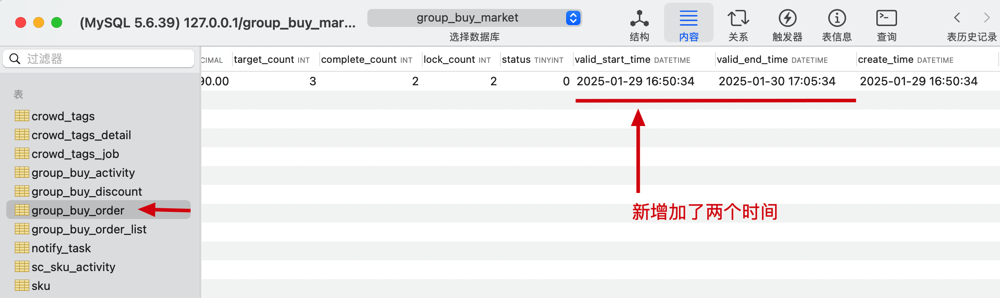

- 执行完毕后，你可以看下活动里的 valid_time 加上拼团的开始时间，之后写入到用户拼团时间里。
- 这个 valid_time 可以加长一些，方便测试。

#### 2. 结算

```java
@Test
public void test_settlementMarketPayOrder() throws Exception {
    TradePaySuccessEntity tradePaySuccessEntity = new TradePaySuccessEntity();
    tradePaySuccessEntity.setSource("s01");
    tradePaySuccessEntity.setChannel("c01");
    tradePaySuccessEntity.setUserId("xfg04");
    tradePaySuccessEntity.setOutTradeNo("075605651839");
    tradePaySuccessEntity.setOutTradeTime(new Date());
    TradePaySettlementEntity tradePaySettlementEntity = tradeSettlementOrderService.settlementMarketPayOrder(tradePaySuccessEntity);
    log.info("请求参数:{}", JSON.toJSONString(tradePaySuccessEntity));
    log.info("测试结果:{}", JSON.toJSONString(tradePaySettlementEntity));
}

```

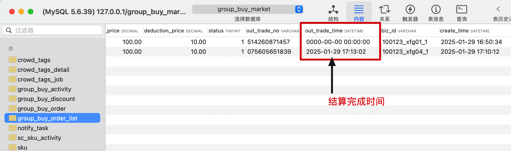

- 结算完成一笔后，会看到 out_trade_time 的更新。
- 注意；`tradePaySuccessEntity.setOutTradeTime(new Date());`需要新增加入参，这个参数会从交易完成的商城系统提供。


## [第2-14节：拼团回调通知任务](https://wx.zsxq.com/group/48411118851818/topic/8858154281221422)

具体文章：[《拼团交易平台系统》第2-14节：拼团回调通知任务](https://articles.zsxq.com/id_mw5rpnlwf93l.html)

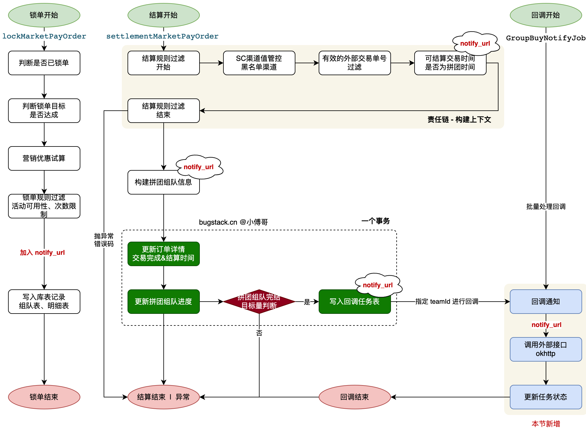

- 首先，本节的重点在拼团成团后，实现回调通知流程。回调的过程，需要在用户锁单时需要增加一个回调的地址，并在拼团完结后发起回调。

- 那么，这里的一些功能改造点；

  - `group_buy_order` 在设计的时候有一个 `notify_url` 回调地址，本节我们修改库表添加上这个字段。并对工程中的 `dao&po&mapper` 操作，增加 `notify_url` 字段。
  - MarketTradeController 营销交易服务，lockMarketPayOrder 锁单接口入参对象，增加 notifyUrl 回调地址。并有 PayDiscountEntity 对象透传到 `TradeRepository#lockMarketPayOrder` 仓储操作。这样写到 `group_buy_order` 表就有回调地址了，等做回调操作的时候，就可以把这个地址写入到回调任务表中。
  - `TradeSettlementOrderService#settlementMarketPayOrder` 结算服务，需要把锁单记录中的 notify_url 拿到，放到 GroupBuyTeamEntity 中，这样在写入 notify_task 表记录的时候就可以把 notify_url 一起写入进去了。
  - 基于 okhttp 框架，封装对 http 接口的调用。用于处理调用外部其他微服务，实现回调通知的处理。因为外部的接口是随着每个服务调用拼团写入进来的 http 请求地址，所以在封装这部分调用的时候，要允许动态透传请求地址。实现类写到 infrastructure 基础设置层的 gateway 调用外部网关层。实现类；`GroupBuyNotifyService` 提供方法；`groupBuyNotify`
  - 在交易结算服务类 ITradeSettlementOrderService，定义执行结算回调通知接口，包括；`execSettlementNotifyJob()、execSettlementNotifyJob(String teamId)` 一个是有入参的，一个无入参。这样可以指定给某个拼团队伍做结算。结算的过程就是调用 `GroupBuyNotifyService#groupBuyNotify` 完成回调通知，并根据返回的结果更新 notify_task 表状态记录（成功、失败、重试），并记录回调次数，小于5次的时候都可以继续回调。
  - 回调通知，可以分为两个阶段处理。一个是拼团完成后立即执行，另外一个任务补偿。立即执行是为了提供时效性，但因为远程的 http 调用受网络和服务的影响可能会失败，所以要增加一个任务补偿来做定时检查。其中立即执行在 `TradeSettlementOrderService#settlementMarketPayOrder -> settlementMarketPayOrder` 处理。另外定时任务在 `GroupBuyNotifyJob` 处理。
  - 测试接口，`trigger/http` 下，增加 `TestApiClientController` 接口实现类，提供回调接口服务。这个是模拟的其他的微服务，将来要提供的接口。

  

## [第2-15节：根据UI展示封装接口](https://wx.zsxq.com/group/48411118851818/topic/1525821124245452)

具体文章：[《拼团交易平台系统》第2-15节：根据UI展示封装接口](https://articles.zsxq.com/id_testl3kz27ac.html)

### 一、本章诉求

根据在上一节使用 DeepSeek 实现的拼团 UI，设计并实现所需的服务端接口。

在互联网公司里的开发过程也是这样，产品在评审期间，会提供 UI 工程师做好的设计图，研发拿到设计图后，提供所需的接口提供相应的字段。

## [第2-16节：引入RabbitMQ分布式多端消费](https://wx.zsxq.com/group/48411118851818/topic/1525884555822242)

具体文章：[《拼团交易平台系统》第2-16节：引入RabbitMQ分布式多端消费](https://articles.zsxq.com/id_ba5e31cmb2uu.html)

### 一、本章诉求

引入 RabbitMQ 分布式技术框架，实现分布式消息消费和多服务消费的能力。

消息，是一种解耦服务间直接（http/rpc）调用的手段，以发送消息和接收消息的模式，完成业务流程的异步化处理。

**RabbitMQ基础教程** ：https://bugstack.cn/md/road-map/rabbitmq.html

### 二、业务流程

在互联网公司中，往往一个微服务发送出来的 MQ，除了自己接收消费处理自己的业务流程，也会有很多其他微服务进行消费。那么这里就会有一个 Topic，被多个应用消费的配置。如图；

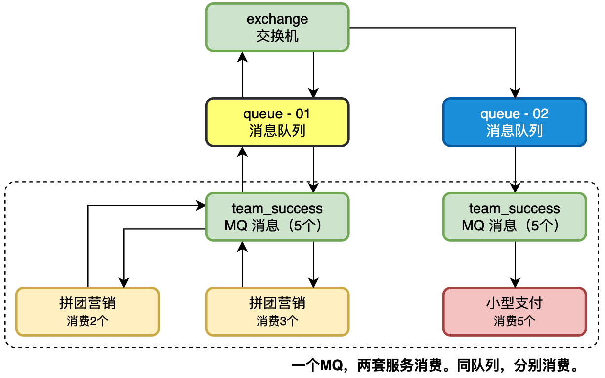

- 以拼团发送结算完成消息举例，拼团是负载均衡部署了2套服务，发送的MQ消息，由小型支付对接。
- 那么，负载均衡的拼团服务，发送MQ后，自己的2套微服务，会分别接收到消息。另外一套小型支付，假设只部署了一套，那么这里会消费5个MQ消息。
- 注意，以 RabbitMQ举例，这里会需要使用到同一套交换机，同一个路由Key，但队列要分别每个服务配置不同的。同时消息支持持久化，也就是拼团发送的MQ消息，即使小型支付服务暂时没有启动，也可以在启动后消费队列里的MQ消息。

## [第2-17节：发送MQ结算消息](https://wx.zsxq.com/group/48411118851818/topic/5125225455814284)

具体文章：[《拼团交易平台系统》第2-17节：发送MQ结算消息](https://articles.zsxq.com/id_f9d3ohg0qnhz.html)

### 一、本章诉求

增加拼团结算完成 MQ 触达方式，HTTP、MQ 触达，由调用方通过入参类型决定。

MQ 一般用在企业内的微服务系统间通信，因为企业内的微服务，共用了一套的 MQ 注册中心，MQ 可以更加高效的触达和分布式部署。而对于企业外的调用，与我们完全不是一个公司的系统，那么不再同一个微服务环境内，则需要通过 HTTP 方式这样标准的协议调用。如；支付宝支付完成回调、微信公众号发送消息后的回调，都是基于 HTTP 的方式实现。

### 二、业务流程

如图，HTTP、MQ，由调用方配置使用那种方式进行处理。

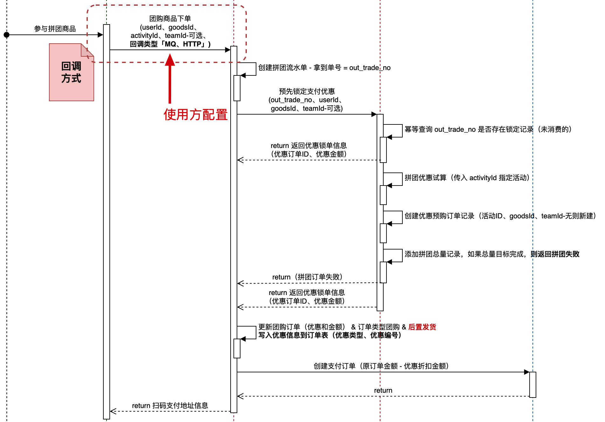

- 用户创建营销锁单时，选择MQ、HTTP回调方式。这个类型会被写入到对应的拼团订单记录里。

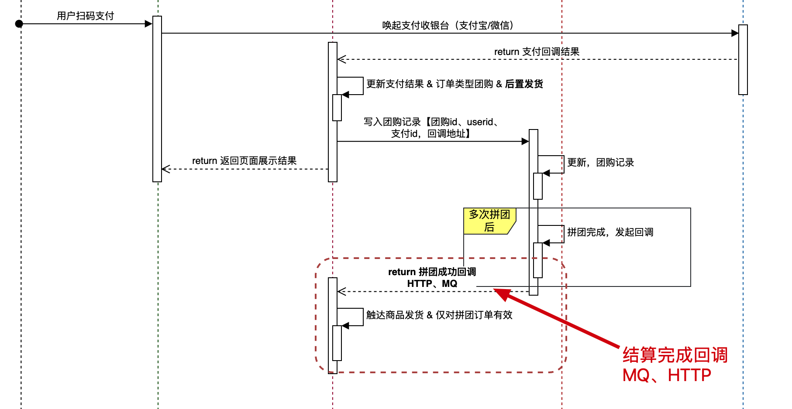

- 拼团完成结算后，在根据写入到拼团订单的记录，回调的方式，来回调通知结算。


# 补充

在该拼团系统中，节点的路由和执行是通过策略模式和责任链模式相结合来实现的。下面是具体的工作原理：

## 1.节点路由机制

1. **抽象基类定义**：
   每个节点都继承自[AbstractGroupBuyMarketSupport](file://D:\1硕士\计算机、设计学习\拼团项目\group-buy-market-master\group-buy-market-domain\src\main\java\cn\bugstack\domain\activity\service\trial\AbstractGroupBuyMarketSupport.java#L15-L26)类，这个类又继承自[AbstractMultiThreadStrategyRouter](file://D:\1硕士\计算机、设计学习\拼团项目\group-buy-market-master\group-buy-market-types\src\main\java\cn\bugstack\types\design\framework\tree\AbstractMultiThreadStrategyRouter.java#L13-L43)，它实现了[StrategyHandler](file://D:\1硕士\计算机、设计学习\拼团项目\group-buy-market-master\group-buy-market-types\src\main\java\cn\bugstack\types\design\framework\tree\StrategyHandler.java#L10-L16)接口。

2. **路由核心方法**：
   在[AbstractMultiThreadStrategyRouter](file://D:\1硕士\计算机、设计学习\拼团项目\group-buy-market-master\group-buy-market-types\src\main\java\cn\bugstack\types\design\framework\tree\AbstractMultiThreadStrategyRouter.java#L13-L43)类中，有一个核心的[router](file://D:\1硕士\计算机、设计学习\拼团项目\group-buy-market-master\group-buy-market-types\src\main\java\cn\bugstack\types\design\framework\tree\AbstractMultiThreadStrategyRouter.java#L19-L23)方法：
   ```java
   public R router(T requestParameter, D dynamicContext) throws Exception {
       StrategyHandler<T, D, R> strategyHandler = get(requestParameter, dynamicContext);
       if(null != strategyHandler) return strategyHandler.apply(requestParameter, dynamicContext);
       return defaultStrategyHandler.apply(requestParameter, dynamicContext);
   }
   ```


3. **节点决策**：
   每个具体的节点类（如[RootNode](file://D:\1硕士\计算机、设计学习\拼团项目\group-buy-market-master\group-buy-market-domain\src\main\java\cn\bugstack\domain\activity\service\trial\node\RootNode.java#L21-L58)、[SwitchNode](file://D:\1硕士\计算机、设计学习\拼团项目\group-buy-market-master\group-buy-market-domain\src\main\java\cn\bugstack\domain\activity\service\trial\node\SwitchNode.java#L20-L54)、[MarketNode](file://D:\1硕士\计算机、设计学习\拼团项目\group-buy-market-master\group-buy-market-domain\src\main\java\cn\bugstack\domain\activity\service\trial\node\MarketNode.java#L30-L122)、[TagNode](file://D:\1硕士\计算机、设计学习\拼团项目\group-buy-market-master\group-buy-market-domain\src\main\java\cn\bugstack\domain\activity\service\trial\node\TagNode.java#L19-L55)、[EndNode](file://D:\1硕士\计算机、设计学习\拼团项目\group-buy-market-master\group-buy-market-domain\src\main\java\cn\bugstack\domain\activity\service\trial\node\EndNode.java#L20-L60)等）都必须实现[get](file://D:\1硕士\计算机、设计学习\拼团项目\group-buy-market-master\group-buy-market-domain\src\main\java\cn\bugstack\domain\activity\service\trial\node\TagNode.java#L50-L53)方法，这个方法决定了下一个要执行的节点。

### 1.1具体实现示例

以几个关键节点为例：

1. **RootNode**：
   ```java
   @Override
   public StrategyHandler<MarketProductEntity, DefaultActivityStrategyFactory.DynamicContext, TrialBalanceEntity> get(MarketProductEntity requestParameter, DefaultActivityStrategyFactory.DynamicContext dynamicContext) throws Exception {
       return switchNode;
   }
   ```

   根节点总是将请求路由到[SwitchNode](file://D:\1硕士\计算机、设计学习\拼团项目\group-buy-market-master\group-buy-market-domain\src\main\java\cn\bugstack\domain\activity\service\trial\node\SwitchNode.java#L20-L54)。

2. **SwitchNode**：
   ```java
   @Override
   public StrategyHandler<MarketProductEntity, DefaultActivityStrategyFactory.DynamicContext, TrialBalanceEntity> get(MarketProductEntity requestParameter, DefaultActivityStrategyFactory.DynamicContext dynamicContext) throws Exception {
       return marketNode;
   }
   ```

   SwitchNode处理完开关逻辑后，将请求路由到[MarketNode](file://D:\1硕士\计算机、设计学习\拼团项目\group-buy-market-master\group-buy-market-domain\src\main\java\cn\bugstack\domain\activity\service\trial\node\MarketNode.java#L30-L122)。

3. **MarketNode**：
   ```java
   @Override
   public StrategyHandler<MarketProductEntity, DefaultActivityStrategyFactory.DynamicContext, TrialBalanceEntity> get(MarketProductEntity requestParameter, DefaultActivityStrategyFactory.DynamicContext dynamicContext) throws Exception {
       return errorNode;
   }
   ```

   MarketNode默认路由到[ErrorNode](file://D:\1硕士\计算机、设计学习\拼团项目\group-buy-market-master\group-buy-market-domain\src\main\java\cn\bugstack\domain\activity\service\trial\node\ErrorNode.java#L18-L40)，但在处理过程中可能会根据条件改变路由。

4. **TagNode**：
   ```java
   @Override
   public StrategyHandler<MarketProductEntity, DefaultActivityStrategyFactory.DynamicContext, TrialBalanceEntity> get(MarketProductEntity requestParameter, DefaultActivityStrategyFactory.DynamicContext dynamicContext) throws Exception {
       return endNode;
   }
   ```

   TagNode处理完人群标签判断后，将请求路由到[EndNode](file://D:\1硕士\计算机、设计学习\拼团项目\group-buy-market-master\group-buy-market-domain\src\main\java\cn\bugstack\domain\activity\service\trial\node\EndNode.java#L20-L60)。

### 1.2执行流程

每个节点的执行流程如下：

1. 调用[router](file://D:\1硕士\计算机、设计学习\拼团项目\group-buy-market-master\group-buy-market-types\src\main\java\cn\bugstack\types\design\framework\tree\AbstractMultiThreadStrategyRouter.java#L19-L23)方法确定下一个节点
2. 执行当前节点的[multiThread](file://D:\1硕士\计算机、设计学习\拼团项目\group-buy-market-master\group-buy-market-types\src\main\java\cn\bugstack\types\design\framework\tree\AbstractMultiThreadStrategyRouter.java#L36-L36)方法（异步加载数据）
3. 执行当前节点的[doApply](file://D:\1硕士\计算机、设计学习\拼团项目\group-buy-market-master\group-buy-market-types\src\main\java\cn\bugstack\types\design\framework\tree\AbstractMultiThreadStrategyRouter.java#L41-L41)方法（业务逻辑处理）
4. 在[doApply](file://D:\1硕士\计算机、设计学习\拼团项目\group-buy-market-master\group-buy-market-types\src\main\java\cn\bugstack\types\design\framework\tree\AbstractMultiThreadStrategyRouter.java#L41-L41)方法末尾再次调用[router](file://D:\1硕士\计算机、设计学习\拼团项目\group-buy-market-master\group-buy-market-types\src\main\java\cn\bugstack\types\design\framework\tree\AbstractMultiThreadStrategyRouter.java#L19-L23)方法，进入下一个节点

这种设计使得每个节点只需要关心自己的业务逻辑和决定下一个节点是什么，形成了一个灵活的处理链。通过实现[get](file://D:\1硕士\计算机、设计学习\拼团项目\group-buy-market-master\group-buy-market-domain\src\main\java\cn\bugstack\domain\activity\service\trial\node\TagNode.java#L50-L53)方法，每个节点可以动态决定下一步的执行路径，实现条件分支和流程控制。


